# Bastion

<h1 align="center">
  <br>
  <a href="https://www.hackthebox.eu/home/machines/profile/186"></a>
  <br>
</h1>


<h4 align="center"> Author: L4mpje</h4>

***

__Machine IP__:  10.10.10.134

__DATE__ : 17/07/2019

__START TIME__: 11:36 PM

***

## Nmap

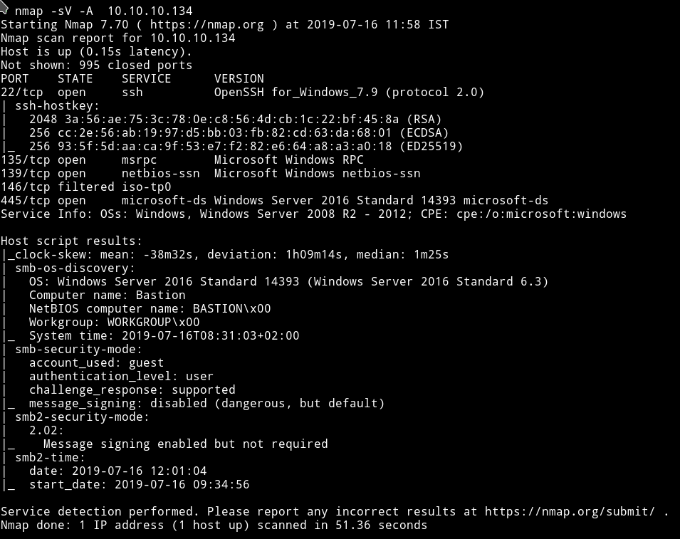

There's SMB service running so we can use tools like `smbmap` or `smbclient` to find some share to look into.

***

## SMB

Using the following command I got the list of shares:

```bash
➜ smbclient -L //10.10.10.134/Backups -U ""
```


We can see that there's one share named `Backups` present. Let's see if we can find anything in it.

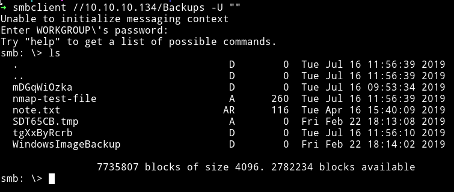

The first thing I read was `note.txt`.

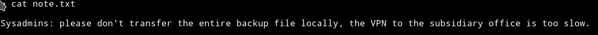

the `mDGqWiOzka` directory was empty and the `nmap-test-file` had some junk data and `SDT65CB.tmp` was empty.

In `WindowsImageBackup` I found another directory named `L4mpje-PC`

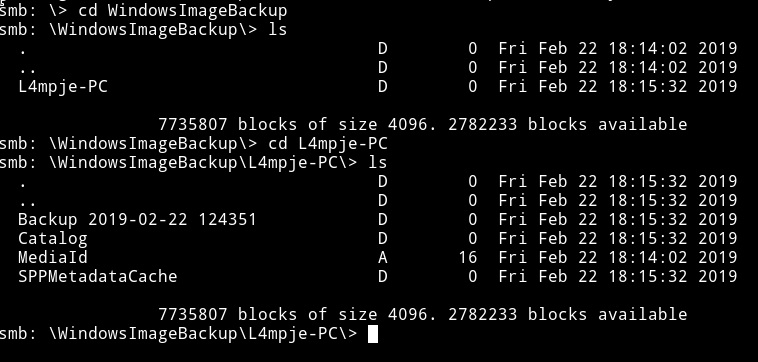

After looking around a bit I found some `.vhd` file in `smb: \WindowsImageBackup\L4mpje-PC\Backup 2019-02-22 124351\>`.

We can download those `.vhd` file and then mount them to find something in them but that might not be the best way to do it because this is what the `note` said:

```
please don't transfer the entire backup files locally, the VPN to the subsidiary office is too slow.
```

So instead we need to find a way to mount the `SMB` directory to our system so we can browse the backup files and then mount the VHD.

__Mount SMB__

* Make a new directory to mount SMB share
    - I did `sudo mkdir /home/bastion`
* Run: `sudo mount -t cifs //10.10.10.134/Backups /home/bastion -o user=""`

This will mount the SMB share.

__Mount VHD__

* Make a new directory, I made a directory within `bastion`
    - `sudo mkdir /home/bastion/vhd`
* Run
```bash
guestmount --add /home/bastion/WindowsImageBackup/L4mpje-PC/"Backup 2019-02-22 124351"/9b9cfbc4-369e-11e9-a17c-806e6f6e6963.vhd --inspector --ro /home/bastion/vhd -v
```
This will mount the VHD, now we can just look around to see if we can find anything.

***

## Pwn User

In Windows we can find juicy stuff in `System32`, you can says it's equivalent to `/etc/` of linux(not exactly).

Windows store passwords in file called `SAM` and we can use tool like `samdump` to get hashes out of that file. And then using tools like `john` or `hashcat` we can crack it.


In `System32/config` we can see the `SAM` file.

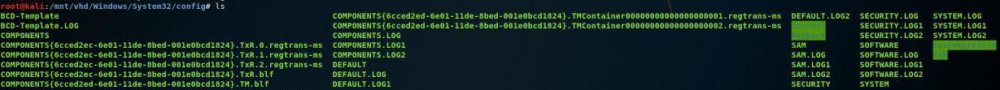

Using `samdump2 SYSTEM SAM` we can dump hashes

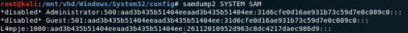

`26112010952d963c8dc4217daec986d9`

I used [`crackstation`](https://crackstation.net/) to crack the hash

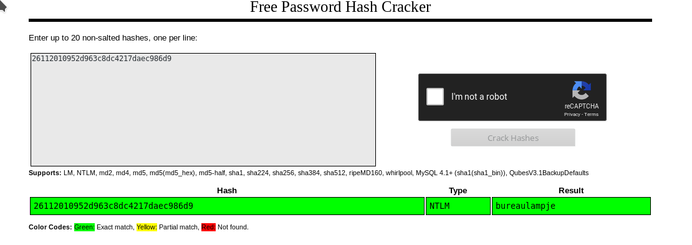

`26112010952d963c8dc4217daec986d9: bureaulampje`

Now we have the password so we can login into `L4mpje` SSH account.

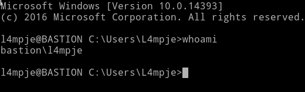

We can just grab the `user` hash now.

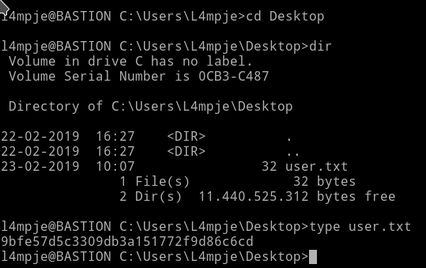

***

## Privilege Escalation

I started looking around but there wasn't anything interesting in the user directory.

I decided to look into `Program Files` and `Program Files (x86)` folder. Since this is where the new software are installed, we can see if there's any vulnerable program installed.

In `Program Files (x86)` I found a program named `mRemoteNg`, that is the only program which isn't present by default.


So I google exploit for it and found a [metasploit script](https://github.com/rapid7/metasploit-framework/blob/master//modules/post/windows/gather/credentials/mremote.rb) for it. But since it's `post` exploit it will need a shell or something(I'm not good with msf).

I continued my search for easy-to-run exploit and found a github repository [kmahyyg/mremoteng-decrypt](https://github.com/kmahyyg/mremoteng-decrypt). According to this I need to get the `User.config` for `mRemoteNG` and then use one of the script to decrypt the password.

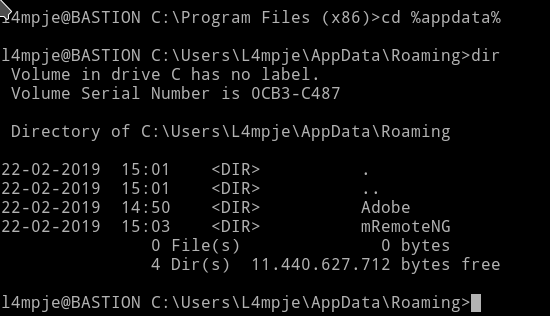

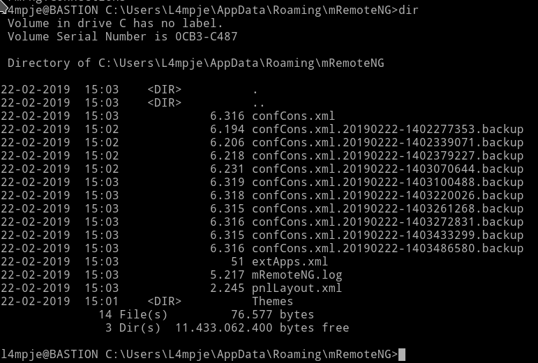

I used the `type` command to see the content of `confCons.xml`

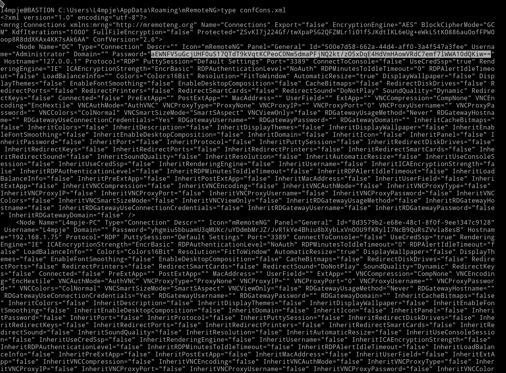

we can see the password hash there.

Now we can just use that password with our script to decrypt it.

***

I had to edit the python script a bit. First I installed `PyCryptodome` and then

Change the following line

```python
from Cryptodome.Cipher import AES
```

to

```python
from Crypto.Cipher import AES
```

***


I used the following command to crack the password:

```bash
➜ python mremoteng_decrypt.py -s "aEWNFV5uGcjUHF0uS17QTdT9kVqtKCPeoC0Nw5dmaPFjNQ2kt\/zO5xDqE4HdVmHAowVRdC7emf7lWWA10dQKiw=="
```

and got the output `Password: thXLHM96BeKL0ER2`

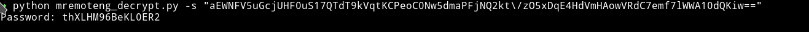

To confirm that I got the right password I used the `L4mpje` hash and checked if I got `bureaulampje` and I actually did got that:

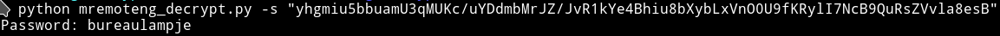

***

First I tried to use the `runas` command to use the `administrator` account but for some reason it didn't worked.

So I logged into `SSH` account of `Administrator` using the `administrator: thXLHM96BeKL0ER2`.

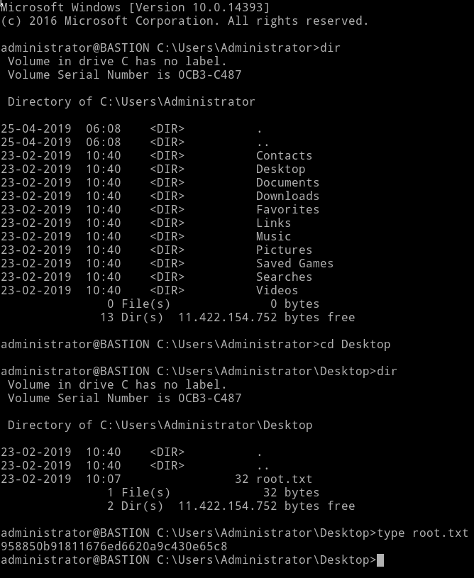

***

Thanks for reading, Feedback is always appreciated

Follow me [@0xmzfr](https://twitter.com/0xmzfr) for more "Writeups".


