# Postman

<h1 align="center">
  <br>
  <a href="https://www.hackthebox.eu/home/machines/profile/215"></a>
  <br>
</h1>
<h4 align="center"> Author: <a href="https://www.hackthebox.eu/home/users/profile/114053" >  TheCyberGeek  </a> </h4>

***

__Machine IP__: 10.10.10.160

__DATE__ : 9/11/2019

__START TIME__: 2:47 PM

***

# Summary

This was a pretty good box. I had to perform full port scan on this box which took more time then total exploiting does.

In this I used a know redis vulnerability to get a shell as `redis` user and then exploited `webmin` to get root shell and flag.

# Index

* [Enumeration](#enumeration)
    - [nmap scan](#nmap)
    - [HTTP Enumeration](#http)
* [Exploiting Redis](#exploiting-redis)
* [Privilege Escalation](#privilege-escalation)


***

# Enumeration

## NMAP

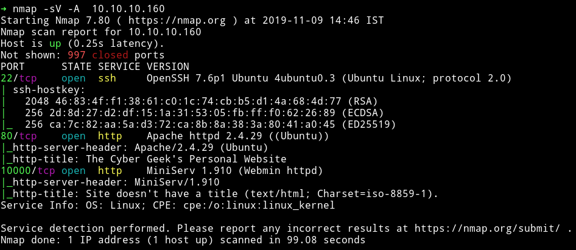

Let's start our enumeration with HTTP services.

### HTTP

On port 80 I found a very simple website running


The website didn't had anything else. Also gobuster didn't found any suspicious directory. So I decided to look at port `10000` which was running a `webmin 1.910`.

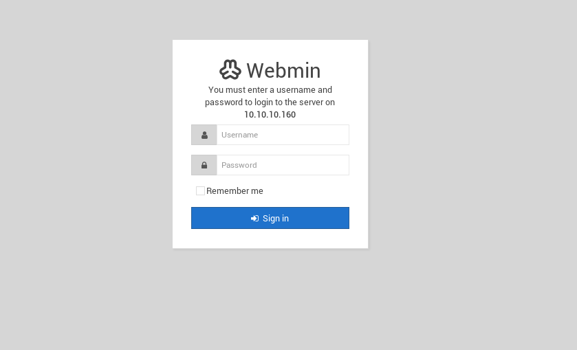

I used searchsploit to find the exploits. There were few but none of them seemed to work. Then I realized I've missed a full port scan. so then I decided to run nmap again but with `-p-`(took sometime) but then I found another port opened.

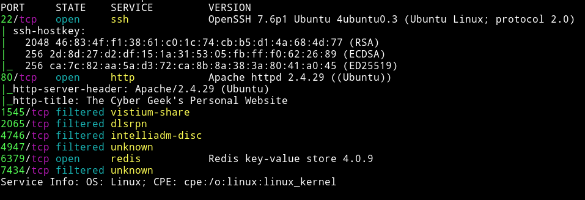

We can see that there is a redis server running on port `6379`.

## Exploiting Redis

I googled for exploits related to redis and found [Redis-Remote-Command-Execution](https://packetstormsecurity.com/files/134200/Redis-Remote-Command-Execution.html). I followed the instruction mentioned in the post and I was able to get a ssh connection using `redis` account.

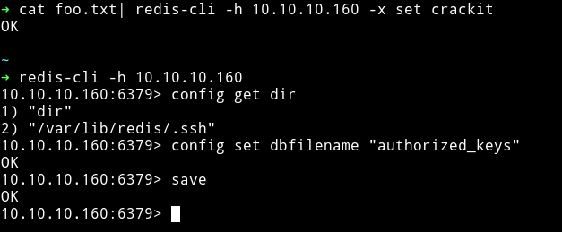

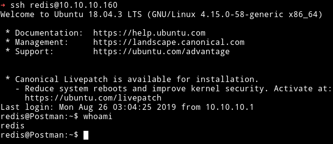

I tried to read the user.txt but I wasn't allowed to do so. I kept looking around and found `ssh private` key for user `Matt` in `/opt`.

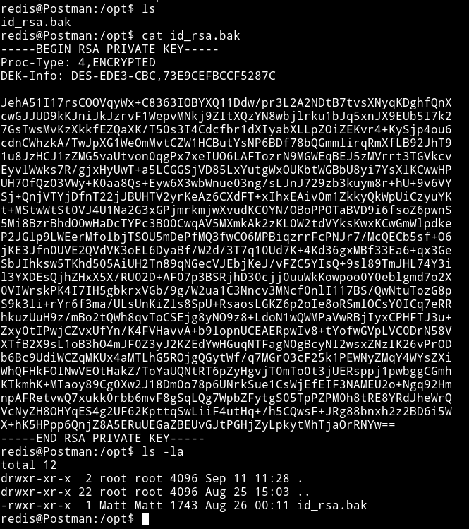

But when I tried to login with that key I was asked for `passphrase`.
I tried to crack the password with `ssh2john`.

```bash
> ssh2john keyz > hash.txt
> john hash.txt
```

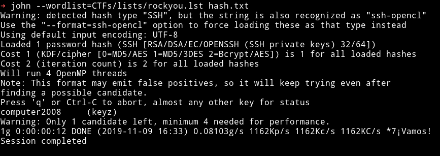

`computer2008`

I tried to ssh with that passphrase but kept getting `connection lost`.

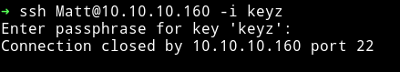

Since I was not able to directly SSH as `matt` I decided to do `su matt` and it worked.

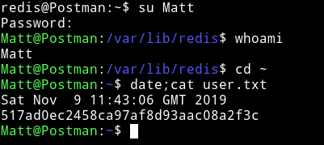

## Privilege Escalation

I tried to enumerate using enumeration script but couldn't find anything. Then I realized there was `webmin` on port 10000 and we found lot of exploit for it. So I decided to try `linux/http/webmin_packageup_rce` from metasploit with the following options

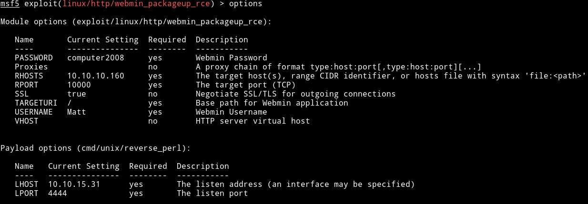

This gave me shell as `root`. And this actually worked because this time I had `USERNAME` and `PASSWORD`.

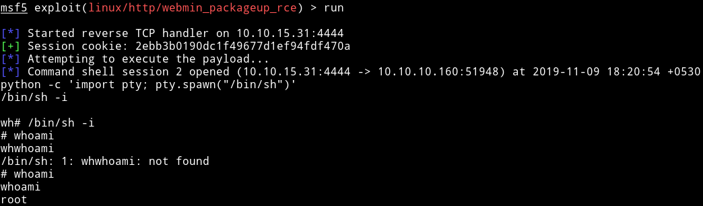

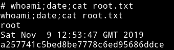

***

Thanks for reading, Feedback is always appreciated.

Follow me [@0xmzfr](https://twitter.com/0xmzfr) for more “Writeups”. And if you'd like to support me considering [donating](https://mzfr.github.io/donate/) 😄


